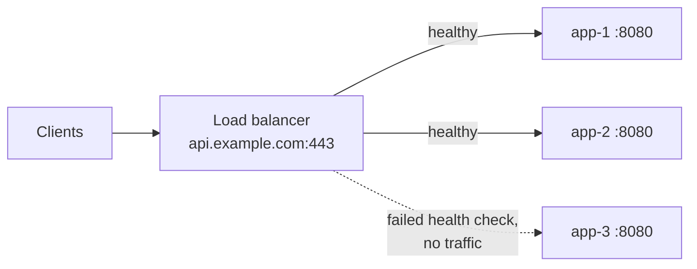
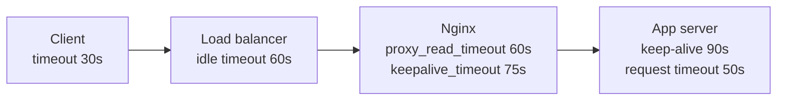

# Load Balancers and Reverse Proxies

## What You'll Learn

- The difference between Layer 4 and Layer 7 load balancing, and when to use each
- How balancing algorithms, health checks, and connection draining work
- Where to terminate TLS, and how to preserve the client's IP address
- How timeouts interact across layers, and what `502`, `503`, and `504` really mean

## What a Load Balancer Does

A load balancer accepts traffic on one address and spreads it across a pool of healthy backends. A **reverse proxy** does the same at the HTTP layer, and often adds TLS termination, routing by host or path, compression, caching, and rate limiting. In practice the terms overlap: Nginx, HAProxy, Envoy, Traefik, and cloud load balancers all act as both.



## Layer 4 vs Layer 7

| | Layer 4 (transport) | Layer 7 (application) |
|---|---|---|
| Sees | IPs, ports, TCP/UDP | HTTP method, host, path, headers, cookies |
| Routes by | Destination port | Host, path, header, and more |
| TLS | Passes through, or terminates without reading HTTP | Terminates to read HTTP |
| Per-request features | None | Retries, redirects, rewrites, header injection, rate limits |
| Performance | Very high, very low latency | Higher CPU per request |
| Protocols | Anything over TCP or UDP: databases, MQTT, gRPC passthrough | HTTP/1.1, HTTP/2, gRPC, WebSockets |
| AWS example | Network Load Balancer (NLB) | Application Load Balancer (ALB) |
| Kubernetes example | `Service` of type `LoadBalancer` | Ingress or Gateway API controller |

Use Layer 7 when you need routing by host or path, or HTTP-aware features. Use Layer 4 for non-HTTP protocols, static IP addresses, extreme throughput, or end-to-end TLS the balancer must not decrypt.

## Balancing Algorithms

| Algorithm | How it picks | Good for |
|---|---|---|
| Round robin | Next backend in turn | Similar backends, similar requests |
| Least connections / least outstanding requests | The backend with the fewest in-flight requests | Uneven request durations |
| Weighted | Proportional to configured weights | Mixed instance sizes, canary releases |
| Hash (client IP, header, or URI) | The same key always maps to the same backend | Cache locality; basic stickiness |
| Consistent hashing | Hash with minimal reshuffling when backends change | Caches and sharded services |

## Health Checks

| Type | How | Catches |
|---|---|---|
| **Active** | The balancer polls `GET /healthz` on each backend | Backends that are down or not ready |
| **Passive** (outlier detection) | The balancer watches real traffic for errors and timeouts | Backends that pass health checks but fail real requests |

Design the health endpoint carefully:

- **Readiness**, not just liveness: return non-200 while the app is starting, warming caches, or shutting down.
- **Don't check shared dependencies** in the load balancer health check. If every backend reports unhealthy because the database blipped, the balancer removes all of them and turns a partial problem into a total outage.
- Keep it fast and cheap — it runs constantly.

## Connection Draining

When a backend is removed (deploy, scale-in), the balancer stops sending **new** requests but lets in-flight ones finish for a **deregistration delay** (AWS calls it that; others say draining).

A graceful shutdown sequence:

1. The instance is marked for removal; the balancer stops routing new traffic to it.
2. The app keeps serving in-flight requests.
3. After the drain period, the app receives `SIGTERM`, finishes, and exits.

In Kubernetes, endpoint removal and `SIGTERM` happen at about the same time, so a short `preStop` sleep gives proxies time to update before the app stops accepting connections.

## Session Affinity (Sticky Sessions)

Stickiness sends a client to the same backend each time, usually with a cookie. It helps legacy apps that keep sessions in memory, but:

- Load becomes uneven, and scaling out doesn't help existing users.
- A backend failure still loses its users' sessions.

Prefer stateless backends with sessions in a shared store such as Redis.

## TLS Termination

| Mode | Balancer decrypts? | Backend traffic | Use when |
|---|---|---|---|
| **Termination** | Yes | Plain HTTP | Trusted private network; simplest |
| **Re-encryption** | Yes | New TLS connection | L7 features needed, and traffic must stay encrypted |
| **Passthrough** | No (L4) | Original TLS | The backend must see the client's TLS session, or compliance forbids decryption |

## Preserving the Client IP

When a proxy terminates the connection, the backend sees the **proxy's** IP.

- **L7:** the proxy adds `X-Forwarded-For: <client>, <proxy1>` and `X-Forwarded-Proto: https`. Configure the application — or the next proxy — to trust these headers **only from known proxy addresses**, or clients can spoof their IP.
- **L4:** use the **PROXY protocol** to prepend the client address to the TCP stream. Both sides must enable it, or the backend reads garbage.

```nginx
# Nginx behind a load balancer in 10.0.0.0/16: trust its X-Forwarded-For
set_real_ip_from 10.0.0.0/16;
real_ip_header   X-Forwarded-For;
real_ip_recursive on;
```

## Timeouts: The Most Common Source of Mystery Errors

Every hop has its own timeouts. They must be consistent:



The rules:

- **Keep-alive on each backend must be longer than the idle timeout of whatever connects to it.** If the app closes an idle connection at 5 seconds while the balancer reuses connections for 60, the balancer occasionally sends a request down a connection the app just closed — producing intermittent `502`s that are very hard to reproduce.
- **Request timeouts should get shorter as you go deeper**, so the innermost layer gives up first and returns a meaningful error rather than the proxy returning a generic `504`.

## 502, 503, and 504

| Code | The proxy is saying… | Common causes |
|---|---|---|
| **502 Bad Gateway** | "I reached the backend, but got an invalid response or the connection broke" | App crashed mid-request; keep-alive timeout mismatch; backend speaking HTTPS on an HTTP target; response headers too large |
| **503 Service Unavailable** | "I have no healthy backend to send this to" (or the app itself returned 503) | All targets failing health checks; deployment removed every backend; rate limiting or circuit breaker open |
| **504 Gateway Timeout** | "The backend didn't respond in time" | Slow queries or dependencies; proxy timeout shorter than real request time; backend unreachable (security group) |

Always check the proxy's own logs — they record which upstream was tried and why it failed:

```text
upstream prematurely closed connection while reading response header from upstream,
client: 203.0.113.9, upstream: "http://10.0.2.15:8080/checkout"
```

## A Minimal Nginx Reverse Proxy

```nginx title="/etc/nginx/conf.d/api.conf"
upstream orders_api {
    least_conn;
    server 10.0.2.15:8080 max_fails=3 fail_timeout=10s;
    server 10.0.2.16:8080 max_fails=3 fail_timeout=10s;
    keepalive 64;                         # reuse connections to backends
}

server {
    listen 443 ssl;
    http2 on;                               # nginx 1.25.1+; older versions: listen 443 ssl http2;
    server_name api.example.com;

    ssl_certificate     /etc/ssl/api/fullchain.pem;
    ssl_certificate_key /etc/ssl/api/privkey.pem;

    location / {
        proxy_pass http://orders_api;
        proxy_http_version 1.1;
        proxy_set_header Connection "";   # required for upstream keepalive
        proxy_set_header Host $host;
        proxy_set_header X-Forwarded-For $proxy_add_x_forwarded_for;
        proxy_set_header X-Forwarded-Proto $scheme;
        proxy_connect_timeout 3s;
        proxy_read_timeout 30s;
        proxy_next_upstream error timeout http_502;
        proxy_next_upstream_tries 2;
    }
}
```

`proxy_next_upstream` retries on another backend — but Nginx won't retry non-idempotent requests like `POST` unless you explicitly add `non_idempotent`, which you usually shouldn't.

## Common Mistakes

- Health checks that test the database, so a dependency blip drains every backend at once.
- App keep-alive timeouts shorter than the load balancer's idle timeout, causing intermittent `502`s.
- Trusting `X-Forwarded-For` from anyone, letting clients spoof their IP past allow-lists and rate limits.
- No connection draining, so every deploy drops in-flight requests.
- Sticky sessions as a substitute for shared session storage.
- Retrying `POST` requests at the proxy and creating duplicate side effects.

## Interview Questions

- When would you choose a Layer 4 load balancer over a Layer 7 one?
- Your service returns intermittent `502`s only under low traffic. What do you suspect?
- What should a load balancer health check verify, and what should it not?
- How does a backend learn the real client IP behind a proxy, and what's the security risk?
- Explain the difference between `502`, `503`, and `504` from a proxy's point of view.

## Next

Continue to [Network Troubleshooting Toolkit](05-network-troubleshooting-toolkit.md).
