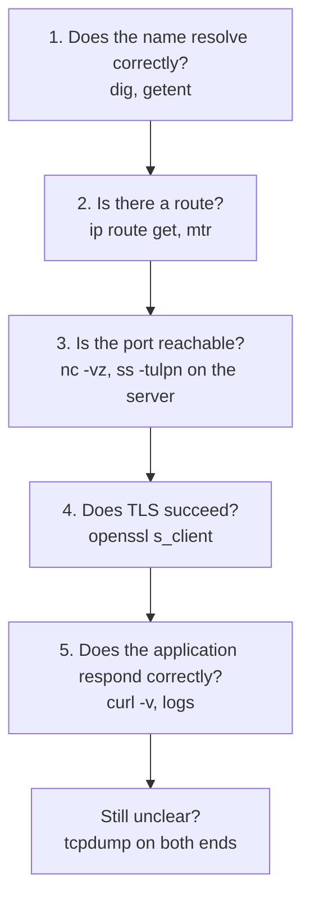

# Network Troubleshooting Toolkit

## What You'll Learn

- A layered method that turns "it can't connect" into a specific, fixable cause
- The one or two commands that answer each question
- How to capture and read packets with `tcpdump` when everything else looks fine
- How to work through the network incidents you're most likely to see

## The Method: Work Up the Stack



Answer each question before moving to the next. Most problems are found at steps 1 and 3.

## Step 1: DNS

```bash
getent hosts api.internal.example.com          # what applications actually get
dig +short api.internal.example.com            # what DNS returns
dig @10.0.0.2 api.internal.example.com         # ask the VPC resolver explicitly
```

- Different answers from `getent` and `dig`: check `/etc/hosts` and `nsswitch.conf`.
- Different answers from different resolvers: split-horizon zones or caching.

More in [DNS](02-dns.md).

## Step 2: Routing and Path

```bash
ip route get 10.0.3.20          # which interface and source IP will be used
ping -c 3 10.0.3.20             # ICMP reachability (often blocked — not conclusive)
mtr -rwc 50 10.0.3.20           # per-hop loss and latency over 50 probes
mtr -rwc 50 -T -P 443 api.example.com   # use TCP to port 443 when ICMP is filtered
```

Reading `mtr`: loss that appears at one hop but **not** on later hops is usually that router rate-limiting ICMP replies — harmless. Loss that starts at a hop and continues to the destination is real.

## Step 3: Port Reachability

From the client:

```bash
nc -vz -w 3 10.0.3.20 5432
```

| Output | Meaning | Look at |
|---|---|---|
| `succeeded` / `open` | TCP handshake completed | Move to TLS and application |
| `Connection refused` | Host reached; nothing listening | The service, its port, its bind address |
| Hangs, then `timed out` | Packets dropped | Security groups, NACLs, host firewall, routes |

On the server:

```bash
sudo ss -tulpn | grep 5432            # listening, and on which address?
sudo iptables -S | head; sudo nft list ruleset | head   # host firewall rules
sudo ufw status verbose
```

`LISTEN 127.0.0.1:5432` means only local connections are accepted, even if every firewall allows the port.

## Step 4: TLS

```bash
openssl s_client -connect api.example.com:443 -servername api.example.com </dev/null 2>&1 \
  | grep -E 'Verify return code|subject=|issuer=|Protocol'
```

`Verify return code: 0 (ok)` means the chain and hostname are valid for this client. Anything else points to the error table in [HTTP and TLS](03-http-and-tls.md#common-tls-errors).

## Step 5: The Application

```bash
curl -sv https://api.example.com/health 2>&1 | grep -E '^[<>*]'

# Bypass DNS and hit one specific backend with the right Host header and SNI
curl -sv --resolve api.example.com:443:10.0.2.15 https://api.example.com/health

# Timing breakdown
curl -s -o /dev/null -w 'dns %{time_namelookup} connect %{time_connect} tls %{time_appconnect} ttfb %{time_starttransfer} total %{time_total} code %{http_code}\n' \
  https://api.example.com/health
```

`--resolve` is invaluable for testing one backend behind a load balancer, or a new server before changing DNS.

## When All Else Fails: tcpdump

Capture on both ends and compare. What one side sends but the other never receives was dropped in between.

```bash
# Handshakes and resets to a database
sudo tcpdump -ni eth0 'host 10.0.3.20 and port 5432 and (tcp[tcpflags] & (tcp-syn|tcp-rst) != 0)'

# DNS queries and answers
sudo tcpdump -ni any port 53

# Save a bounded capture for Wireshark
sudo tcpdump -ni eth0 -s 0 -c 5000 -w /tmp/api.pcap 'host 10.0.2.15 and port 8080'
```

Reading the flags:

| Pattern | Meaning |
|---|---|
| `[S]` sent repeatedly, no reply | Dropped by a firewall or routing — or the SYN reached the server but the reply is lost |
| `[S]` then `[R.]` | Port closed: connection refused |
| `[S]`, `[S.]`, `[.]` | Handshake completed |
| Data then `[R]` mid-stream | A peer or middlebox reset the connection — check proxy timeouts |
| Large packets retransmitted, small ones fine | MTU black hole |

!!! warning "Captures can contain secrets"
    Unencrypted traffic in a capture includes credentials and personal data. Capture only what you need, limit the packet count, and delete files when you're done.

## Inside Containers and Kubernetes

Minimal images don't include these tools. Bring them with you:

```bash
# Docker: share the target container's network namespace
docker run --rm -it --network container:orders-api nicolaka/netshoot

# Kubernetes: ephemeral debug container in the pod's network namespace
kubectl debug -it pod/orders-api-7c9d -n shop --image=nicolaka/netshoot --target=orders-api

# A throwaway pod to test from inside the cluster
kubectl run netcheck --rm -it --image=nicolaka/netshoot -n shop -- bash
```

See [Kubernetes Networking Troubleshooting](../../kubernetes/troubleshooting/02-networking-and-service-problems.md) for Service, endpoint, and NetworkPolicy checks.

## Scenario Playbook

### "Connection timed out" to a database from a new app server

1. `nc -vz db 5432` hangs → packets dropped.
2. `ip route get <db-ip>` looks right.
3. Check the database's security group: it allows the **old** app subnet, not the new one.
4. Fix the rule to reference the app's security group instead of a CIDR, so future subnets don't hit this again.

### DNS resolves, `curl` hangs after "Connected"

1. `curl -v` shows the TCP connection and then stalls during the TLS handshake.
2. Small requests work; large responses hang.
3. `ping -M do -s 1472 <host>` fails; `-s 1372` works → MTU black hole on a VPN or tunnel path.
4. Lower the MTU on the tunnel interface, or clamp TCP MSS on the gateway.

### Intermittent `502`s after enabling keep-alive

1. Load balancer logs show `upstream prematurely closed connection`.
2. The app server's keep-alive timeout is 5 seconds; the balancer's idle timeout is 60.
3. Set the app keep-alive above the balancer's idle timeout (for example 75 seconds).

### Everything is slow for pods, only for external calls

1. `time getent hosts api.stripe.com` inside the pod takes 200 ms or more.
2. `tcpdump port 53` shows each lookup trying every search domain first.
3. Use a trailing dot for external hosts or lower `ndots` — see [Kubernetes DNS](02-dns.md#kubernetes-dns-and-ndots).

## Quick Reference

| Question | Command |
|---|---|
| What does this name resolve to for applications? | `getent hosts NAME` |
| What does DNS say, from a specific server? | `dig @SERVER NAME` |
| Which route will be used? | `ip route get IP` |
| Where is loss or latency on the path? | `mtr -rwc 50 HOST` |
| Is the port open? | `nc -vz -w 3 HOST PORT` |
| What's listening here? | `sudo ss -tulpn` |
| Is the certificate valid? | `openssl s_client -connect HOST:443 -servername HOST` |
| Where does the time go? | `curl -w '...time_*...'` |
| Test one backend directly | `curl --resolve HOST:443:IP https://HOST/` |
| What's really on the wire? | `sudo tcpdump -ni IFACE 'host IP and port PORT'` |

## Common Mistakes

- Concluding "the network is down" because `ping` fails, when ICMP is simply blocked.
- Skipping DNS and debugging firewalls for an hour while the name points to the wrong address.
- Testing from your laptop instead of from the host or pod that actually has the problem.
- Reading a single `mtr` hop's ICMP loss as real packet loss.
- Capturing packets on only one side and guessing where they were dropped.

## Interview Questions

- A service can't reach a database. Walk through how you'd troubleshoot it, step by step.
- What's the difference in what you'd investigate for "connection refused" versus "connection timed out"?
- How do you test a specific backend behind a load balancer without changing DNS?
- How would you debug networking inside a Kubernetes pod whose image has no shell tools?
- When do you reach for `tcpdump`, and how do you read a failed handshake in its output?

## Next

You've finished Networking. Continue to [Git and Branching](../git/index.md), or apply these skills to [AWS networking](../../cloud/aws/03-vpc-networking.md).
