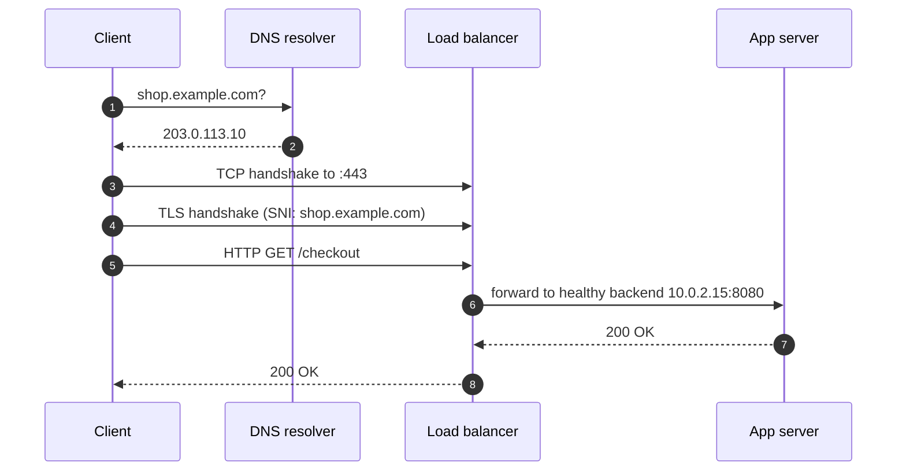

# Networking for DevOps

A large share of production incidents come down to networking: a DNS record that didn't update, an expired certificate, a load balancer timeout shorter than the application's, a security group that blocks one port. This track explains how traffic actually moves, so you can reason about those failures instead of guessing.

## What You'll Learn

- How IP addresses, subnets, routes, TCP connections, and ports work together
- How DNS resolution works end to end, and why it breaks in confusing ways
- What happens during an HTTP request and a TLS handshake
- How load balancers and reverse proxies route, health-check, and time out traffic
- A layered method and toolkit for diagnosing any "it can't connect" problem

## The Path of a Request

Each step can fail independently, and each failure has a different symptom. The chapters follow this path.

## Read in This Order

1. [TCP/IP, Ports, and Sockets](01-tcp-ip-ports-and-sockets.md) — addressing and CIDR, routing, NAT, TCP vs UDP, connection states, and MTU
2. [DNS](02-dns.md) — the resolution chain, record types, TTLs and caching, Linux resolvers, and Kubernetes DNS quirks
3. [HTTP and TLS](03-http-and-tls.md) — requests and status codes, HTTP/2 and HTTP/3, the TLS handshake, certificates, and common TLS errors
4. [Load Balancers and Reverse Proxies](04-load-balancers-and-reverse-proxies.md) — L4 vs L7, algorithms, health checks, timeouts, client IPs, and 502/503/504
5. [Network Troubleshooting Toolkit](05-network-troubleshooting-toolkit.md) — a layer-by-layer method with `dig`, `curl`, `ss`, `mtr`, `openssl`, and `tcpdump`

## Already Covered Elsewhere

| Topic | Where |
|---|---|
| Interfaces, loopback, and the `127.0.0.1` trap in containers | [Docker: Networking Foundations](../../docker/12-networking-fundamentals.md) |
| Bridge networks, NAT, and port publishing | [Docker Networking](../../docker/13-docker-networking.md) |
| Pod networking, Services, and CNI | [Kubernetes Networking](../../kubernetes/networking/index.md) |
| Ingress and Gateway API | [Ingress](../../kubernetes/networking/03-ingress-and-ingress-controllers.md), [Gateway API](../../kubernetes/networking/07-gateway-api.md) |
| VPCs, subnets, security groups, and Route 53 | [AWS Networking](../../cloud/aws/03-vpc-networking.md) |

## Next

Start with [TCP/IP, Ports, and Sockets](01-tcp-ip-ports-and-sockets.md).
