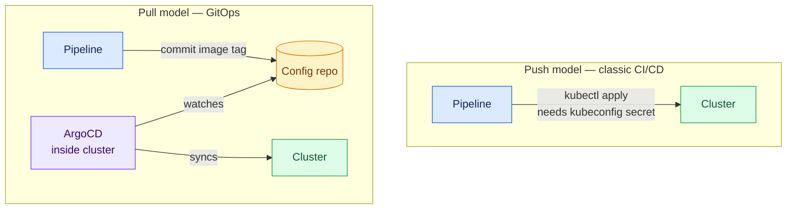
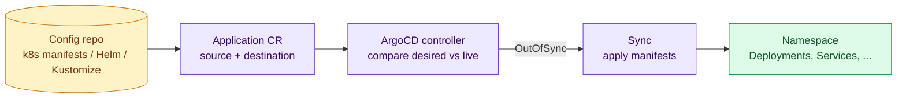
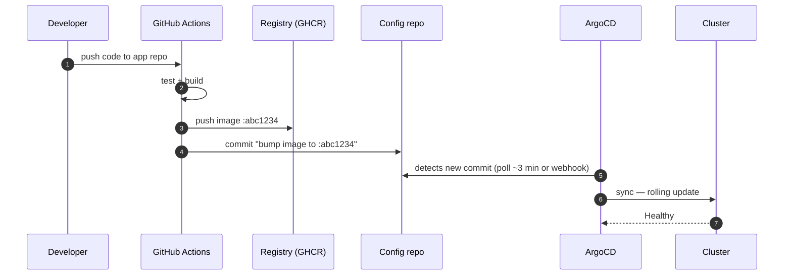
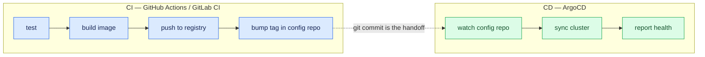

# ArgoCD and GitOps

ArgoCD is a **GitOps controller for Kubernetes**. Instead of your pipeline pushing changes into the cluster with `kubectl apply`, ArgoCD runs *inside* the cluster, watches a Git repository that describes the desired state, and continuously makes the cluster match it.

!!! info "Why GitOps"
    - **Git is the single source of truth** — every deploy is a commit; every rollback is a revert
    - **No cluster credentials in CI** — the pipeline never touches the cluster; ArgoCD pulls
    - **Drift detection** — if someone edits the cluster by hand, ArgoCD flags (or reverts) it
    - **Auditable** — `git log` *is* the deployment history

---

## Push vs Pull Deployment



The pull model removes the most dangerous secret from CI (cluster admin credentials) and decouples "a new image exists" from "the cluster changed."

---

## Installation

You need a Kubernetes cluster (minikube, kind, k3s, or managed). Then:

### 1. Install ArgoCD

```bash
kubectl create namespace argocd
kubectl apply -n argocd \
  -f https://raw.githubusercontent.com/argoproj/argo-cd/stable/manifests/install.yaml

# Wait for it to come up
kubectl -n argocd rollout status deploy/argocd-server
kubectl get pods -n argocd
```

### 2. Access the UI

```bash
# Port-forward for local access
kubectl port-forward svc/argocd-server -n argocd 8080:443
```

Open **https://localhost:8080** (accept the self-signed cert).

### 3. Get the initial admin password

```bash
kubectl -n argocd get secret argocd-initial-admin-secret \
  -o jsonpath="{.data.password}" | base64 -d; echo
```

Log in as `admin` with that password — then change it.

### 4. Install the CLI (optional but recommended)

```bash
# macOS
brew install argocd

# Linux
curl -sSL -o argocd https://github.com/argoproj/argo-cd/releases/latest/download/argocd-linux-amd64
sudo install -m 555 argocd /usr/local/bin/argocd

# Login
argocd login localhost:8080 --username admin --insecure
argocd account update-password
```

---

## Core Concepts



- **Application** — a custom resource pairing a Git source (repo + path + revision) with a destination (cluster + namespace).
- **Sync** — applying the manifests so live state matches Git. Manual or automated.
- **Health** — ArgoCD understands Kubernetes resources deeply enough to say whether a Deployment is *Progressing*, *Healthy*, or *Degraded*.
- **Sync status** — `Synced` (cluster == Git) or `OutOfSync` (drift or new commit).

---

## Your First Application

Point ArgoCD at the `k8s/` folder created in the [Java](java-github-actions.md) or [Python](python-github-actions.md) pipeline pages:

```yaml
# application.yaml
apiVersion: argoproj.io/v1alpha1
kind: Application
metadata:
  name: fastapi-demo
  namespace: argocd
spec:
  project: default

  source:
    repoURL: https://github.com/sameeralam3127/fastapi-demo.git
    targetRevision: main
    path: k8s                        # folder containing the manifests

  destination:
    server: https://kubernetes.default.svc   # the cluster ArgoCD runs in
    namespace: fastapi-demo

  syncPolicy:
    automated:
      prune: true                    # delete resources removed from Git
      selfHeal: true                 # revert manual cluster edits
    syncOptions:
      - CreateNamespace=true
```

```bash
kubectl apply -f application.yaml
argocd app get fastapi-demo
argocd app sync fastapi-demo        # only needed if automated sync is off
```

Within seconds the UI shows the app tree — Deployment, ReplicaSet, Pods, Service — with live health status.

!!! tip "Private repos"
    Register credentials once: `argocd repo add https://github.com/you/repo.git --username you --password <PAT>` — or connect via SSH deploy key. Apps referencing that repo authenticate automatically.

---

## The Full CI + GitOps Flow

The pattern used in production: **two repos** (or two folders) — application code and deployment config. CI builds the image and commits the new tag to the config repo; ArgoCD does the rest.



### The CI side: bump the tag

Add this job after `build-image` in the GitHub Actions workflow. It uses **Kustomize**, the cleanest way to change an image tag in Git:

```yaml
  update-manifest:
    needs: build-image
    runs-on: ubuntu-latest
    steps:
      - name: Check out config repo
        uses: actions/checkout@v4
        with:
          repository: sameeralam3127/fastapi-demo-config
          token: ${{ secrets.CONFIG_REPO_PAT }}   # PAT with repo write access

      - name: Bump image tag
        run: |
          cd k8s
          kustomize edit set image \
            ghcr.io/${{ github.repository }}=ghcr.io/${{ github.repository }}:${{ github.sha }}

      - name: Commit and push
        run: |
          git config user.name "ci-bot"
          git config user.email "ci-bot@users.noreply.github.com"
          git commit -am "Deploy ${{ github.sha }}"
          git push
```

With a `k8s/kustomization.yaml` in the config repo:

```yaml
apiVersion: kustomize.config.k8s.io/v1beta1
kind: Kustomization
resources:
  - deployment.yaml
  - service.yaml
images:
  - name: ghcr.io/sameeralam3127/fastapi-demo
    newTag: abc1234        # CI rewrites this line on every release
```

Point the ArgoCD `Application.spec.source.path` at that folder — ArgoCD detects Kustomize automatically.

!!! warning "Never use `:latest` with GitOps"
    ArgoCD compares *manifests*, not image contents. If the manifest always says `:latest`, a new push changes nothing in Git and ArgoCD sees nothing to sync. Immutable tags (the commit SHA) are what make GitOps work — and what make rollbacks a one-line revert.

---

## Sync Policies and Rollback

| Policy | Behavior | Use when |
|---|---|---|
| Manual sync | ArgoCD shows OutOfSync; a human clicks Sync | Production with change control |
| `automated` | Syncs on every Git change | Dev/staging, mature teams |
| `automated + prune` | Also deletes resources removed from Git | Config repo is truly authoritative |
| `automated + selfHeal` | Reverts manual `kubectl` edits | Enforcing no-drift policy |

Rollback is just Git:

```bash
# In the config repo
git revert HEAD
git push
# ArgoCD syncs the cluster back to the previous image automatically
```

Or from the CLI for an emergency, bypassing Git temporarily:

```bash
argocd app history fastapi-demo
argocd app rollback fastapi-demo <ID>
```

---

## Managing Many Apps: App of Apps

Once you have several services, define one parent Application whose "manifests" are… more Applications:

```
argocd-apps/
├── root-app.yaml          # points at apps/
└── apps/
    ├── fastapi-demo.yaml
    ├── spring-demo.yaml
    └── monitoring.yaml
```

```yaml
# root-app.yaml
apiVersion: argoproj.io/v1alpha1
kind: Application
metadata:
  name: root
  namespace: argocd
spec:
  project: default
  source:
    repoURL: https://github.com/sameeralam3127/argocd-apps.git
    targetRevision: main
    path: apps
  destination:
    server: https://kubernetes.default.svc
    namespace: argocd
  syncPolicy:
    automated: { prune: true, selfHeal: true }
```

Apply `root-app.yaml` once by hand; every app added to the `apps/` folder afterwards deploys itself.

---

## Best Practices

- [x] Keep **app code** and **deployment config** in separate repos (or at minimum separate folders with separate CI triggers)
- [x] Deploy **immutable tags** (commit SHA), never `:latest`
- [x] Start with manual sync in production; enable `automated` once you trust the flow
- [x] Enable `selfHeal` to surface and revert manual drift
- [x] Use the **app-of-apps** pattern from the second service onwards
- [x] Add a Git webhook (Settings → Webhooks → `https://argocd.example.com/api/webhook`) so syncs trigger in seconds instead of the ~3-minute poll

---

## Where This Leaves the Pipeline



CI owns everything up to and including a Git commit. ArgoCD owns everything after. The interface between them is a version-controlled, reviewable, revertible text change — which is the entire point of GitOps.
