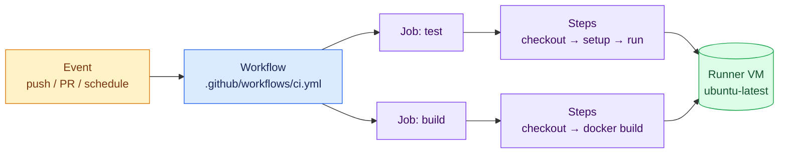
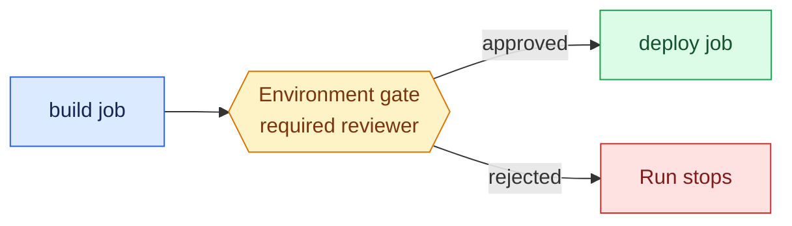

# GitHub Actions Deep Dive

GitHub Actions is GitHub's built-in CI/CD platform. There is nothing to install for hosted usage: you commit a YAML file under `.github/workflows/`, and GitHub runs it on managed virtual machines every time a matching event fires.

!!! info "Why teams pick GitHub Actions"
    - **Zero setup** — no server to run, no plugins to manage
    - **Marketplace** — thousands of reusable actions (`actions/checkout`, `docker/build-push-action`, …)
    - **Native to the repo** — pipeline status shows on every commit and pull request
    - **Free tier** — unlimited minutes for public repos, generous quota for private ones

---

## How It Works



The vocabulary, top-down:

- **Workflow** — one YAML file in `.github/workflows/`. A repo can have many.
- **Event** — what triggers the workflow (`push`, `pull_request`, `schedule`, `workflow_dispatch` for a manual button, `release`, …).
- **Job** — a group of steps that runs on one fresh runner VM. Jobs run **in parallel** unless you chain them with `needs:`.
- **Step** — a single shell command (`run:`) or a reusable action (`uses:`).
- **Runner** — the machine executing the job. GitHub-hosted (`ubuntu-latest`, `windows-latest`, `macos-latest`) or self-hosted.

---

## Setup: Your First Workflow

No installation needed — just a file in the right place.

### 1. Create the workflow file

```bash
mkdir -p .github/workflows
```

### 2. Add `.github/workflows/ci.yml`

```yaml
name: CI

on:
  push:
    branches: [main]
  pull_request:
    branches: [main]

jobs:
  test:
    runs-on: ubuntu-latest
    steps:
      - name: Check out the code
        uses: actions/checkout@v4

      - name: Say hello
        run: echo "Pipeline is alive on $(uname -a)"
```

### 3. Push and watch

```bash
git add .github/workflows/ci.yml
git commit -m "Add first workflow"
git push
```

Open the repo's **Actions** tab — the run appears within seconds.

!!! tip "Manual runs"
    Add `workflow_dispatch:` under `on:` to get a **Run workflow** button in the UI. Invaluable for deploy workflows.

---

## Anatomy of a Real Workflow

The example below shows most of the features you will use daily — read the comments:

```yaml
name: Build and Test

on:
  push:
    branches: [main]
    paths-ignore: ["docs/**", "*.md"]   # don't waste minutes on doc changes
  pull_request:

# Cancel superseded runs on the same branch
concurrency:
  group: ${{ github.workflow }}-${{ github.ref }}
  cancel-in-progress: true

# Least-privilege token for the whole workflow
permissions:
  contents: read

env:
  APP_NAME: demo-app                     # workflow-wide variable

jobs:
  test:
    runs-on: ubuntu-latest
    strategy:
      matrix:                            # run the job once per combination
        python-version: ["3.11", "3.12", "3.13"]
    steps:
      - uses: actions/checkout@v4

      - uses: actions/setup-python@v5
        with:
          python-version: ${{ matrix.python-version }}
          cache: pip                     # built-in dependency caching

      - name: Install and test
        run: |
          pip install -r requirements.txt
          pytest -v

  build:
    needs: test                          # only runs if every matrix leg passed
    runs-on: ubuntu-latest
    steps:
      - uses: actions/checkout@v4
      - name: Build artifact
        run: echo "build something here"
      - name: Upload artifact
        uses: actions/upload-artifact@v4
        with:
          name: dist
          path: dist/
```

### Key building blocks

| Feature | Syntax | What it does |
|---|---|---|
| Job dependency | `needs: test` | Chains jobs; otherwise parallel |
| Matrix | `strategy.matrix` | Fan out one job across versions/OSes |
| Caching | `cache: pip` / `actions/cache@v4` | Reuse dependencies between runs |
| Artifacts | `upload-artifact` / `download-artifact` | Pass files between jobs |
| Conditions | `if: github.ref == 'refs/heads/main'` | Skip steps/jobs conditionally |
| Concurrency | `concurrency:` | Cancel outdated runs |
| Permissions | `permissions:` | Scope the auto-issued `GITHUB_TOKEN` |

---

## Secrets and Variables

Never hardcode credentials in YAML. Store them in the repo:

**Settings → Secrets and variables → Actions**

- **Secrets** — encrypted, masked in logs (`DOCKERHUB_TOKEN`, `SSH_KEY`, …)
- **Variables** — plain config values (`REGISTRY_URL`, …)

```yaml
steps:
  - name: Log in to Docker Hub
    uses: docker/login-action@v3
    with:
      username: ${{ vars.DOCKERHUB_USERNAME }}
      password: ${{ secrets.DOCKERHUB_TOKEN }}
```

!!! warning "The built-in token is often enough"
    Every run gets `secrets.GITHUB_TOKEN` automatically. It can push images to **GitHub Container Registry (GHCR)** without any extra secret — one reason GHCR is the lowest-friction registry for Actions users.

---

## Environments and Deployment Gates

Environments add protection rules to deploy jobs:

**Settings → Environments → New environment** (e.g. `production`), then add **required reviewers** or a wait timer.

```yaml
jobs:
  deploy:
    runs-on: ubuntu-latest
    environment:
      name: production
      url: https://myapp.example.com     # shown on the run page
    steps:
      - name: Deploy
        run: ./deploy.sh
```



Environment-scoped secrets (e.g. a production kubeconfig) are only exposed to jobs targeting that environment — a second layer of least privilege.

---

## Self-Hosted Runners

Use self-hosted runners when you need more CPU/RAM, access to a private network, GPUs, or persistent caches.

### Install on Ubuntu

1. In the repo (or org): **Settings → Actions → Runners → New self-hosted runner** — GitHub shows a personalized token with these steps:

```bash
# Download the runner
mkdir actions-runner && cd actions-runner
curl -o actions-runner-linux-x64.tar.gz -L \
  https://github.com/actions/runner/releases/latest/download/actions-runner-linux-x64-2.319.1.tar.gz
tar xzf actions-runner-linux-x64.tar.gz

# Register it (token comes from the GitHub UI)
./config.sh --url https://github.com/<owner>/<repo> --token <TOKEN>

# Run as a systemd service so it survives reboots
sudo ./svc.sh install
sudo ./svc.sh start
sudo ./svc.sh status
```

2. Target it from a workflow:

```yaml
jobs:
  build:
    runs-on: self-hosted        # or a custom label like [self-hosted, gpu]
```

!!! danger "Never use self-hosted runners on public repos"
    Anyone can open a pull request against a public repo. If that PR's workflow runs on your machine, you have handed strangers shell access. Self-hosted runners belong with private repos only.

---

## Reusable Workflows

Once several repos share the same pipeline shape, extract it:

```yaml
# .github/workflows/reusable-docker.yml — the callee
on:
  workflow_call:
    inputs:
      image-name:
        required: true
        type: string

jobs:
  build:
    runs-on: ubuntu-latest
    steps:
      - uses: actions/checkout@v4
      - run: docker build -t ${{ inputs.image-name }} .
```

```yaml
# any repo — the caller
jobs:
  docker:
    uses: my-org/pipelines/.github/workflows/reusable-docker.yml@main
    with:
      image-name: my-service
```

---

## Best Practices Checklist

- [x] Pin actions to a major version (`@v4`) or a commit SHA for supply-chain safety
- [x] Set `permissions:` explicitly — default to `contents: read`
- [x] Use `concurrency` to cancel superseded runs and save minutes
- [x] Cache dependencies (`setup-java`/`setup-python` have it built in)
- [x] Gate production deploys with an **environment** and required reviewers
- [x] Keep secrets in GitHub, never in YAML or code
- [x] Use `paths-ignore` so docs changes don't trigger builds

---

## Next Steps

Now apply all of this to a real application:

- [Java pipeline: Spring Boot from tests to a hosted container](java-github-actions.md)
- [Python pipeline: FastAPI from tests to a hosted container](python-github-actions.md)
