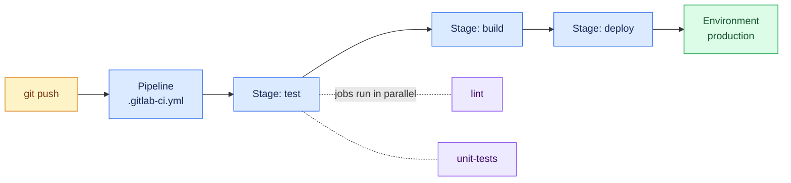

# GitLab CI/CD

GitLab bundles source control, CI/CD, and a container registry in one application. The pipeline lives in a single file at the repo root — `.gitlab-ci.yml` — and runs on **runners**, which are agents you (or gitlab.com) host.

!!! info "GitHub Actions vs GitLab CI at a glance"
    | Concept | GitHub Actions | GitLab CI |
    |---|---|---|
    | Pipeline file | `.github/workflows/*.yml` (many) | `.gitlab-ci.yml` (one, can include others) |
    | Execution unit | job → steps | stage → jobs |
    | Ordering | `needs:` between jobs | `stages:` list (+ `needs:` for DAGs) |
    | Reusable units | marketplace actions | `include:`, templates, `extends:` |
    | Registry | GHCR | built-in per-project registry |
    | Agents | hosted or self-hosted runners | shared or self-hosted runners |

---

## How a GitLab Pipeline Runs



- Jobs in the **same stage** run in parallel.
- A stage starts only when the previous stage succeeded.
- Each job runs in a fresh container defined by its `image:`.

---

## Runner Installation (Ubuntu)

On gitlab.com, shared runners work out of the box. For self-hosted GitLab or private infrastructure, install your own:

```bash
# 1. Add the official repository and install
curl -L "https://packages.gitlab.com/install/repositories/runner/gitlab-runner/script.deb.sh" | sudo bash
sudo apt install gitlab-runner

# 2. Register the runner
#    Get the URL and token from: Project → Settings → CI/CD → Runners
sudo gitlab-runner register \
  --url https://gitlab.com \
  --token <RUNNER_TOKEN> \
  --executor docker \
  --docker-image alpine:latest

# 3. Verify
sudo gitlab-runner status
sudo gitlab-runner list
```

!!! tip "Pick the docker executor"
    The `docker` executor runs every job in a clean container — the closest match to how gitlab.com shared runners behave, and it keeps the runner host clean.

---

## Anatomy of `.gitlab-ci.yml`

```yaml
stages: [test, build, deploy]        # execution order

default:
  image: alpine:latest               # image used when a job doesn't set one

variables:
  APP_NAME: demo-app

unit-tests:
  stage: test
  image: python:3.13-slim
  script:
    - pip install -r requirements-dev.txt
    - pytest -v
  rules:
    - if: $CI_PIPELINE_SOURCE == "merge_request_event"
    - if: $CI_COMMIT_BRANCH == "main"

build-job:
  stage: build
  script:
    - echo "building $APP_NAME"
  artifacts:
    paths: [dist/]                   # pass files to later stages
    expire_in: 1 week

deploy-job:
  stage: deploy
  script:
    - ./deploy.sh
  environment:
    name: production
    url: https://myapp.example.com
  rules:
    - if: $CI_COMMIT_BRANCH == "main"
      when: manual                   # requires a click — a deploy gate
```

Key built-in variables you will use constantly:

| Variable | Meaning |
|---|---|
| `$CI_COMMIT_SHA` / `$CI_COMMIT_SHORT_SHA` | Commit being built |
| `$CI_COMMIT_BRANCH` | Branch name |
| `$CI_REGISTRY` | This GitLab's registry hostname |
| `$CI_REGISTRY_IMAGE` | `registry.gitlab.com/<group>/<project>` |
| `$CI_REGISTRY_USER` / `$CI_REGISTRY_PASSWORD` | Auto-issued registry credentials |
| `$CI_PIPELINE_SOURCE` | What triggered the run (`push`, `merge_request_event`, …) |

---

## Building Docker Images: Docker-in-Docker

Jobs run in containers, so building an image *inside* a job needs the docker-in-docker (`dind`) service:

```yaml
build-image:
  stage: build
  image: docker:27
  services:
    - docker:27-dind
  variables:
    DOCKER_TLS_CERTDIR: "/certs"
  script:
    - docker login -u $CI_REGISTRY_USER -p $CI_REGISTRY_PASSWORD $CI_REGISTRY
    - docker build -t $CI_REGISTRY_IMAGE:$CI_COMMIT_SHORT_SHA -t $CI_REGISTRY_IMAGE:latest .
    - docker push $CI_REGISTRY_IMAGE --all-tags
```

The pushed image appears under the project's **Deploy → Container Registry** — no external registry account needed.

---

## Full Example: Python Web App

The same FastAPI app from the [Python pipeline page](python-github-actions.md), expressed in GitLab CI:

```yaml
stages: [test, build, deploy]

variables:
  IMAGE_TAG: $CI_REGISTRY_IMAGE:$CI_COMMIT_SHORT_SHA

lint:
  stage: test
  image: python:3.13-slim
  script:
    - pip install ruff
    - ruff check .

pytest:
  stage: test
  image: python:3.13-slim
  cache:
    key: { files: [requirements-dev.txt] }
    paths: [.cache/pip]
  variables:
    PIP_CACHE_DIR: "$CI_PROJECT_DIR/.cache/pip"
  script:
    - pip install -r requirements-dev.txt
    - pytest -v --cov=app --junitxml=report.xml
  artifacts:
    when: always
    reports:
      junit: report.xml              # test results shown in MR UI

build-image:
  stage: build
  image: docker:27
  services: [docker:27-dind]
  script:
    - docker login -u $CI_REGISTRY_USER -p $CI_REGISTRY_PASSWORD $CI_REGISTRY
    - docker build -t $IMAGE_TAG -t $CI_REGISTRY_IMAGE:latest .
    - docker push $CI_REGISTRY_IMAGE --all-tags
  rules:
    - if: $CI_COMMIT_BRANCH == "main"

deploy-production:
  stage: deploy
  image: alpine:latest
  before_script:
    - apk add --no-cache openssh-client
    - eval $(ssh-agent -s)
    - echo "$DEPLOY_SSH_KEY" | ssh-add -
  script:
    - ssh -o StrictHostKeyChecking=no $DEPLOY_USER@$DEPLOY_HOST "
        docker login -u $CI_REGISTRY_USER -p $CI_REGISTRY_PASSWORD $CI_REGISTRY &&
        docker pull $CI_REGISTRY_IMAGE:latest &&
        docker stop app || true && docker rm app || true &&
        docker run -d --name app --restart unless-stopped -p 80:8000 $CI_REGISTRY_IMAGE:latest"
  environment:
    name: production
    url: http://myapp.example.com
  rules:
    - if: $CI_COMMIT_BRANCH == "main"
      when: manual
```

Set `DEPLOY_SSH_KEY`, `DEPLOY_USER`, and `DEPLOY_HOST` under **Settings → CI/CD → Variables** (mark the key as *Masked* and *Protected*).

---

## Full Example: Java Web App

The Spring Boot app from the [Java pipeline page](java-github-actions.md), in GitLab CI:

```yaml
stages: [test, build, deploy]

maven-verify:
  stage: test
  image: maven:3.9-eclipse-temurin-21
  cache:
    key: maven
    paths: [.m2/repository]
  variables:
    MAVEN_OPTS: "-Dmaven.repo.local=$CI_PROJECT_DIR/.m2/repository"
  script:
    - mvn --batch-mode verify
  artifacts:
    when: always
    reports:
      junit: target/surefire-reports/TEST-*.xml

build-image:
  stage: build
  image: docker:27
  services: [docker:27-dind]
  script:
    - docker login -u $CI_REGISTRY_USER -p $CI_REGISTRY_PASSWORD $CI_REGISTRY
    - docker build -t $CI_REGISTRY_IMAGE:$CI_COMMIT_SHORT_SHA -t $CI_REGISTRY_IMAGE:latest .
    - docker push $CI_REGISTRY_IMAGE --all-tags
  rules:
    - if: $CI_COMMIT_BRANCH == "main"

deploy-production:
  stage: deploy
  script:
    - echo "Same SSH pattern as the Python example, or hand off to ArgoCD"
  environment:
    name: production
  rules:
    - if: $CI_COMMIT_BRANCH == "main"
      when: manual
```

---

## Best Practices

- [x] Use `rules:` (not the legacy `only/except`) to control when jobs run
- [x] Publish JUnit reports with `artifacts.reports.junit` — failures render inline in merge requests
- [x] Cache dependencies keyed on the lockfile (`cache.key.files`)
- [x] Make production deploys `when: manual` and tie them to an `environment`
- [x] Mark credential variables **Masked** and **Protected**
- [x] Split long pipelines with `include:` once they grow past ~200 lines

For Kubernetes deployments, the GitOps handoff works exactly as with GitHub Actions — the pipeline builds and pushes the image, then [ArgoCD](argocd.md) syncs the manifests.
