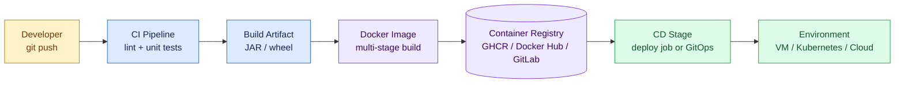
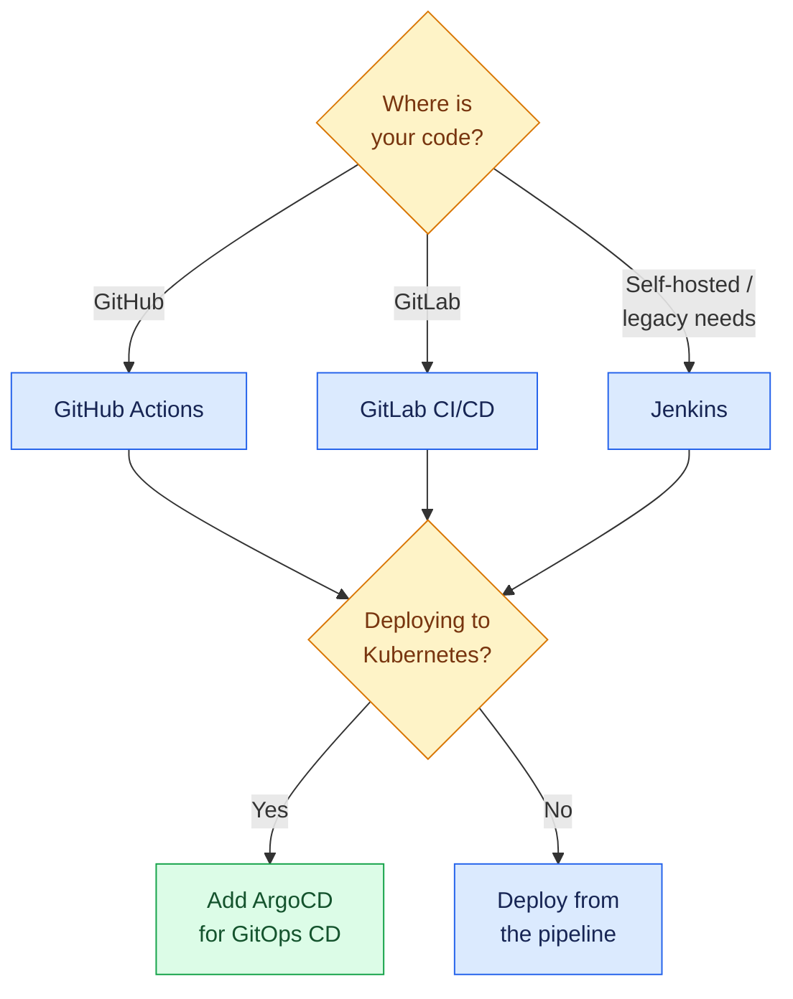

# CI/CD Pipelines

CI/CD is the automation backbone of modern software delivery. **Continuous Integration (CI)** builds and tests every change as soon as it is pushed. **Continuous Delivery/Deployment (CD)** packages that change — usually as a container image — and ships it to an environment automatically.

This section is a practical, tool-by-tool deep dive. Every page includes installation and setup guidance, real YAML you can copy, and diagrams of how the pieces connect.

!!! info "What you will learn in this section"
    - How a commit flows through **test → build → image → registry → deploy**
    - **GitHub Actions** from zero to production pipelines
    - Complete pipelines for a **Java (Spring Boot)** and a **Python (FastAPI)** web app
    - **GitLab CI/CD** with runners and the built-in container registry
    - **GitOps with ArgoCD** — letting a controller deploy for you
    - Where **Jenkins** fits and how its model compares

---

## The Big Picture

Every CI/CD pipeline, regardless of tool, is a variation of this flow:

The stages map to concrete tool features:

| Stage | GitHub Actions | GitLab CI | Jenkins | ArgoCD |
|---|---|---|---|---|
| Trigger | `on: push` | `rules:` | webhook / poll | Git watch (GitOps) |
| Test | job + steps | `stage: test` | `stage('Test')` | not its job |
| Build image | `docker/build-push-action` | `docker build` in job | `docker.build()` | not its job |
| Store image | GHCR / Docker Hub | GitLab Registry | any registry | reads registry via manifests |
| Deploy | deploy job / environment | `environment:` | `stage('Deploy')` | **automatic sync** |

!!! tip "CI tools push, ArgoCD pulls"
    GitHub Actions, GitLab CI, and Jenkins **push** changes to servers.
    ArgoCD flips the model: it runs *inside* the cluster and **pulls** the desired state from Git. Most production setups combine both — CI builds the image, ArgoCD deploys it.

---

## Choosing a Tool

- **GitHub Actions** — zero infrastructure to start, huge marketplace of reusable actions, free minutes for public repos. The default choice if your code lives on GitHub.
- **GitLab CI/CD** — a single application for repos, pipelines, and a container registry. Excellent for self-hosted setups.
- **Jenkins** — self-hosted, plugin-driven, infinitely customizable. Common in enterprises with existing investment. See the [Jenkins guide](jenkins.md).
- **ArgoCD** — not a CI tool at all; a Kubernetes GitOps controller that continuously reconciles your cluster with Git.

---

## Section Contents

| Page | What it covers |
|---|---|
| [GitHub Actions Deep Dive](github-actions.md) | Concepts, workflow anatomy, runners, secrets, caching, matrix builds, self-hosted runner setup |
| [Java Pipeline: Code to Production](java-github-actions.md) | Spring Boot app — JUnit tests, Maven build, multi-stage Docker image, push to GHCR, deploy |
| [Python Pipeline: Code to Production](python-github-actions.md) | FastAPI app — pytest, ruff, Docker image, push, deploy |
| [GitLab CI/CD](gitlab-ci.md) | `.gitlab-ci.yml`, runner installation, built-in registry, Java and Python examples |
| [ArgoCD and GitOps](argocd.md) | Install ArgoCD on Kubernetes, Application manifests, CI + GitOps end-to-end flow |
| [Jenkins](jenkins.md) | Installation on Ubuntu, first pipeline, core concepts |

!!! note "Suggested reading order"
    Start with the GitHub Actions deep dive, then follow the Java **or** Python pipeline page end-to-end (they are parallel tracks — same pipeline, different stack). Finish with ArgoCD to see how GitOps replaces the deploy stage.
