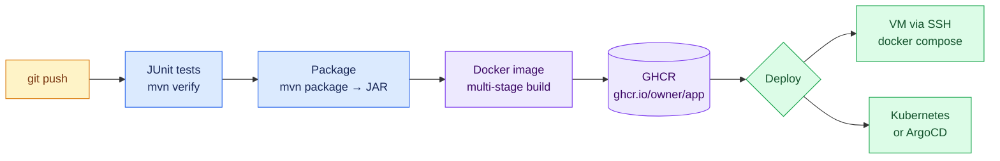
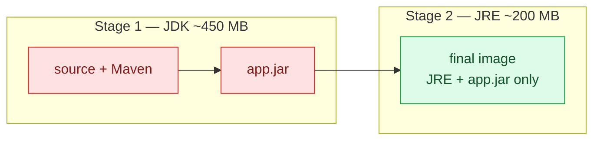
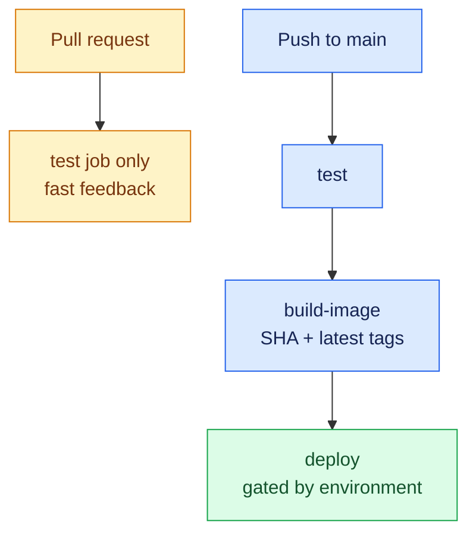

# Java Pipeline: Spring Boot from Code to Production

This page builds one complete, working pipeline for a Java web application: every push runs the tests, builds the JAR, packages it into a small Docker image, pushes the image to GitHub Container Registry (GHCR), and deploys it.



---

## The Application

A minimal Spring Boot web app. Project layout:

```
spring-demo/
├── .github/workflows/pipeline.yml
├── src/
│   ├── main/java/com/example/demo/
│   │   ├── DemoApplication.java
│   │   └── HelloController.java
│   └── test/java/com/example/demo/
│       └── HelloControllerTest.java
├── Dockerfile
└── pom.xml
```

### The controller

```java
// src/main/java/com/example/demo/HelloController.java
package com.example.demo;

import org.springframework.web.bind.annotation.GetMapping;
import org.springframework.web.bind.annotation.RestController;

@RestController
public class HelloController {

    @GetMapping("/")
    public String hello() {
        return "Hello from Spring Boot CI/CD!";
    }

    @GetMapping("/health")
    public String health() {
        return "OK";
    }
}
```

### The test the pipeline will run

```java
// src/test/java/com/example/demo/HelloControllerTest.java
package com.example.demo;

import org.junit.jupiter.api.Test;
import org.springframework.beans.factory.annotation.Autowired;
import org.springframework.boot.test.autoconfigure.web.servlet.WebMvcTest;
import org.springframework.test.web.servlet.MockMvc;

import static org.springframework.test.web.servlet.request.MockMvcRequestBuilders.get;
import static org.springframework.test.web.servlet.result.MockMvcResultMatchers.*;

@WebMvcTest(HelloController.class)
class HelloControllerTest {

    @Autowired
    private MockMvc mockMvc;

    @Test
    void rootReturnsGreeting() throws Exception {
        mockMvc.perform(get("/"))
               .andExpect(status().isOk())
               .andExpect(content().string("Hello from Spring Boot CI/CD!"));
    }

    @Test
    void healthEndpointIsUp() throws Exception {
        mockMvc.perform(get("/health"))
               .andExpect(status().isOk());
    }
}
```

### `pom.xml` essentials

```xml
<parent>
    <groupId>org.springframework.boot</groupId>
    <artifactId>spring-boot-starter-parent</artifactId>
    <version>3.4.1</version>
</parent>

<properties>
    <java.version>21</java.version>
</properties>

<dependencies>
    <dependency>
        <groupId>org.springframework.boot</groupId>
        <artifactId>spring-boot-starter-web</artifactId>
    </dependency>
    <dependency>
        <groupId>org.springframework.boot</groupId>
        <artifactId>spring-boot-starter-test</artifactId>
        <scope>test</scope>
    </dependency>
</dependencies>
```

Verify locally before automating:

```bash
./mvnw verify          # runs the JUnit tests
./mvnw package         # produces target/demo-0.0.1-SNAPSHOT.jar
java -jar target/*.jar # http://localhost:8080
```

---

## The Dockerfile: Multi-Stage Build

A multi-stage build compiles inside a full JDK image but ships only a slim JRE image — the result is roughly a third of the size and contains no build tools.

```dockerfile
# ---- Stage 1: build ----
FROM eclipse-temurin:21-jdk AS build
WORKDIR /app

# Cache dependencies: copy the build definition first, source later
COPY mvnw pom.xml ./
COPY .mvn .mvn
RUN ./mvnw dependency:go-offline -q

COPY src src
RUN ./mvnw package -DskipTests -q

# ---- Stage 2: runtime ----
FROM eclipse-temurin:21-jre
WORKDIR /app

# Run as a non-root user
RUN useradd --system --uid 1001 appuser
USER appuser

COPY --from=build /app/target/*.jar app.jar

EXPOSE 8080
HEALTHCHECK --interval=30s --timeout=3s \
  CMD curl -sf http://localhost:8080/health || exit 1
ENTRYPOINT ["java", "-jar", "app.jar"]
```



!!! tip "Tests run in CI, not in Docker"
    The Dockerfile uses `-DskipTests` deliberately. Tests belong in a dedicated pipeline job where failures are reported clearly — the image build should only run after tests have already passed.

---

## The Complete Workflow

`.github/workflows/pipeline.yml`:

```yaml
name: Java CI/CD

on:
  push:
    branches: [main]
  pull_request:

env:
  REGISTRY: ghcr.io
  IMAGE_NAME: ${{ github.repository }}   # e.g. sameeralam3127/spring-demo

concurrency:
  group: ${{ github.workflow }}-${{ github.ref }}
  cancel-in-progress: true

jobs:
  # ---------- CI: test on every push and PR ----------
  test:
    runs-on: ubuntu-latest
    steps:
      - uses: actions/checkout@v4

      - name: Set up JDK 21
        uses: actions/setup-java@v4
        with:
          distribution: temurin
          java-version: "21"
          cache: maven                    # caches ~/.m2 between runs

      - name: Run unit tests
        run: ./mvnw --batch-mode verify

      - name: Publish test report
        if: always()                      # report even when tests fail
        uses: actions/upload-artifact@v4
        with:
          name: surefire-reports
          path: target/surefire-reports/

  # ---------- Build and push the image (main branch only) ----------
  build-image:
    needs: test
    if: github.ref == 'refs/heads/main'
    runs-on: ubuntu-latest
    permissions:
      contents: read
      packages: write                     # allows pushing to GHCR
    outputs:
      image-tag: ${{ steps.meta.outputs.version }}
    steps:
      - uses: actions/checkout@v4

      - name: Log in to GHCR
        uses: docker/login-action@v3
        with:
          registry: ${{ env.REGISTRY }}
          username: ${{ github.actor }}
          password: ${{ secrets.GITHUB_TOKEN }}   # built-in, no setup needed

      - name: Extract image metadata
        id: meta
        uses: docker/metadata-action@v5
        with:
          images: ${{ env.REGISTRY }}/${{ env.IMAGE_NAME }}
          tags: |
            type=sha,prefix=            # tag = commit SHA
            type=raw,value=latest

      - name: Build and push
        uses: docker/build-push-action@v6
        with:
          context: .
          push: true
          tags: ${{ steps.meta.outputs.tags }}
          labels: ${{ steps.meta.outputs.labels }}
          cache-from: type=gha           # layer cache stored in Actions
          cache-to: type=gha,mode=max

  # ---------- Deploy to a VM over SSH ----------
  deploy:
    needs: build-image
    runs-on: ubuntu-latest
    environment:
      name: production
      url: http://myapp.example.com
    steps:
      - name: Deploy via SSH
        uses: appleboy/ssh-action@v1
        with:
          host: ${{ secrets.DEPLOY_HOST }}
          username: ${{ secrets.DEPLOY_USER }}
          key: ${{ secrets.DEPLOY_SSH_KEY }}
          script: |
            docker pull ghcr.io/${{ github.repository }}:latest
            docker stop spring-demo || true
            docker rm spring-demo || true
            docker run -d --name spring-demo --restart unless-stopped \
              -p 80:8080 ghcr.io/${{ github.repository }}:latest
```

### What each job guarantees



- **Pull requests** run only the `test` job — contributors get fast feedback, nothing is published.
- **Pushes to main** run test → build-image → deploy in sequence; each stage only runs if the previous one passed.
- Every image is tagged with the **commit SHA**, so any version can be rolled back with `docker run ...:<old-sha>`.

---

## Setup Checklist

1. **GHCR** — works out of the box; the `permissions: packages: write` block plus `GITHUB_TOKEN` handles login. The image appears under the repo's **Packages** section.
2. **Deploy secrets** — in **Settings → Secrets and variables → Actions** create:
   - `DEPLOY_HOST` — server IP or hostname
   - `DEPLOY_USER` — SSH user
   - `DEPLOY_SSH_KEY` — private key (generate a dedicated pair with `ssh-keygen -t ed25519`)
3. **Server prerequisites** — Docker installed, and the server logged in to GHCR if the image is private:
   ```bash
   echo <PAT-with-read:packages> | docker login ghcr.io -u <username> --password-stdin
   ```
4. **Environment gate** — create a `production` environment in repo settings and add yourself as a required reviewer to get a manual approval step before every deploy.

---

## Deploying to Kubernetes Instead

Replace the `deploy` job with a manifest and `kubectl` — or better, hand deployment to [ArgoCD](argocd.md):

```yaml
# k8s/deployment.yaml
apiVersion: apps/v1
kind: Deployment
metadata:
  name: spring-demo
spec:
  replicas: 2
  selector:
    matchLabels: { app: spring-demo }
  template:
    metadata:
      labels: { app: spring-demo }
    spec:
      containers:
        - name: spring-demo
          image: ghcr.io/OWNER/spring-demo:latest   # ArgoCD watches this file
          ports: [{ containerPort: 8080 }]
          readinessProbe:
            httpGet: { path: /health, port: 8080 }
---
apiVersion: v1
kind: Service
metadata:
  name: spring-demo
spec:
  selector: { app: spring-demo }
  ports: [{ port: 80, targetPort: 8080 }]
  type: LoadBalancer
```

With GitOps, the pipeline's last step is not `kubectl apply` — it is a commit that bumps the image tag in this file. The [ArgoCD page](argocd.md) walks through that flow end to end.

---

## Troubleshooting

| Symptom | Likely cause | Fix |
|---|---|---|
| `Permission denied` pushing to GHCR | Missing `packages: write` | Add the `permissions:` block to the job |
| Tests pass locally, fail in CI | JDK version mismatch | Pin the same version in `setup-java` and `pom.xml` |
| Image works locally, crashes on server | Architecture mismatch (Apple Silicon vs x86) | Add `platforms: linux/amd64` to `build-push-action` |
| Slow builds | No dependency cache | Ensure `cache: maven` and `cache-from/to: type=gha` are set |
| `./mvnw: Permission denied` | Wrapper not executable in Git | `git update-index --chmod=+x mvnw` |
