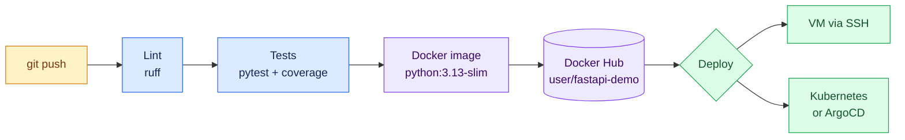
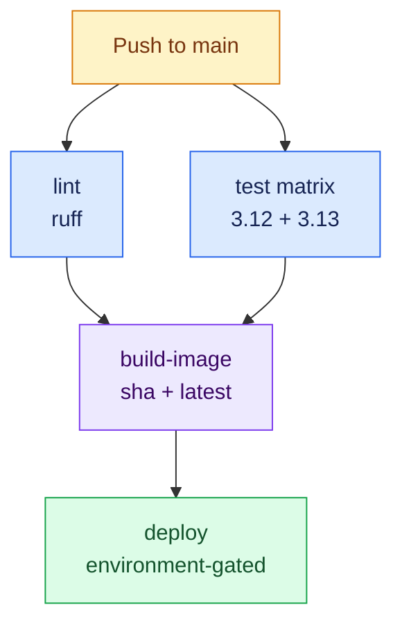

# Python Pipeline: FastAPI from Code to Production

This page mirrors the [Java pipeline](java-github-actions.md) for a Python stack: every push lints and tests a FastAPI web app, builds a slim Docker image, pushes it to **Docker Hub**, and deploys it. (The Java page used GHCR — this one uses Docker Hub so you see both registries; the steps are interchangeable.)



---

## The Application

```
fastapi-demo/
├── .github/workflows/pipeline.yml
├── app/
│   ├── __init__.py
│   └── main.py
├── tests/
│   └── test_main.py
├── Dockerfile
├── requirements.txt
└── requirements-dev.txt
```

### The app

```python
# app/main.py
from fastapi import FastAPI

app = FastAPI(title="FastAPI CI/CD Demo")


@app.get("/")
def read_root() -> dict:
    return {"message": "Hello from FastAPI CI/CD!"}


@app.get("/health")
def health() -> dict:
    return {"status": "ok"}
```

### The tests the pipeline will run

```python
# tests/test_main.py
from fastapi.testclient import TestClient

from app.main import app

client = TestClient(app)


def test_root_returns_greeting():
    response = client.get("/")
    assert response.status_code == 200
    assert response.json() == {"message": "Hello from FastAPI CI/CD!"}


def test_health_endpoint_is_up():
    response = client.get("/health")
    assert response.status_code == 200
    assert response.json()["status"] == "ok"
```

### Dependencies

```text
# requirements.txt — what the container needs
fastapi==0.115.6
uvicorn[standard]==0.34.0
```

```text
# requirements-dev.txt — what CI additionally needs
-r requirements.txt
pytest==8.3.4
pytest-cov==6.0.0
httpx==0.28.1
ruff==0.9.2
```

Verify locally before automating:

```bash
python -m venv .venv && source .venv/bin/activate
pip install -r requirements-dev.txt
ruff check .
pytest -v --cov=app
uvicorn app.main:app --reload   # http://localhost:8000
```

---

## The Dockerfile

Python images don't need a compile stage the way Java does, but a build stage still pays off: wheels are built once with build tools present, then installed into a clean runtime image.

```dockerfile
# ---- Stage 1: build wheels ----
FROM python:3.13-slim AS build
WORKDIR /app
COPY requirements.txt .
RUN pip wheel --no-cache-dir --wheel-dir /wheels -r requirements.txt

# ---- Stage 2: runtime ----
FROM python:3.13-slim
WORKDIR /app

# Run as a non-root user
RUN useradd --system --uid 1001 appuser

COPY --from=build /wheels /wheels
RUN pip install --no-cache-dir /wheels/* && rm -rf /wheels

COPY app app
USER appuser

EXPOSE 8000
HEALTHCHECK --interval=30s --timeout=3s \
  CMD python -c "import urllib.request; urllib.request.urlopen('http://localhost:8000/health')"
CMD ["uvicorn", "app.main:app", "--host", "0.0.0.0", "--port", "8000"]
```

!!! tip "Why `python:3.13-slim` and not `alpine`?"
    Alpine uses musl instead of glibc, so many wheels (numpy, pydantic-core, …) must compile from source — slower builds and occasional runtime surprises. `-slim` is small *and* compatible.

---

## The Complete Workflow

`.github/workflows/pipeline.yml`:

```yaml
name: Python CI/CD

on:
  push:
    branches: [main]
  pull_request:

env:
  IMAGE: ${{ vars.DOCKERHUB_USERNAME }}/fastapi-demo

concurrency:
  group: ${{ github.workflow }}-${{ github.ref }}
  cancel-in-progress: true

jobs:
  # ---------- CI: lint and test on every push and PR ----------
  lint:
    runs-on: ubuntu-latest
    steps:
      - uses: actions/checkout@v4
      - uses: actions/setup-python@v5
        with:
          python-version: "3.13"
      - name: Ruff lint and format check
        run: |
          pip install ruff
          ruff check .
          ruff format --check .

  test:
    runs-on: ubuntu-latest
    strategy:
      matrix:
        python-version: ["3.12", "3.13"]   # prove it works on both
    steps:
      - uses: actions/checkout@v4

      - uses: actions/setup-python@v5
        with:
          python-version: ${{ matrix.python-version }}
          cache: pip

      - name: Install dependencies
        run: pip install -r requirements-dev.txt

      - name: Run tests with coverage
        run: pytest -v --cov=app --cov-report=term-missing --cov-fail-under=80

  # ---------- Build and push the image (main branch only) ----------
  build-image:
    needs: [lint, test]
    if: github.ref == 'refs/heads/main'
    runs-on: ubuntu-latest
    steps:
      - uses: actions/checkout@v4

      - name: Log in to Docker Hub
        uses: docker/login-action@v3
        with:
          username: ${{ vars.DOCKERHUB_USERNAME }}
          password: ${{ secrets.DOCKERHUB_TOKEN }}

      - name: Build and push
        uses: docker/build-push-action@v6
        with:
          context: .
          push: true
          tags: |
            ${{ env.IMAGE }}:${{ github.sha }}
            ${{ env.IMAGE }}:latest
          cache-from: type=gha
          cache-to: type=gha,mode=max

  # ---------- Deploy ----------
  deploy:
    needs: build-image
    runs-on: ubuntu-latest
    environment:
      name: production
      url: http://myapp.example.com
    steps:
      - name: Deploy via SSH
        uses: appleboy/ssh-action@v1
        with:
          host: ${{ secrets.DEPLOY_HOST }}
          username: ${{ secrets.DEPLOY_USER }}
          key: ${{ secrets.DEPLOY_SSH_KEY }}
          script: |
            docker pull ${{ env.IMAGE }}:latest
            docker stop fastapi-demo || true
            docker rm fastapi-demo || true
            docker run -d --name fastapi-demo --restart unless-stopped \
              -p 80:8000 ${{ env.IMAGE }}:latest
```



Note that `lint` and `test` run **in parallel** — `build-image` waits for both via `needs: [lint, test]`.

---

## Setup Checklist

1. **Docker Hub token** — Docker Hub → **Account Settings → Security → New Access Token** (read/write scope).
2. **Repo configuration** — in **Settings → Secrets and variables → Actions**:
   - Variable `DOCKERHUB_USERNAME` — your Docker Hub username
   - Secret `DOCKERHUB_TOKEN` — the access token
   - Secrets `DEPLOY_HOST`, `DEPLOY_USER`, `DEPLOY_SSH_KEY` — as in the Java guide
3. **Environment gate** — create a `production` environment with a required reviewer for manual deploy approval.

---

## Kubernetes Variant

```yaml
# k8s/deployment.yaml
apiVersion: apps/v1
kind: Deployment
metadata:
  name: fastapi-demo
spec:
  replicas: 2
  selector:
    matchLabels: { app: fastapi-demo }
  template:
    metadata:
      labels: { app: fastapi-demo }
    spec:
      containers:
        - name: fastapi-demo
          image: docker.io/USER/fastapi-demo:latest
          ports: [{ containerPort: 8000 }]
          readinessProbe:
            httpGet: { path: /health, port: 8000 }
---
apiVersion: v1
kind: Service
metadata:
  name: fastapi-demo
spec:
  selector: { app: fastapi-demo }
  ports: [{ port: 80, targetPort: 8000 }]
  type: LoadBalancer
```

As with Java, the cleanest production setup lets [ArgoCD](argocd.md) apply this manifest instead of running `kubectl` from the pipeline.

---

## Troubleshooting

| Symptom | Likely cause | Fix |
|---|---|---|
| `ModuleNotFoundError: app` in tests | Missing `__init__.py` or wrong working dir | Add `app/__init__.py`; run pytest from repo root |
| Docker Hub push denied | Token lacks write scope | Regenerate the access token with read/write |
| Tests hang on `TestClient` | Missing `httpx` | It is required by `fastapi.testclient` — add to dev requirements |
| Wheels compile slowly in image build | Alpine base image | Switch to `python:3.13-slim` |
| Coverage gate fails | `--cov-fail-under=80` | Add tests, or tune the threshold consciously |
