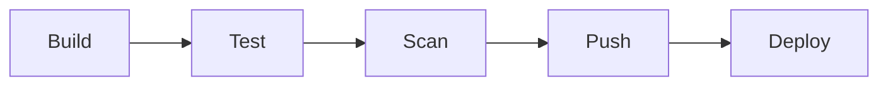

# CI/CD Pipelines for Kubernetes

## What You'll Learn

- The five stages every Kubernetes deployment pipeline needs, and what each one is actually guarding against
- A complete, working pipeline in GitHub Actions, Jenkins, and GitLab CI that builds, scans, and deploys to a cluster
- Where a push-based pipeline like these hits its limits — and what that motivates in later chapters

## Why This Matters

`kubectl apply`-ing a manifest from your laptop works until it doesn't: someone forgets a step, applies the wrong image tag, or ships straight to production without a test running first. A pipeline is what turns "deploying" from a person remembering a checklist into a machine enforcing one, every single time.

## Mental Model

Every CI/CD pipeline targeting Kubernetes is a variation on the same five stages, in the same order, because each stage is a gate that catches a specific class of problem before it reaches the cluster.



| Stage | Catches | Typical tools |
|---|---|---|
| Build | Code that doesn't compile/bundle | `docker build`, Buildx, Kaniko, buildpacks |
| Test | Logic bugs, regressions | Unit/integration test runners, coverage gates |
| Scan | Known CVEs, secrets committed by accident | Trivy, Grype, Snyk, gitleaks |
| Push | — (this stage just publishes the artifact) | Container registries: GHCR, ECR, Docker Hub |
| Deploy | Bad rollouts, unready pods | `kubectl`, Helm, Kustomize, `kubectl rollout status` as the gate |

Skipping a stage doesn't remove the risk it covers — it just means that risk reaches production instead of your pipeline.

### GitHub Actions

```yaml
# .github/workflows/deploy.yml
name: Build, Scan, and Deploy

on:
  push:
    branches: [main]

env:
  REGISTRY: ghcr.io
  IMAGE_NAME: ${{ github.repository }}

jobs:
  build-test-scan:
    runs-on: ubuntu-latest
    permissions:
      contents: read
      packages: write
    outputs:
      image_tag: ${{ steps.meta.outputs.tag }}
    steps:
      - uses: actions/checkout@v4

      - name: Run unit tests
        run: |
          docker build --target test -t app-test:ci .
          docker run --rm app-test:ci npm test

      - name: Set image tag from commit SHA
        id: meta
        run: echo "tag=${GITHUB_SHA::7}" >> "$GITHUB_OUTPUT"

      - name: Build image
        run: docker build -t "$REGISTRY/$IMAGE_NAME:${{ steps.meta.outputs.tag }}" .

      - name: Scan image for critical/high CVEs
        uses: aquasecurity/trivy-action@0.24.0
        with:
          image-ref: "${{ env.REGISTRY }}/${{ env.IMAGE_NAME }}:${{ steps.meta.outputs.tag }}"
          severity: "CRITICAL,HIGH"
          exit-code: "1"

      - name: Log in to registry
        uses: docker/login-action@v3
        with:
          registry: ${{ env.REGISTRY }}
          username: ${{ github.actor }}
          password: ${{ secrets.GITHUB_TOKEN }}

      - name: Push image
        run: docker push "$REGISTRY/$IMAGE_NAME:${{ steps.meta.outputs.tag }}"

  deploy:
    needs: build-test-scan
    runs-on: ubuntu-latest
    environment: production
    steps:
      - name: Configure kubeconfig
        run: |
          mkdir -p "$HOME/.kube"
          echo "${{ secrets.KUBE_CONFIG_B64 }}" | base64 -d > "$HOME/.kube/config"

      - name: Deploy new image
        run: |
          kubectl set image deployment/checkout-api \
            checkout-api="$REGISTRY/$IMAGE_NAME:${{ needs.build-test-scan.outputs.image_tag }}" \
            -n production

      - name: Gate on rollout success
        run: kubectl rollout status deployment/checkout-api -n production --timeout=180s
```

The `deploy` job only runs `needs: build-test-scan` — if the scan step's `exit-code: "1"` fires on a critical CVE, the job fails and `deploy` never runs. `environment: production` also lets you require manual approval on that job in GitHub's repo settings, without adding pipeline complexity.

### Jenkins (declarative pipeline)

```groovy
pipeline {
    agent any

    environment {
        IMAGE = "registry.example.com/checkout-api"
        TAG   = "${env.GIT_COMMIT.take(7)}"
    }

    stages {
        stage('Build') {
            steps { sh 'docker build -t ${IMAGE}:${TAG} .' }
        }

        stage('Test') {
            steps { sh 'docker run --rm ${IMAGE}:${TAG} npm test' }
        }

        stage('Scan') {
            steps {
                sh '''
                    trivy image --severity CRITICAL,HIGH --exit-code 1 ${IMAGE}:${TAG}
                '''
            }
        }

        stage('Push') {
            steps {
                withCredentials([usernamePassword(credentialsId: 'registry-creds',
                        usernameVariable: 'USER', passwordVariable: 'PASS')]) {
                    sh '''
                        echo "$PASS" | docker login registry.example.com -u "$USER" --password-stdin
                        docker push ${IMAGE}:${TAG}
                    '''
                }
            }
        }

        stage('Deploy') {
            when { branch 'main' }
            steps {
                withKubeConfig([credentialsId: 'kubeconfig-prod']) {
                    sh '''
                        kubectl set image deployment/checkout-api checkout-api=${IMAGE}:${TAG} -n production
                        kubectl rollout status deployment/checkout-api -n production --timeout=180s
                    '''
                }
            }
        }
    }

    post {
        failure {
            sh 'kubectl rollout undo deployment/checkout-api -n production || true'
        }
    }
}
```

The `post { failure { ... } }` block is the pipeline's safety net: if `rollout status` times out because new pods never became ready, Jenkins automatically rolls back rather than leaving a half-deployed Deployment in production.

### GitLab CI

```yaml
# .gitlab-ci.yml
stages: [build, test, scan, push, deploy]

variables:
  IMAGE: "$CI_REGISTRY_IMAGE:$CI_COMMIT_SHORT_SHA"

build:
  stage: build
  script:
    - docker build -t "$IMAGE" .

test:
  stage: test
  script:
    - docker run --rm "$IMAGE" npm test

scan:
  stage: scan
  image: aquasec/trivy:0.54.1
  script:
    - trivy image --severity CRITICAL,HIGH --exit-code 1 "$IMAGE"

push:
  stage: push
  script:
    - echo "$CI_REGISTRY_PASSWORD" | docker login -u "$CI_REGISTRY_USER" --password-stdin "$CI_REGISTRY"
    - docker push "$IMAGE"

deploy:
  stage: deploy
  image: bitnami/kubectl:1.30
  environment:
    name: production
  rules:
    - if: '$CI_COMMIT_BRANCH == "main"'
  script:
    - kubectl config use-context "$KUBE_CONTEXT"
    - kubectl set image deployment/checkout-api checkout-api="$IMAGE" -n production
    - kubectl rollout status deployment/checkout-api -n production --timeout=180s
```

GitLab's `stages:` list is what enforces ordering — each named stage runs only after every job in the previous stage succeeds, so a failed `scan` job blocks `push` and `deploy` from ever starting.

## Where a Push-Based Pipeline Hits Its Limits

Every example above ends the same way: the pipeline runner directly calls `kubectl` against production, using credentials it holds. That works, but it means:

- The CI system needs standing credentials to every cluster it deploys to — a growing attack surface as the number of clusters grows.
- Nothing detects drift — if someone runs `kubectl edit` by hand after a deploy, the pipeline has no idea and won't fix it.
- Rolling back means re-running a pipeline, not just reverting a Git commit.

[GitOps with ArgoCD and Flux](04-gitops-with-argocd-and-flux.md) flips this model: instead of the pipeline pushing to the cluster, a controller *inside* the cluster pulls from Git and reconciles continuously — closing exactly these gaps.

## Common Mistakes

- Pushing `:latest` and deploying by tag alone — always deploy an immutable, unique tag (commit SHA or semver) so `rollout undo` and audits are meaningful.
- Treating a passing `docker build` as proof the app works — without the test stage actually gating deploy, a broken build still ships.
- Skipping `kubectl rollout status` after `kubectl set image`, so the pipeline reports success even when the rollout is still stuck or failing.
- Storing the kubeconfig or cluster credentials as a repo file instead of the CI system's secret store.
- Giving the deploy stage broader RBAC permissions than it needs — scope its ServiceAccount to exactly the namespaces and verbs the pipeline actually uses.

## Interview Questions

- Walk through the five stages of a Kubernetes CI/CD pipeline and what each one prevents.
- How do you make a Kubernetes deployment step in CI actually gate on success, not just "the command didn't error"?
- What's the security concern with giving a CI system standing `kubectl` credentials to a production cluster?
- Compare implementing the same pipeline in GitHub Actions versus Jenkins — what changes structurally?

See [Interview Prep](../interview-prep/index.md) for full answers.

## Next

Continue to [Scripting and Automation with kubectl](02-scripting-and-automation-with-kubectl.md) to harden the `kubectl` calls inside these pipelines so they're truly idempotent and fail loudly instead of silently.
