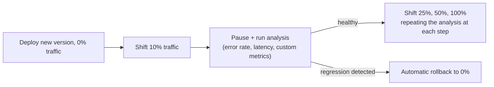

# Progressive Delivery: Canary and Blue-Green

## What You'll Learn

- How Argo Rollouts and Flagger turn canary and blue-green from a manual two-Deployment trick into an automated, metric-driven process
- How traffic-weight shifting actually works at the Service/Ingress/mesh level
- How to configure automated analysis that halts or rolls back a release based on real error-rate and latency regressions, with no human watching a dashboard

## Why This Matters

[Deployment Strategies](../workloads-and-scheduling/01-deployment-strategies.md) covers *why* canary and blue-green exist and how you'd approximate them with two plain Deployments and a Service selector swap. That approximation has no automated traffic-weight control and no automated rollback — a human has to watch dashboards and manually shift traffic or hit undo. Argo Rollouts and Flagger are the tools that make progressive delivery something a pipeline can run unattended.

## Mental Model

Both tools replace (or wrap) the standard `Deployment` with a custom resource that understands **steps**: shift some traffic, pause, run an analysis, decide whether to proceed, repeat. The controller inside the cluster does the watching and deciding — not a human, and not your CI pipeline.



### Argo Rollouts

Argo Rollouts introduces a `Rollout` CRD that's a drop-in replacement for `Deployment` — same `spec.template`, plus a `strategy.canary` or `strategy.blueGreen` block.

```yaml
apiVersion: argoproj.io/v1alpha1
kind: Rollout
metadata:
  name: checkout-api
  namespace: production
spec:
  replicas: 10
  selector:
    matchLabels:
      app: checkout-api
  template:
    metadata:
      labels:
        app: checkout-api
    spec:
      containers:
        - name: checkout-api
          image: registry.example.com/checkout-api:1.15.0
          ports:
            - containerPort: 8080
  strategy:
    canary:
      canaryService: checkout-api-canary
      stableService: checkout-api-stable
      trafficRouting:
        nginx:
          stableIngress: checkout-api-ingress
      steps:
        - setWeight: 10
        - pause: { duration: 5m }
        - analysis:
            templates:
              - templateName: success-rate-check
            args:
              - name: service-name
                value: checkout-api-canary
        - setWeight: 25
        - pause: { duration: 5m }
        - setWeight: 50
        - pause: { duration: 5m }
        - setWeight: 100
```

```yaml
apiVersion: argoproj.io/v1alpha1
kind: AnalysisTemplate
metadata:
  name: success-rate-check
  namespace: production
spec:
  args:
    - name: service-name
  metrics:
    - name: success-rate
      interval: 1m
      successCondition: result[0] >= 0.95
      failureLimit: 3
      provider:
        prometheus:
          address: http://prometheus.monitoring.svc.cluster.local:9090
          query: |
            sum(rate(http_requests_total{service="{{args.service-name}}",code!~"5.."}[2m]))
            /
            sum(rate(http_requests_total{service="{{args.service-name}}"}[2m]))
```

Reading this bottom-up: the `AnalysisTemplate` queries Prometheus every minute for the canary's success rate; if it drops below 95% three times (`failureLimit: 3`), Argo Rollouts automatically pauses the rollout and rolls traffic back to the stable version — no human intervention, no pipeline step needed.

```bash
kubectl argo rollouts get rollout checkout-api -n production --watch
kubectl argo rollouts promote checkout-api -n production   # manually advance past a pause
kubectl argo rollouts abort checkout-api -n production      # manually abort and roll back
```

### Flagger

Flagger takes a different shape: it watches your *existing* Deployment and drives a service mesh or ingress controller's traffic split for you, rather than replacing the Deployment with a new kind.

```yaml
apiVersion: flagger.app/v1beta1
kind: Canary
metadata:
  name: checkout-api
  namespace: production
spec:
  targetRef:
    apiVersion: apps/v1
    kind: Deployment
    name: checkout-api
  service:
    port: 80
    targetPort: 8080
  analysis:
    interval: 1m
    threshold: 5          # consecutive failed checks before rollback
    maxWeight: 50
    stepWeight: 10
    metrics:
      - name: request-success-rate
        thresholdRange:
          min: 95
        interval: 1m
      - name: request-duration
        thresholdRange:
          max: 500          # p99 latency in ms
        interval: 1m
    webhooks:
      - name: load-test
        url: http://flagger-loadtester.production/
        metadata:
          cmd: "hey -z 1m -q 10 -c 2 http://checkout-api-canary.production/"
```

You deploy a new image the normal way (`kubectl set image` or a new `kubectl apply`) — Flagger notices the Deployment's pod template changed, spins up a canary track, and drives traffic from 0% up to `maxWeight` in `stepWeight` increments, running the `metrics` checks (backed by Prometheus queries Flagger generates for you) at each step. A failed check `threshold` number of times triggers automatic rollback to 0% canary traffic.

### Argo Rollouts vs. Flagger

| | Argo Rollouts | Flagger |
|---|---|---|
| Model | Replaces `Deployment` with a `Rollout` CRD | Wraps an existing `Deployment`, driven by a separate `Canary` CRD |
| Traffic routing | NGINX Ingress, Istio, Linkerd, SMI, ALB, Traefik (via plugins) | Istio, Linkerd, App Mesh, Gateway API, NGINX, Contour |
| Blue-green support | Yes, native `strategy.blueGreen` | Indirect, via traffic mirroring/A-B patterns |
| Ecosystem fit | Pairs naturally with Argo CD (same project, same UI) | Pairs naturally with Flux and service-mesh-heavy setups |
| Migration cost | Requires converting `Deployment` → `Rollout` | No manifest kind change — lower migration friction |

Both need a traffic-splitting layer underneath them (an ingress controller or service mesh that supports weighted routing) — neither tool invents traffic shifting itself; they orchestrate an existing router's weights.

## How Traffic-Weight Shifting Actually Works

Underneath either tool, weighted traffic shifting means the ingress controller or mesh proxy is configured to split requests probabilistically across two backend Services:

```yaml
# Example: NGINX Ingress canary annotations (what Argo Rollouts manages for you)
apiVersion: networking.k8s.io/v1
kind: Ingress
metadata:
  name: checkout-api-canary
  annotations:
    nginx.ingress.kubernetes.io/canary: "true"
    nginx.ingress.kubernetes.io/canary-weight: "10"
spec:
  ingressClassName: nginx
  rules:
    - host: checkout.example.com
      http:
        paths:
          - path: /
            pathType: Prefix
            backend:
              service:
                name: checkout-api-canary
                port:
                  number: 80
```

Neither Argo Rollouts nor Flagger requires you to hand-write these annotations — they generate and update them (or the equivalent Istio `VirtualService` weights) as the rollout progresses. Understanding that this is what's happening underneath is what makes debugging a stuck rollout tractable instead of magic.

## Common Mistakes

- Adopting canary tooling without first having real success-rate/latency metrics in Prometheus (or equivalent) to analyze — the automation has nothing to gate on.
- Setting `stepWeight`/`setWeight` increments too large or `pause` durations too short to catch a regression before most traffic has already shifted.
- Forgetting that both tools need a compatible traffic-routing layer (ingress controller or mesh) already installed — neither one adds traffic splitting to a plain `ClusterIP` Service.
- Treating a successful canary analysis as proof of correctness rather than of "no regression in the metrics you defined" — untested metrics won't catch untested failure modes.
- Mixing manual `kubectl edit` changes into a `Rollout` or the Deployment a `Canary` targets, confusing the controller's view of current vs. desired state.

## Interview Questions

- How does Argo Rollouts' `Rollout` CRD differ structurally from a Flagger `Canary` targeting a normal `Deployment`?
- Walk through what happens, step by step, when a canary's error rate crosses the failure threshold mid-rollout.
- What has to already be installed in a cluster before either tool can shift real traffic weights?
- Why is a plain `Deployment` with two ReplicaSets and a Service selector swap not sufficient for genuine progressive delivery?

See [Interview Prep](../interview-prep/index.md) for full answers.

## Next

Continue to [GitOps with ArgoCD and Flux](04-gitops-with-argocd-and-flux.md) to see how the same Argo project's GitOps controller — and its alternative, Flux — reconciles what's actually running against what's in Git.
