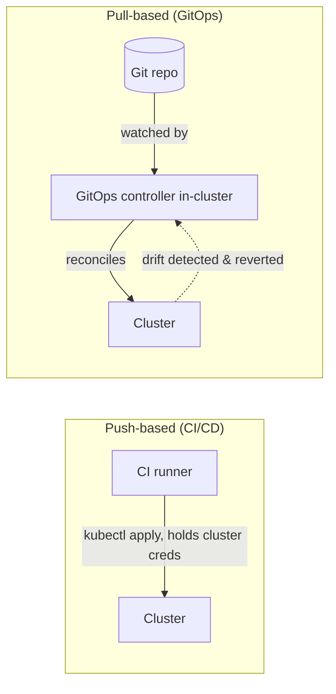

# GitOps with ArgoCD and Flux

## What You'll Learn

- The core GitOps principle — git as the single source of truth, reconciled by a pull-based controller instead of a push-based pipeline
- How to install ArgoCD and define a real `Application` that syncs a repo to a cluster
- How to install Flux and define a real `Kustomization` and `HelmRelease`
- When GitOps is worth adopting over the pipeline model from [CI/CD Pipelines for Kubernetes](01-cicd-pipelines-for-kubernetes.md), and when it isn't

## Why This Matters

Every pipeline example so far ends with the CI runner directly calling `kubectl` or `helm` against the cluster, using credentials it holds. That's push-based delivery, and it has two structural weaknesses: the CI system needs standing write access to production, and nothing detects or corrects drift if someone changes the live cluster by hand afterward. GitOps fixes both by moving the "who applies changes" role inside the cluster itself.

## Mental Model

**Push-based CI/CD** (file 1 in this section): a pipeline, running outside the cluster, pushes changes into it when a build succeeds. The cluster is passive; the pipeline is the source of action.

**GitOps**: a controller running *inside* the cluster continuously watches a Git repository and reconciles the live state to match it — pulling, not being pushed to. Git becomes the literal source of truth: to change what's running, you commit to Git, and the controller notices and applies it. There is no separate "deploy" credential to protect, because the controller already has cluster access and Git access is all that's gated.



The drift-correction property is what push-based pipelines fundamentally can't offer without extra tooling: if someone runs `kubectl edit deployment` by hand, a GitOps controller notices the live state no longer matches Git and reverts it on the next reconciliation loop (typically within minutes), whereas a CI pipeline has no way to even know that happened.

### ArgoCD: install and a real Application

```bash
kubectl create namespace argocd
kubectl apply -n argocd -f https://raw.githubusercontent.com/argoproj/argo-cd/v2.12.4/manifests/install.yaml

kubectl -n argocd rollout status deployment/argocd-server --timeout=180s

# Retrieve the initial admin password
kubectl -n argocd get secret argocd-initial-admin-secret \
  -o jsonpath='{.data.password}' | base64 -d
```

```yaml
apiVersion: argoproj.io/v1alpha1
kind: Application
metadata:
  name: checkout-api
  namespace: argocd
spec:
  project: default
  source:
    repoURL: https://github.com/example-org/checkout-api-config.git
    targetRevision: main
    path: overlays/production
  destination:
    server: https://kubernetes.default.svc
    namespace: production
  syncPolicy:
    automated:
      prune: true       # delete resources removed from Git
      selfHeal: true     # revert manual drift automatically
    syncOptions:
      - CreateNamespace=true
    retry:
      limit: 5
      backoff:
        duration: 5s
        factor: 2
        maxDuration: 3m
```

```bash
kubectl apply -f checkout-api-application.yaml -n argocd

argocd app get checkout-api
argocd app sync checkout-api     # force an immediate reconciliation
argocd app history checkout-api  # every past sync, tied to a Git commit
```

`prune: true` and `selfHeal: true` are what make this genuinely GitOps rather than just "kubectl apply, but triggered by ArgoCD" — without `selfHeal`, ArgoCD only reports drift; with it, ArgoCD actively reverts it.

### Flux: install and a real Kustomization + HelmRelease

```bash
flux check --pre
flux bootstrap github \
  --owner=example-org \
  --repository=fleet-infra \
  --branch=main \
  --path=clusters/production \
  --personal
```

`flux bootstrap` does something ArgoCD's basic install doesn't: it commits Flux's own manifests into your Git repo and wires the cluster to track that repo going forward — the bootstrap step itself is a GitOps action.

```yaml
# clusters/production/checkout-api-source.yaml
apiVersion: source.toolkit.fluxcd.io/v1
kind: GitRepository
metadata:
  name: checkout-api-config
  namespace: flux-system
spec:
  interval: 1m
  url: https://github.com/example-org/checkout-api-config.git
  ref:
    branch: main
---
# clusters/production/checkout-api-kustomization.yaml
apiVersion: kustomize.toolkit.fluxcd.io/v1
kind: Kustomization
metadata:
  name: checkout-api
  namespace: flux-system
spec:
  interval: 5m
  sourceRef:
    kind: GitRepository
    name: checkout-api-config
  path: "./overlays/production"
  prune: true
  targetNamespace: production
```

For a chart-based deployment instead of raw manifests, Flux's `HelmRelease` points at a chart source and drives `helm upgrade --install` for you on every reconciliation:

```yaml
apiVersion: source.toolkit.fluxcd.io/v1
kind: HelmRepository
metadata:
  name: bitnami
  namespace: flux-system
spec:
  interval: 1h
  url: https://charts.bitnami.com/bitnami
---
apiVersion: helm.toolkit.fluxcd.io/v2
kind: HelmRelease
metadata:
  name: checkout-redis
  namespace: production
spec:
  interval: 10m
  chart:
    spec:
      chart: redis
      version: "20.x"
      sourceRef:
        kind: HelmRepository
        name: bitnami
        namespace: flux-system
  values:
    architecture: standalone
    auth:
      enabled: true
      existingSecret: checkout-redis-auth
```

```bash
flux get kustomizations
flux get helmreleases -n production
flux reconcile kustomization checkout-api --with-source
```

### ArgoCD vs. Flux

| | ArgoCD | Flux |
|---|---|---|
| Interface | Full web UI plus CLI, app-centric view | CLI/CRD-first; UI available via Weave GitOps or ArgoCD-style add-ons |
| Core unit | `Application` | `Kustomization` and/or `HelmRelease` |
| Helm support | Renders Helm as a source type inside `Application` | Native `HelmRelease` CRD with its own reconciliation |
| Multi-cluster fleet management | `ApplicationSet` generators | Flux's `Kustomization`/`GitRepository` composition, or Flux's multi-tenancy features |
| Ecosystem fit | Pairs naturally with Argo Rollouts (same project, same CRDs) | Pairs naturally with Flagger (both CNCF, commonly deployed together) |

Both are graduated CNCF projects solving the same reconciliation problem; the choice usually comes down to whether your team wants a UI-centric app view (ArgoCD) or a more Kubernetes-native, CLI/CRD-composable toolkit that leans on existing `HelmRelease`/`Kustomization` primitives (Flux) — and which progressive-delivery tool from [Progressive Delivery](03-progressive-delivery-canary-and-blue-green.md) you're already leaning toward, since Argo Rollouts and Flagger pair naturally with their respective GitOps sibling.

## When to Pick GitOps Over a Traditional Pipeline

| Signal | Favors |
|---|---|
| Single cluster, small team, deploys are infrequent | Traditional CI/CD pipeline (file 1) — GitOps overhead may not pay for itself yet |
| Many clusters/environments that must stay consistent | GitOps — one Git repo per environment, reconciled identically everywhere |
| Compliance requires an audit trail of exactly what changed and when | GitOps — Git history *is* the audit trail |
| Manual `kubectl` drift is a recurring incident cause | GitOps — `selfHeal`/Flux reconciliation actively corrects it |
| CI system holding standing cluster credentials is a security concern | GitOps — the in-cluster controller holds credentials, CI only needs Git write access |
| Deploys need complex pre-deploy steps (schema migrations, external API calls) that don't map cleanly to "apply this manifest" | Traditional pipeline, or a hybrid: CI still handles migrations, GitOps handles manifest application |

Most mature setups end up hybrid: CI still owns build/test/scan/push (file 1), while the final "apply this to the cluster" step is a Git commit that a GitOps controller picks up, rather than a `kubectl apply` the pipeline runs directly.

## Common Mistakes

- Running ArgoCD or Flux without `selfHeal`/enforced reconciliation and then still allowing routine manual `kubectl` changes — you get GitOps's dashboard without its drift protection.
- Pointing a GitOps controller at the same repo that holds application source code without separating "code" from "desired cluster state," making it hard to review infrastructure changes independently of app changes.
- Forgetting that a GitOps controller reconciling on an interval (e.g., Flux's `interval: 5m`) means a bad commit stays live until the next `git revert` and reconciliation — GitOps doesn't remove the need for review before merge.
- Granting the GitOps controller's ServiceAccount cluster-admin instead of scoping it to only the namespaces/resources it should manage.
- Treating ArgoCD/Flux adoption as a replacement for CI entirely — they reconcile manifests, they don't build, test, or scan images.

## Interview Questions

- What specifically makes GitOps "pull-based" as opposed to a CI pipeline running `kubectl apply`?
- What does `selfHeal: true` do in ArgoCD, and what's the operational risk of running without it?
- Compare ArgoCD's `Application` model to Flux's `Kustomization`/`HelmRelease` model — what's structurally different?
- Under what circumstances would you keep a traditional push-based pipeline instead of moving to GitOps?

See [Interview Prep](../interview-prep/index.md) for full answers.

## Next

Continue to [Production Engineering](../production-engineering/index.md) for the reliability practices — SLOs, capacity planning, disaster recovery — that build on top of a working, automated delivery pipeline.
