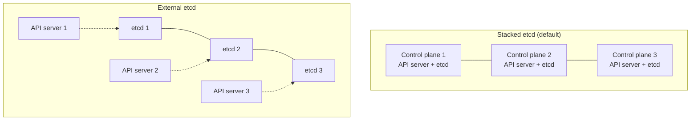

# kubeadm Cluster Setup

## What You'll Learn

- The exact sequence `kubeadm init` and `kubeadm join` run, and what each prerequisite actually does
- Why every node reports `NotReady` until you install a CNI plugin, and why that's expected
- The difference between stacked etcd and external etcd control-plane topologies, and when each earns its complexity

## Why This Matters

Most engineers only ever join an already-running managed cluster. But `kubeadm` is still how you stand up on-prem clusters, air-gapped clusters, and most Kubernetes certification labs — and understanding what it does under the hood is what turns "the cluster won't come up" from a panic into a checklist.

## Mental Model

`kubeadm` doesn't install Kubernetes for you — it bootstraps the minimum control plane needed for Kubernetes to take over managing itself. It generates certificates, writes static pod manifests for the control-plane components, and starts a single-node control plane that then admits more nodes via a join token. Everything after that first boot is regular Kubernetes reconciliation.

### Control-plane prerequisites

Before `kubeadm init` will succeed, every control-plane and worker host needs:

| Prerequisite | Why |
|---|---|
| A container runtime (containerd 2.x, CRI-O) implementing the CRI, using the **systemd cgroup driver** (`SystemdCgroup = true` in containerd's config) | kubelet doesn't run containers itself — it delegates to the runtime; a cgroup-driver mismatch between kubelet and runtime makes Pods restart randomly |
| **cgroup v2** on the host | Current kubelets refuse to start on cgroup v1 hosts by default (cgroup v1 support is in maintenance and being removed). Every current mainstream distribution defaults to v2; check with `stat -fc %T /sys/fs/cgroup` (prints `cgroup2fs`) |
| Swap off, or swap explicitly configured | The kubelet refuses to start with swap on by default. Swap support is stable since v1.34: set `failSwapOn: false` and `memorySwap.swapBehavior: LimitedSwap` in the kubelet config if you want it |
| Unique hostname, MAC address, and `product_uuid` per node | kubeadm and the scheduler use these as node identity; cloned VMs sometimes share them by accident |
| Required ports open between nodes (6443, 2379-2380, 10250-10259) | API server, etcd peer/client traffic, kubelet API, scheduler/controller-manager health |
| `net.ipv4.ip_forward=1` (plus `br_netfilter` and `net.bridge.bridge-nf-call-iptables=1` for bridge-based CNIs) | Nodes must forward pod traffic; kubeadm's preflight checks fail without IP forwarding |

### Initializing the first control-plane node

```bash
sudo kubeadm init \
  --control-plane-endpoint "cp-lb.internal.example.com:6443" \
  --upload-certs \
  --pod-network-cidr 192.168.0.0/16

mkdir -p "$HOME"/.kube
sudo cp -i /etc/kubernetes/admin.conf "$HOME"/.kube/config
sudo chown "$(id -u)":"$(id -g)" "$HOME"/.kube/config
```

- `--control-plane-endpoint` should point at a load balancer or DNS name in front of the control plane, even for a single control-plane node — adding more later requires it to have been set from the start.
- `--pod-network-cidr` must match whatever CNI plugin you're about to install; get it wrong and pod-to-pod networking silently never works.
- `--upload-certs` lets additional control-plane nodes join without manually copying certificates around.

`kubeadm init` prints a `kubeadm join` command with a token and CA cert hash at the end — save it, it's how every other node gets in.

### The CNI-before-Ready gotcha

```bash
kubectl get nodes
# NAME           STATUS     ROLES           AGE   VERSION
# cp-1           NotReady   control-plane   90s   v1.37.0
```

This is expected. The kubelet reports `NotReady` until a CNI plugin is installed and pod networking is functional — the node has no way to give pods IP addresses yet. Install a CNI immediately after `init`:

```bash
# Install the Cilium CLI first: https://docs.cilium.io/en/stable/gettingstarted/k8s-install-default/
cilium install --version 1.20.1
cilium status --wait
```

Within a minute or two of the CNI's own pods becoming `Running`, the node flips to `Ready`. If it never does, the CNI's pod CIDR doesn't match `--pod-network-cidr`, or the CNI's DaemonSet pods themselves aren't scheduling — check `kubectl get pods -n kube-system` first.

### Joining more nodes

```bash
# Worker node
sudo kubeadm join cp-lb.internal.example.com:6443 \
  --token abcdef.0123456789abcdef \
  --discovery-token-ca-cert-hash sha256:1234...

# Additional control-plane node
sudo kubeadm join cp-lb.internal.example.com:6443 \
  --token abcdef.0123456789abcdef \
  --discovery-token-ca-cert-hash sha256:1234... \
  --control-plane \
  --certificate-key <key-from-upload-certs>
```

Join tokens expire after 24 hours by default. Generate a fresh one with `kubeadm token create --print-join-command` rather than reusing an old one from your shell history.

## Single vs. Stacked vs. External etcd Topologies



| Topology | Layout | Failure blast radius | Operational cost |
|---|---|---|---|
| Single control plane | One node runs everything | Losing it takes down the whole control plane | Lowest — fine for dev/test |
| Stacked etcd HA | Each control-plane node co-locates its own etcd member | Losing a control-plane node loses an etcd member too, but the two fail together, which is simpler to reason about | Moderate — `kubeadm`'s default and best-documented HA path |
| External etcd HA | etcd runs on separate dedicated hosts, API servers connect to the etcd cluster remotely | A control-plane node can fail without touching etcd, and vice versa | Highest — more hosts to patch, monitor, and back up |

For most teams, stacked etcd with 3 control-plane nodes is the right default. External etcd is worth the extra hosts only when etcd's resource needs (see the next chapter) are so different from the API server's that co-locating them causes contention, or when you need to scale control-plane and etcd node counts independently.

## Common Mistakes

- Forgetting `--control-plane-endpoint` on the very first `kubeadm init`, then discovering it can't be added retroactively without rebuilding the control plane.
- Not installing a CNI right after `init` and assuming the cluster is broken because nodes sit `NotReady`.
- Reusing a join token from documentation or an old runbook instead of generating a fresh one — tokens are single-cluster and time-limited.
- Mismatching `--pod-network-cidr` against the CNI manifest's expected CIDR, causing pods to get no IP or the wrong IP range.
- Running `kubeadm init` a second time on a node that failed partway through, without `kubeadm reset` first, leaving stale certificates and static pod manifests behind.

## Interview Questions

- What exactly does `kubeadm init` set up, and what does it deliberately leave to you?
- Why does a freshly initialized control-plane node show `NotReady`, and what fixes it?
- When would you choose external etcd over the default stacked topology?
- What's the role of `--control-plane-endpoint`, and why must it be set before the first node joins?

See [Interview Prep](../interview-prep/index.md) for full answers.

## Next

Continue to [etcd and Control Plane Internals](02-etcd-and-control-plane-internals.md) to understand what that etcd member you just stood up is actually doing for the cluster.
