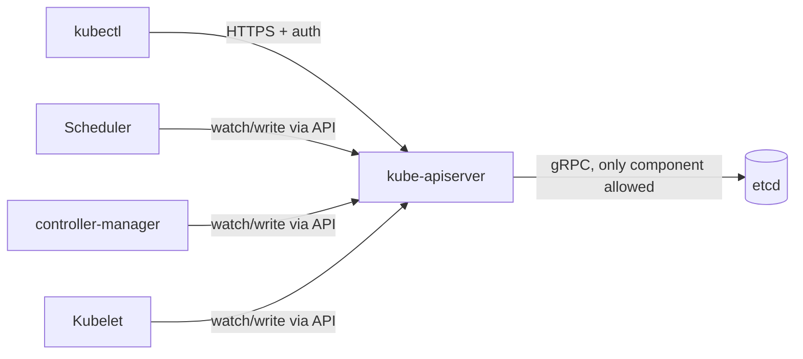

# etcd and Control Plane Internals

## What You'll Learn

- Why etcd, not any Kubernetes component itself, is the actual source of truth for cluster state
- Why the API server is the only component allowed to talk to etcd directly, and what that buys you
- Why etcd clusters need an odd number of members, and how quorum failure actually behaves

## Why This Matters

"The cluster went down" almost always traces back to one of two things: the API server, or etcd underneath it. If you don't have a mental model of what etcd is actually storing and how fragile it is to latency, you'll misdiagnose control-plane incidents as application problems, and you won't know which backups actually matter.

## Mental Model

Every object in Kubernetes — every Pod, Deployment, Secret, ConfigMap, Node record — is a key in etcd's key-value store. Nothing else in the cluster has a copy. The scheduler doesn't know what pods exist independently of etcd. The kubelet doesn't know what it's supposed to be running independently of etcd. If etcd's data is gone and unrecoverable, the cluster's state is gone — the containers might still be running on nodes, but nothing knows they should be.



### Why only the API server talks to etcd

Every other control-plane component — the scheduler, the controller manager, every kubelet on every node — only ever talks to `kube-apiserver`. None of them have etcd credentials or a direct connection. This is deliberate:

- **Single point of validation.** The API server enforces authentication, authorization (RBAC), and admission control on every write. If components wrote to etcd directly, each one would need to reimplement that enforcement correctly.
- **Single point of schema consistency.** The API server knows the current API versions and conversion logic between them. Direct etcd writers would need to agree on encoding, versioning, and object schema themselves.
- **A stable watch/cache layer.** The API server maintains watch caches so thousands of clients (kubelets, controllers) can watch for changes without each one hammering etcd's watch mechanism directly.

This is also why a wedged or overloaded API server takes the whole cluster down functionally, even if etcd itself is healthy — nothing else has a path around it.

### Quorum and why etcd needs an odd number of members

etcd is a distributed system that uses the Raft consensus algorithm: a write is only committed once a **majority** of members have durably persisted it. Quorum is `(N/2) + 1`.

| Cluster size | Quorum needed | Members it can lose and stay writable |
|---|---|---|
| 1 | 1 | 0 |
| 3 | 2 | 1 |
| 4 | 3 | 1 |
| 5 | 3 | 2 |
| 6 | 4 | 2 |

Notice 4 members tolerate the same single-member loss as 3, but need one more host to do it — an even-sized cluster adds cost without adding fault tolerance. That's why production etcd clusters are almost always sized 3, 5, or occasionally 7: odd numbers, more hosts than the previous odd number, more tolerance.

!!! warning "Losing quorum is not the same as losing data"
    If enough members go down that quorum is lost, etcd stops accepting **writes** — the cluster effectively freezes (no scheduling decisions, no status updates persist) but existing data on the surviving members is still intact. Restoring quorum (bringing members back, or restoring from snapshot per [Backup and Restore](05-backup-and-restore.md)) resumes normal operation without necessarily losing anything, provided you don't also lose a majority of members' data simultaneously.

### Performance and latency sensitivity

etcd fsyncs every write to disk before acknowledging it, and Raft replication means every write round-trips to a majority of members before it's considered committed. That makes etcd unusually sensitive to two things production teams often get wrong:

- **Disk latency.** etcd's own documentation recommends SSDs and warns explicitly against network-attached storage with variable latency. A slow disk under etcd shows up as cluster-wide API latency, not just an etcd metric.
- **Network latency between members.** Raft's leader election and replication both assume low, consistent latency between etcd peers. Stretching an etcd cluster across regions (rather than availability zones in the same region) is a common cause of mysterious leader elections and API slowness.

```bash
# Check etcd's own view of its health and latency
ETCDCTL_API=3 etcdctl endpoint health --cluster \
  --endpoints=https://127.0.0.1:2379 \
  --cacert=/etc/kubernetes/pki/etcd/ca.crt \
  --cert=/etc/kubernetes/pki/etcd/server.crt \
  --key=/etc/kubernetes/pki/etcd/server.key -w table

ETCDCTL_API=3 etcdctl endpoint status --cluster \
  --endpoints=https://127.0.0.1:2379 \
  --cacert=/etc/kubernetes/pki/etcd/ca.crt \
  --cert=/etc/kubernetes/pki/etcd/server.crt \
  --key=/etc/kubernetes/pki/etcd/server.key -w table
```

`endpoint status` shows which member is the current Raft leader and each member's DB size — a good first check when the API server feels slow for no obvious reason.

## Common Mistakes

- Running etcd on spinning disks or shared network storage with unpredictable latency, then chasing "random" API server slowness for weeks.
- Sizing an etcd cluster at 4 or 6 members, paying for extra hosts with no extra fault tolerance over 3 or 5.
- Assuming a scheduler or controller-manager restart fixes state problems — they hold no state of their own; if something looks wrong, the truth (or the bug) is in etcd via the API server.
- Treating "etcd is down" and "quorum is lost" as the same thing — a cluster can lose one member out of five and be completely fine.
- Stretching a single etcd cluster across high-latency network links (e.g., separate cloud regions) for "geo-redundancy" and getting constant leader elections instead.

## Interview Questions

- Why is the API server the only component that talks directly to etcd?
- Why do etcd clusters use an odd number of members, and what actually breaks when quorum is lost?
- What happens to a running pod's containers if etcd becomes permanently unavailable?
- Why is etcd unusually sensitive to disk and network latency compared to a typical stateless service?

See [Interview Prep](../interview-prep/index.md) for full answers.

## Next

Continue to [Node Management](03-node-management.md) to see how you safely take a node in and out of service without etcd or the scheduler fighting you.
