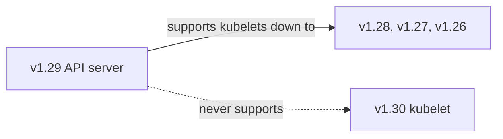

# Cluster Upgrades

## What You'll Learn

- The version skew policy that governs how far apart your control plane and kubelets are allowed to drift
- The correct `kubeadm upgrade` order: control plane first, then nodes one at a time
- How EKS, GKE, and AKS change — and simplify — this process on managed control planes

## Why This Matters

Kubernetes ships a new minor version roughly every four months, and each minor version is supported for about 14 months. A cluster that never upgrades eventually falls off supported versions entirely, loses access to security patches, and accumulates enough version drift that the eventual forced upgrade becomes far riskier than a series of small ones would have been.

## Mental Model

Kubernetes deliberately allows some version drift between components, but only within specific bounds — and the bounds all point in the same direction: **the control plane must never be older than the components below it.**

### The version skew policy

| Component pair | Maximum skew allowed |
|---|---|
| `kube-apiserver` instances (HA cluster) | Must all be within 1 minor version of each other |
| `kubelet` vs. `kube-apiserver` | kubelet may be up to 3 minor versions older (as of recent policy; historically 2) — but never newer |
| `kube-controller-manager`/`kube-scheduler` vs. `kube-apiserver` | Must not be newer than the API server; may be up to 1 minor version older |
| `kubectl` vs. `kube-apiserver` | May be 1 minor version older or newer |

The rule that matters most in practice: **kubelets can lag behind the API server, but never lead it.** This is exactly why upgrades always go control plane first — upgrading a kubelet to a newer minor version than the API server it talks to is unsupported and can break in unpredictable ways.



### The kubeadm upgrade workflow

Upgrades happen one minor version at a time — you cannot skip from 1.28 straight to 1.30, you go 1.28 → 1.29 → 1.30, verifying health at each step.

**1. Upgrade the first control-plane node**

```bash
# On the first control-plane node
sudo apt-mark unhold kubeadm
sudo apt-get install -y kubeadm=1.30.4-1.1
sudo apt-mark hold kubeadm

sudo kubeadm upgrade plan          # shows what will change, sanity-checks skew
sudo kubeadm upgrade apply v1.30.4

sudo apt-mark unhold kubelet kubectl
sudo apt-get install -y kubelet=1.30.4-1.1 kubectl=1.30.4-1.1
sudo apt-mark hold kubelet kubectl
sudo systemctl daemon-reload
sudo systemctl restart kubelet
```

**2. Upgrade remaining control-plane nodes**

```bash
# On each additional control-plane node
sudo kubeadm upgrade node
# then upgrade kubelet/kubectl packages exactly as above
```

**3. Upgrade worker nodes, one at a time**

```bash
# From a machine with kubectl access
kubectl drain node-worker-1 --ignore-daemonsets --delete-emptydir-data

# On node-worker-1
sudo kubeadm upgrade node
sudo apt-get install -y kubelet=1.30.4-1.1 kubectl=1.30.4-1.1
sudo systemctl daemon-reload
sudo systemctl restart kubelet

# Back on the kubectl machine
kubectl uncordon node-worker-1
kubectl get nodes   # confirm Ready at the new version before moving to the next node
```

Repeat the drain → upgrade → uncordon cycle for every worker node, one at a time, confirming health before moving on. This is the same cordon/drain discipline from [Node Management](03-node-management.md) applied to an entire fleet.

!!! warning "Never upgrade all nodes simultaneously"
    Draining and upgrading nodes one at a time is what keeps the application available during the upgrade. Upgrading every node at once is functionally a full-cluster outage.

## How Managed Platforms Change This

| Platform | Control plane upgrade | Node upgrade |
|---|---|---|
| Self-managed (`kubeadm`) | Fully manual, as above | Fully manual, one node at a time |
| Amazon EKS | One `eksctl upgrade cluster` / console click; AWS handles etcd and API server | Managed node groups support rolling upgrade via `eksctl upgrade nodegroup`; self-managed node groups still need manual draining |
| Google GKE | Automatic by default (configurable maintenance windows); can be manual | Node auto-upgrade is on by default, respecting `PodDisruptionBudget`s during rolling replacement |
| Azure AKS | `az aks upgrade` triggers a managed, orchestrated control-plane upgrade | Node pools upgrade via `az aks nodepool upgrade`, with configurable surge and max-unavailable settings |

The version skew policy still applies underneath all three managed platforms — they just automate the sequencing and safety checks that `kubeadm upgrade` makes you run by hand. The trade-off is control: managed platforms often restrict how far you can defer an upgrade before they force one, since they don't want to support arbitrarily old minor versions either.

## Common Mistakes

- Upgrading a kubelet to a newer minor version than the control plane — unsupported, and can cause API compatibility failures.
- Skipping minor versions (1.28 straight to 1.30) instead of stepping through each one.
- Upgrading all worker nodes at once instead of one at a time with drain/uncordon between each.
- Forgetting to `apt-mark hold`/pin the package versions, letting an unrelated `apt upgrade` silently bump Kubernetes components out of band.
- Assuming a managed platform's "automatic" node upgrade doesn't need `PodDisruptionBudget`s — it still respects them, and a misconfigured PDB can still stall a managed upgrade.

## Interview Questions

- What is the Kubernetes version skew policy, and which direction is the drift allowed to go?
- Why must the control plane always be upgraded before the kubelets?
- Walk through the full `kubeadm upgrade` sequence for a 3-control-plane, 5-worker cluster.
- How does upgrading an EKS-managed node group differ operationally from upgrading self-managed `kubeadm` worker nodes?

See [Interview Prep](../interview-prep/index.md) for full answers.

## Next

Continue to [Backup and Restore](05-backup-and-restore.md) — take a fresh etcd snapshot before every upgrade, so a bad one is always recoverable.
