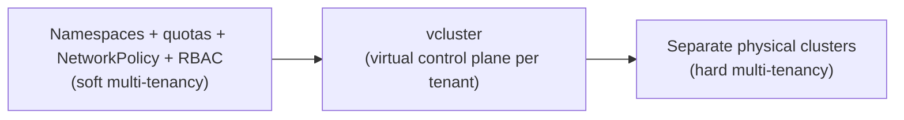

# Multi-Tenancy

## What You'll Learn

- How to isolate tenants inside a shared cluster using namespaces, `ResourceQuota`, and `LimitRange`
- How `NetworkPolicy` and RBAC scoping close the gaps namespaces alone leave open
- The real trade-off between soft multi-tenancy in one cluster, separate clusters per tenant, and virtual clusters (vcluster)

## Why This Matters

"Just give every team a namespace" is the default answer, and it's usually right — until one team's runaway job starves another team's production workload of CPU, or a misconfigured Service accidentally becomes reachable from a namespace it has no business talking to. Multi-tenancy is the set of guardrails that makes "shared cluster" not mean "shared blast radius."

## Mental Model

A Kubernetes namespace is a **scoping boundary for names and some policies** — it is not, by itself, a security or resource-isolation boundary. Two pods in different namespaces on the same node still share the same kernel, the same node's CPU and memory, and can reach each other over the network by default. Everything in this chapter is about actively closing those gaps, because namespaces alone don't.

### ResourceQuota: capping what a tenant can consume

```yaml
apiVersion: v1
kind: ResourceQuota
metadata:
  name: team-checkout-quota
  namespace: team-checkout
spec:
  hard:
    requests.cpu: "20"
    requests.memory: 40Gi
    limits.cpu: "40"
    limits.memory: 80Gi
    pods: "50"
    persistentvolumeclaims: "10"
    services.loadbalancers: "2"
```

A `ResourceQuota` caps the *sum* of requests/limits across every pod in the namespace, plus counts of objects like PVCs and LoadBalancer Services (which cost real money from a cloud provider). Once a namespace hits its quota, new pod creation is rejected at admission time — the tenant gets an immediate, clear error instead of silently starving other tenants of cluster capacity.

### LimitRange: setting sane per-pod defaults

```yaml
apiVersion: v1
kind: LimitRange
metadata:
  name: team-checkout-limits
  namespace: team-checkout
spec:
  limits:
    - type: Container
      default:
        cpu: 500m
        memory: 512Mi
      defaultRequest:
        cpu: 100m
        memory: 128Mi
      max:
        cpu: "4"
        memory: 4Gi
      min:
        cpu: 50m
        memory: 64Mi
```

`ResourceQuota` caps the namespace total; `LimitRange` caps and defaults *individual* containers within it. Without a `LimitRange`, a single pod with no resource requests set can consume the entire namespace's quota by itself, or — worse — consume unbounded node resources if the namespace has no quota at all.

### NetworkPolicy: closing the default-open network

By default, every pod in a cluster can reach every other pod, across namespaces, unless a CNI plugin that enforces `NetworkPolicy` is installed and policies are defined. Isolating a tenant's namespace means writing a default-deny policy and then explicitly allowing what's needed:

```yaml
apiVersion: networking.k8s.io/v1
kind: NetworkPolicy
metadata:
  name: default-deny-ingress
  namespace: team-checkout
spec:
  podSelector: {}
  policyTypes:
    - Ingress
---
apiVersion: networking.k8s.io/v1
kind: NetworkPolicy
metadata:
  name: allow-from-ingress-controller-and-same-namespace
  namespace: team-checkout
spec:
  podSelector: {}
  policyTypes:
    - Ingress
  ingress:
    - from:
        - namespaceSelector:
            matchLabels:
              kubernetes.io/metadata.name: ingress-nginx
        - podSelector: {}   # allow same-namespace traffic
```

This pair denies all inbound traffic to `team-checkout` by default, then re-opens exactly two paths: traffic from the ingress controller's namespace, and traffic between pods within the same namespace. Every other namespace is now unreachable from `team-checkout` unless another policy explicitly allows it.

### RBAC: scoping who can do what, per namespace

```yaml
apiVersion: rbac.authorization.k8s.io/v1
kind: RoleBinding
metadata:
  name: team-checkout-edit
  namespace: team-checkout
subjects:
  - kind: Group
    name: team-checkout-engineers
    apiGroup: rbac.authorization.k8s.io
roleRef:
  kind: ClusterRole
  name: edit           # built-in ClusterRole, bound namespace-locally via RoleBinding
  apiGroup: rbac.authorization.k8s.io
```

Binding the built-in `edit` `ClusterRole` via a namespace-scoped `RoleBinding` (rather than a `ClusterRoleBinding`) gives the team full CRUD on most namespaced resources *inside their own namespace only* — they can't list, read, or modify anything in another team's namespace, and they can't touch cluster-scoped resources like `Node` or `ClusterRole` objects at all.

## Namespaces vs. Separate Clusters vs. Virtual Clusters



| Approach | Isolation strength | Operational cost | Good fit when |
|---|---|---|---|
| Namespaces + quotas + NetworkPolicy + RBAC | Soft — shared kernel, shared control plane, shared node pool | Lowest — one cluster to upgrade, monitor, back up | Trusted internal teams, cost efficiency matters, workloads aren't adversarial toward each other |
| Virtual clusters (vcluster) | Medium — each tenant gets its own API server and control-plane objects, syncing down into a shared underlying cluster | Moderate — more control planes to reason about, but still one physical cluster's worth of nodes | Tenants need their own CRDs, RBAC root, or even Kubernetes version, without the cost of dedicated nodes |
| Separate physical clusters | Strong — separate control plane, separate etcd, often separate node pools entirely | Highest — N clusters to upgrade, back up, patch, and monitor | Regulatory separation requirements, genuinely untrusted or adversarial tenants, or wildly different availability/compliance needs per tenant |

The honest trade-off: namespace-based multi-tenancy is cheap and usually sufficient, but a determined or careless tenant can still exhaust shared cluster-level resources (the API server itself, image pull bandwidth, DNS) that quotas don't fully bound. Reach for vcluster or separate clusters only once you've identified a specific isolation gap namespaces can't close — not by default, because "more clusters" is a genuinely larger ongoing operational burden.

## Common Mistakes

- Creating a namespace per tenant with no `ResourceQuota` at all, so "multi-tenant" provides zero actual resource isolation.
- Setting a `ResourceQuota` but no `LimitRange`, letting a single unbounded pod claim the entire namespace's quota.
- Assuming namespaces block network traffic by default — they don't; without a CNI enforcing `NetworkPolicy` and explicit policies, every pod can reach every other pod cluster-wide.
- Granting `ClusterRoleBinding`s (cluster-wide) instead of namespace-scoped `RoleBinding`s "to save time," which quietly defeats the whole point of tenant isolation.
- Reaching for separate clusters per tenant by default, before establishing that namespace-based isolation is actually insufficient for the threat model.

## Interview Questions

- What does a Kubernetes namespace actually isolate, and what does it not isolate by default?
- How do `ResourceQuota` and `LimitRange` work together, and what happens if you set one without the other?
- Walk through the `NetworkPolicy` rules needed to fully isolate one tenant's namespace from another's.
- When would you choose vcluster or separate physical clusters over namespace-based multi-tenancy?

See [Interview Prep](../interview-prep/index.md) for full answers.

## Next

Continue to [CI/CD and GitOps](../cicd-and-gitops/index.md) to see how deployments get onto these tenant-isolated namespaces safely and repeatably.
