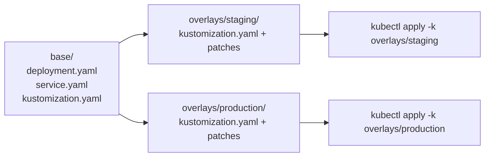

# Kustomize

## What You'll Learn

- The base/overlays directory layout Kustomize uses to manage per-environment variation
- Strategic merge patches versus JSON 6902 patches, and when each is the right tool
- When to reach for Kustomize instead of Helm — and when a real setup uses both together

## Why This Matters

Helm solves environment variation with templating and a values schema; Kustomize solves the same problem without templates at all — it takes plain, valid Kubernetes YAML and applies structured patches on top. No templating language to learn, no `{{ }}` syntax errors, and `kubectl` has built-in Kustomize support (`kubectl apply -k`), so no separate tool install is strictly required. That template-free approach is exactly why some teams standardize on it instead of, or in front of, Helm.

## Mental Model

> A Kustomize **base** is a directory of plain Kubernetes manifests plus a `kustomization.yaml` that lists them. An **overlay** is a separate directory that references a base and layers **patches** on top — different replica counts, different image tags, extra labels — without ever editing the base's files.



## How It Works

### Directory layout

```
orders-api/
├── base/
│   ├── deployment.yaml
│   ├── service.yaml
│   └── kustomization.yaml
└── overlays/
    ├── staging/
    │   ├── kustomization.yaml
    │   └── replica-patch.yaml
    └── production/
        ├── kustomization.yaml
        ├── replica-patch.yaml
        └── resources-patch.yaml
```

```yaml
# base/deployment.yaml
apiVersion: apps/v1
kind: Deployment
metadata:
  name: orders-api
spec:
  replicas: 1
  selector:
    matchLabels:
      app: orders-api
  template:
    metadata:
      labels:
        app: orders-api
    spec:
      containers:
        - name: orders-api
          image: registry.example.com/orders-api:2.4.0
          resources:
            requests:
              cpu: 100m
              memory: 128Mi
```

```yaml
# base/kustomization.yaml
apiVersion: kustomize.config.k8s.io/v1beta1
kind: Kustomization
resources:
  - deployment.yaml
  - service.yaml
```

### Strategic merge patches

A strategic merge patch looks like a partial Kubernetes manifest — you specify only the fields you want to change, and Kustomize merges it into the base using Kubernetes' field-merge semantics (list items matched by key, not by index).

```yaml
# overlays/production/replica-patch.yaml
apiVersion: apps/v1
kind: Deployment
metadata:
  name: orders-api
spec:
  replicas: 5
```

```yaml
# overlays/production/kustomization.yaml
apiVersion: kustomize.config.k8s.io/v1beta1
kind: Kustomization
resources:
  - ../../base
patches:
  - path: replica-patch.yaml
  - path: resources-patch.yaml
images:
  - name: registry.example.com/orders-api
    newTag: 2.4.0
namespace: production
```

### JSON 6902 patches

For edits that strategic merge can't express cleanly — removing a field, or targeting a specific array element by index — a JSON Patch (RFC 6902) gives precise, operation-based control:

```yaml
# overlays/production/resources-patch.yaml (JSON 6902 style)
- op: replace
  path: /spec/template/spec/containers/0/resources/requests/cpu
  value: "500m"
- op: add
  path: /spec/template/spec/containers/0/resources/limits
  value:
    cpu: "1000m"
    memory: 512Mi
```

```yaml
# referencing it in kustomization.yaml
patches:
  - path: resources-patch.yaml
    target:
      kind: Deployment
      name: orders-api
```

Use strategic merge for most day-to-day overrides (replicas, env vars, image tags) since it reads like ordinary YAML; reach for JSON 6902 when you need to delete a field outright or patch a specific list index that strategic merge's key-based matching can't target.

### Applying

```bash
# Preview the fully rendered manifests without applying
kubectl kustomize overlays/production
kustomize build overlays/production   # equivalent, using the standalone binary

# Apply directly
kubectl apply -k overlays/production

# Diff against the live cluster before applying
kubectl diff -k overlays/production
```

### When to use Kustomize instead of Helm — and when to use both

| Use Kustomize when | Use Helm when | Use both when |
|---|---|---|
| You own the manifests and want zero templating syntax | You're packaging something for others to install with configurable inputs | You're consuming a third-party Helm chart but need environment-specific tweaks it doesn't expose via `values.yaml` |
| Environment differences are structural patches (replicas, resource limits, namespace) | You need versioned releases, rollback history, and a values schema | You render the chart once (`helm template`) and layer Kustomize patches on the output |
| You want `kubectl` alone to apply it, no extra tooling | You're distributing a reusable, parameterized package across many consumers | Your CD pipeline standardizes on Kustomize overlays as the final promotion step, regardless of upstream packaging |

A common combined pattern: `helm template some-chart --values base-values.yaml > base/rendered.yaml`, then commit that rendered output as a Kustomize base and manage per-environment differences with overlays — getting Helm's packaging ecosystem and Kustomize's simple, template-free per-environment patching in the same pipeline.

## Common Mistakes

- Editing files directly inside `base/` to handle one environment's needs, which defeats the entire point of overlays and causes drift the next time the base is updated.
- Reaching for a JSON 6902 patch for a simple field override that a strategic merge patch would express far more readably.
- Forgetting `namespace:` in an overlay's `kustomization.yaml` and being surprised resources land in the base's (often unset/default) namespace.
- Assuming `kubectl apply -k` and `helm install` are interchangeable — Kustomize has no release/revision/rollback concept; `kubectl apply` alone doesn't track history the way Helm does.

## Interview Questions

- How does a Kustomize overlay avoid modifying the base directory while still changing its output?
- When would you choose a JSON 6902 patch over a strategic merge patch?
- Describe a pipeline that uses both Helm and Kustomize together, and why.

See [Interview Prep](../interview-prep/index.md) for full answers.

## Next

Continue to [External Secrets and Secret Stores](06-external-secrets-and-secret-stores.md) to close the gap between native Kubernetes Secrets and a real secrets-management strategy.
