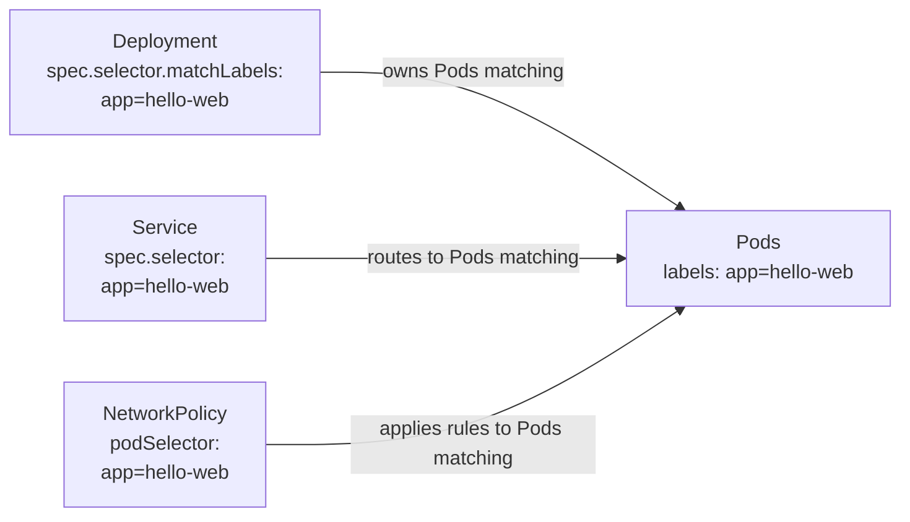

# Labels, Selectors, and Annotations

## What You'll Learn

- The difference between labels and annotations, and why Kubernetes enforces that distinction
- Equality-based vs. set-based selector syntax
- How Services, Deployments, and NetworkPolicies each use selectors to find "their" objects

## Why This Matters

Selectors are the invisible wiring behind nearly every "why isn't this working" question in Kubernetes: a Service with no traffic, a Deployment that "lost" its Pods, a NetworkPolicy that blocks more (or less) than intended. All three trace back to the same mechanism — a label match — so understanding it once pays off everywhere.

## Labels vs. Annotations

| | Labels | Annotations |
|---|---|---|
| Purpose | Identify and select objects | Attach non-identifying metadata |
| Queryable? | Yes — the API server can filter and index on them | No — not usable in selectors |
| Format constraints | Strict: keys/values limited to 63 chars, alphanumeric plus `-_.`, optional DNS-style prefix | Loose: arbitrary strings, including JSON blobs |
| Typical use | `app=web`, `env=prod`, `tier=frontend` | Build commit SHA, last-updated-by, config-reload checksums, tool-specific config (`nginx.ingress.kubernetes.io/rewrite-target`) |

```yaml
metadata:
  labels:
    app: hello-web
    env: prod
    tier: frontend
  annotations:
    build.example.com/commit: "a1b2c3d"
    description: "Public marketing site, owned by team-web"
```

The rule of thumb: if you'll ever need to *find* objects by this value, it's a label. If it's just informational for humans or tools, it's an annotation.

```bash
kubectl label pods hello-web-6b9f4c8d7f-2xk4p env=prod
kubectl annotate pods hello-web-6b9f4c8d7f-2xk4p description="Canary instance"
kubectl get pods --show-labels
```

## Equality-Based vs. Set-Based Selectors

**Equality-based** — simplest form, used by Services and older APIs:

```bash
kubectl get pods -l app=hello-web
kubectl get pods -l 'tier!=frontend'
```

**Set-based** — more expressive, supported anywhere `matchExpressions` is used (Deployments, NetworkPolicies, node affinity):

```bash
kubectl get pods -l 'env in (prod,staging)'
kubectl get pods -l 'tier notin (frontend)'
kubectl get pods -l 'app'          # key exists, any value
kubectl get pods -l '!app'         # key does not exist
```

In manifests, `matchLabels` is shorthand equality; `matchExpressions` is the set-based form and can express things `matchLabels` can't, like "key exists" or "value in this list":

```yaml
selector:
  matchLabels:
    app: hello-web
  matchExpressions:
    - key: env
      operator: In
      values: ["prod", "staging"]
    - key: tier
      operator: Exists
```

When both are present in one selector, every clause must match — they're combined with logical AND, never OR.

## How Selectors Wire Real Objects Together



All three objects independently evaluate the same label against the same Pods — there's no shared "registration" step. This is also why a single typo in a label or a selector silently breaks the connection instead of raising an error: from the API server's point of view, "zero Pods matched" is a completely valid, unremarkable result.

```bash
# The fastest way to confirm a selector is actually matching something
kubectl get pods -l app=hello-web
kubectl describe deployment hello-web | grep Selector
kubectl describe svc hello-web | grep Selector
```

## Common Mistakes

- Putting information you'll need to query on later into an annotation instead of a label — it silently can't be used in a selector, and there's no error telling you why your `kubectl get -l` returned nothing.
- A `Deployment.spec.selector` that doesn't match `Deployment.spec.template.metadata.labels` — this is actually rejected by the API server as immutable-selector validation, but it's a common first error to hit.
- Assuming `matchLabels` and `matchExpressions` combine with OR — they always combine with AND; there's no selector-level OR in Kubernetes's native selector syntax.
- Changing a Pod's labels by hand (`kubectl label`) and being surprised a Service stops routing to it, or a Deployment's ReplicaSet "adopts" or "orphans" it.

## Interview Questions

- What's the practical difference between a label and an annotation, and why does Kubernetes enforce it?
- Write a set-based selector that matches Pods where `env` is `prod` or `staging`, but `tier` is not `frontend`.
- How would you find why a Service has zero endpoints when the Pods it should route to are clearly `Running`?

See [Interview Prep](../interview-prep/index.md) for full answers.

## Next

Continue to [ConfigMaps and Secrets](06-configmaps-and-secrets.md) to see the other main way configuration reaches a Pod, alongside labels.
