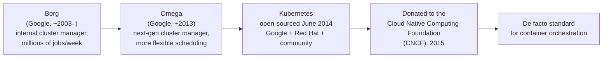

# History and Why Kubernetes Exists

## What You'll Learn

- Where Kubernetes actually came from — Google's internal Borg and Omega cluster managers
- Why Google open-sourced it in 2014 and then handed it to a neutral foundation
- The specific gap between "I can run one container" and "I can run a fleet of containers reliably," and why Docker alone doesn't close it

## Why This Matters

"Kubernetes was inspired by Borg" is a trivia-night fact that's usually left at that. The useful version of that fact is: Kubernetes isn't a research project or a startup's weekend hack — it's a distillation of roughly fifteen years of Google running hundreds of thousands of containers in production, with the sharp internal edges filed off for the outside world. That lineage explains why Kubernetes is opinionated about things like declarative state and controllers instead of imperative scripts: those opinions were paid for in outages before you ever saw them.

## From Bare Metal to VMs to Containers to Orchestration

Infrastructure history, compressed:

- **Bare metal era** — one application per physical server, most of the time. Safe, but wasteful: a server sized for peak load sits mostly idle the rest of the time, and provisioning a new one takes days or weeks.
- **Virtual machine era** — a hypervisor lets one physical server run several isolated VMs, each with its own OS. Utilization improves, but every VM still carries a full OS's boot time, memory footprint, and patching burden.
- **Container era** — Docker (built on Linux namespaces and cgroups, and popularizing the OCI image format) packages an application with its dependencies into a single portable image that starts in milliseconds and shares the host kernel instead of booting its own. This is a packaging and runtime win, not a fleet-management win.
- **Orchestration era** — once a team has more than a handful of containers spread across more than one machine, someone has to decide *which machine runs which container*, restart it when it dies, move it when a node fails, and route traffic to whichever instances are currently healthy. That's the job Kubernetes does.

Each layer solved the problem the layer below it couldn't. Containers solved "my app doesn't behave the same in dev and prod." They did not solve "who restarts container 4,812 when the machine it's on dies at 3 a.m."

## What Docker Alone Doesn't Solve

Docker builds and runs *one* container on *one* host well. It has no native, cluster-wide answer for:

| Problem | What's needed |
|---|---|
| Which of N machines should run this container? | A scheduler |
| The container (or the whole node) just died — now what? | A controller that notices and restarts/reschedules it |
| Traffic needs to reach whichever replicas are currently healthy | A stable virtual IP and load-balancing layer |
| I need to roll out v2 without downtime, and roll back if it's bad | A rollout controller with history |
| Config and secrets need to reach containers without baking them into the image | A config-distribution mechanism |
| The desired state needs to hold *continuously*, not just at deploy time | A control loop that never stops watching |

Docker Swarm and Apache Mesos both attempted this too, in the same era — but Kubernetes won the ecosystem, in large part because its design already reflected years of production lessons Google had learned the hard way, before most competitors had run a single container at that scale.

## Borg, Omega, and the Path to Open Source

**Borg** is Google's internal cluster manager, running since the early 2000s and still running the vast majority of Google's own workloads — Search, Gmail, and everything else — as tens of thousands of jobs across enormous fleets. It proved that a declarative, control-loop-based system could operate containers reliably at a scale almost no one else had reached. **Omega** was a subsequent internal project that reworked Borg's scheduler architecture to be more flexible and decentralized; some of its ideas fed into Kubernetes's design, though Kubernetes is a fresh implementation, not a fork of either.

In **June 2014**, Google open-sourced Kubernetes — a name derived from the Greek word for "helmsman" or "pilot" (the seven spokes in the Kubernetes logo are a nod to the original project codename, "Project Seven," itself a *Star Trek* reference). Rather than keep it as a Google-controlled project, Google donated Kubernetes to the newly formed **Cloud Native Computing Foundation (CNCF)** in 2015 — a deliberate move to make it vendor-neutral, so that AWS, Microsoft, Red Hat, and every other infrastructure vendor would have equal standing to contribute rather than treating it as "Google's product." That neutrality is a large part of why Kubernetes, rather than a proprietary alternative, became the industry's shared substrate.

## Common Mistakes

- Thinking Kubernetes *is* Borg, open-sourced as-is. It's a new implementation informed by Borg and Omega's lessons, not a direct port.
- Believing Docker and Kubernetes are competitors. Docker (or another container runtime) is typically what actually runs a container *on* a node; Kubernetes decides *which* node, *how many* replicas, and *what to do when something fails* — see [What Is Kubernetes?](01-what-is-kubernetes.md) for exactly where the line sits.
- Assuming orchestration is only a "large scale" problem. Teams hit the "who restarts this at 3 a.m." problem well before they have Google-scale traffic.

## Interview Questions

- What is Kubernetes's relationship to Google's Borg and Omega systems?
- Why did Google donate Kubernetes to the CNCF instead of keeping it under Google's control?
- What specific problem does Kubernetes solve that Docker alone does not?

See [Interview Prep](../interview-prep/index.md) for full answers.

## Next

Continue to [What Is Kubernetes?](01-what-is-kubernetes.md) for a precise definition and a comparison against Docker, Ansible, and Terraform.
