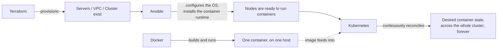

# What Is Kubernetes?

## What You'll Learn

- A definition of Kubernetes precise enough to use in an interview, not just "it runs containers"
- The difference between orchestration, configuration management, and provisioning — and why *continuous reconciliation* is the property that sets Kubernetes apart
- Exactly where Kubernetes sits next to Docker, Ansible, and Terraform in a real stack

## Why This Matters

"Kubernetes orchestrates containers" is true and almost useless — a cron job that restarts a crashed container also "orchestrates" it, badly. The useful question is *how* Kubernetes orchestrates: not by running a script once and walking away, but by never stopping. That single property — a control loop that watches forever — is what separates Kubernetes from every tool people compare it to, and it's the answer interviewers are actually listening for.

## Mental Model

> Kubernetes is a system that takes a **declared desired state** for a set of containers — how many replicas, which image, how much CPU/memory, what network identity — and continuously drives the **actual state** of a cluster of machines toward it, forever, without a human re-running anything.

That word "continuously" is doing all the work. You declare state once (`kubectl apply -f deployment.yaml`); Kubernetes's controllers keep comparing actual state to desired state on a loop, indefinitely, and correct any drift the moment they see it — a pod crashes, a node dies, someone deletes a pod by hand — with no one re-triggering the check.

| Term | Question it answers | Typical tool | Reconciles how often? |
|---|---|---|---|
| **Provisioning** | Does the infrastructure exist yet? (a VM, a VPC, a cluster) | Terraform, CloudFormation | Only when you run `apply` |
| **Configuration management** | Is this existing machine set up correctly? | Ansible, Puppet, Chef | Only when you run a playbook/run |
| **Orchestration (continuous)** | Does the desired state of my containers still hold, right now and every second after? | **Kubernetes** | Continuously, via controllers that never stop watching |

Terraform and Ansible both reconcile — but only *on demand*, when a human or a pipeline explicitly triggers a run. Kubernetes's controllers are always running, always comparing, always correcting. That's the differentiator worth leading with in an interview: not "it manages containers," but "it manages containers via controllers that reconcile continuously, not on a schedule a human controls."

## Where Kubernetes Sits Next to Docker, Ansible, and Terraform

- **Docker** answers "how do I package this app and run it as a container, on one machine, right now?" It builds images and can run individual containers, but it has no built-in, cluster-wide answer for scheduling, self-healing, or rolling updates across many hosts.
- **Ansible** answers "is this existing machine configured correctly, right now?" — including, often, installing and configuring the container runtime and `kubelet` that let a machine join a Kubernetes cluster in the first place. Ansible does not run continuously; it reconciles only when a playbook runs.
- **Terraform** answers "does this infrastructure exist, in this shape?" — the VMs, networking, and often the managed Kubernetes control plane (EKS, GKE, AKS) that Kubernetes will later run on top of.
- **Kubernetes** answers "does the desired state of my containers still hold?" **continuously**, via controllers that never stop watching — the property none of the other three have by default.

A well-run team typically uses all four together: Terraform provisions the cluster and its supporting cloud infrastructure, Ansible (or the cloud provider's own tooling) configures anything below the Kubernetes API, Docker builds the images that get pushed to a registry, and Kubernetes takes over continuous reconciliation of everything that runs inside the cluster from there.

## Common Mistakes

- Calling Kubernetes "just a Docker manager" — Kubernetes is runtime-agnostic (it talks to any CRI-compliant runtime, such as `containerd` or CRI-O) and its job starts well past "run one container."
- Assuming Kubernetes replaces the need for Ansible or Terraform. It doesn't provision cloud infrastructure or configure a bare OS by itself — something still has to get nodes into a state where `kubelet` can join them to a cluster.
- Treating "orchestration" and "continuous reconciliation" as synonyms for every tool. Ansible playbooks are also a form of orchestration (this task, then that task, in order) — they just don't run forever the way a Kubernetes controller does.

## Interview Questions

- What is Kubernetes, in one precise sentence you could defend under follow-up questions?
- What specifically distinguishes Kubernetes's reconciliation model from what Ansible or Terraform do?
- Where would you draw the line between what Terraform, Ansible, Docker, and Kubernetes are each responsible for in a real deployment pipeline?

See [Interview Prep](../interview-prep/index.md) for full answers.

## Next

Continue to [Architecture and the Control Plane](02-architecture-and-control-plane.md) to see exactly which components make continuous reconciliation happen.
