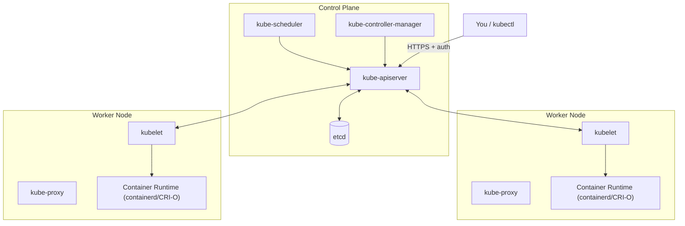

# Architecture and the Control Plane

## What You'll Learn

- What each control-plane and node component actually does, and which single component talks to etcd
- The control-loop / reconciliation pattern that every controller in Kubernetes follows
- How a `kubectl apply` travels from your terminal to a running container

## Why This Matters

Nearly every confusing Kubernetes symptom — a pod stuck `Pending`, a rollout that won't progress, a Service with no endpoints — resolves to "which component was supposed to act here, and did it?" You can't debug that without knowing which of the six or seven moving parts owns which job. This page is the map everything else in these docs assumes you have.

## Mental Model: Control Plane vs. Worker Nodes

A Kubernetes cluster splits into two kinds of machines. The **control plane** makes cluster-wide decisions (what should run, where); **worker nodes** actually run your containers.



## Control Plane Components

| Component | Role | One thing worth remembering |
|---|---|---|
| **kube-apiserver** | The front door — a REST API that validates and processes every request (`kubectl`, controllers, kubelets all go through it) | It is the **only** control-plane component that talks to etcd directly; everything else goes through it |
| **etcd** | A distributed, strongly consistent key-value store holding all cluster state | It's the cluster's single source of truth — losing it without a backup means losing the cluster's memory of everything |
| **kube-scheduler** | Watches for newly created Pods with no assigned node, and picks one based on resource requests, affinity/anti-affinity, taints/tolerations, and constraints | It only *decides* the node — it never runs anything itself |
| **kube-controller-manager** | Runs the built-in controllers (Node, ReplicaSet, Endpoints, Job, ServiceAccount, and more) as a single binary, each running its own reconciliation loop | "Controller" here means any loop that watches actual state and pushes it toward desired state |
| **cloud-controller-manager** | Talks to your cloud provider's API for cloud-specific logic (provisioning LoadBalancer Services, attaching cloud disks, tagging nodes) | Only present on cloud-managed clusters; local clusters (minikube, kind) typically don't run one |

## Worker Node Components

| Component | Role | One thing worth remembering |
|---|---|---|
| **kubelet** | The agent on every node; makes sure the containers described in the PodSpecs it's been assigned are actually running, and reports node/pod status back to the API server | It talks to the container runtime through the CRI — it does not run containers itself |
| **kube-proxy** | Maintains the network rules (iptables or IPVS) on each node that implement the Service abstraction — routing traffic for a Service's virtual IP to one of its backing Pods | You'll see this again in [Services](../core-concepts/03-services.md) |
| **Container runtime** | The software that actually pulls images and starts/stops containers — `containerd` and CRI-O are the common choices today | Talks to the kubelet via the **Container Runtime Interface (CRI)**, a plugin API that lets Kubernetes stay runtime-agnostic |

The CRI matters because it's why Kubernetes isn't "a Docker orchestrator" — any runtime that implements the CRI works, which is why Docker Engine itself was removed as a *direct* Kubernetes runtime in v1.24 (images built by Docker still run fine everywhere, since they're standard OCI images; what changed is which daemon runs them on the node).

## The Control-Loop / Reconciliation Mental Model

Every controller in Kubernetes — built-in or custom — follows the same shape:

1. **Watch** the API server for objects it cares about (e.g., Deployments, or Pods with a specific label).
2. **Compare** the object's desired state (`spec`) against its observed actual state (`status`).
3. **Act** — create, delete, or update objects to close the gap (e.g., create a missing Pod, delete an extra one).
4. **Repeat**, forever, reacting to every change and also re-checking periodically as a safety net.

This is the mechanism behind the claim in [What Is Kubernetes?](01-what-is-kubernetes.md) that reconciliation is continuous: there is no "done" state for a controller — it keeps watching for as long as the cluster runs.

## Following One `kubectl apply`

```bash
kubectl apply -f deployment.yaml
```

1. `kubectl` sends an authenticated HTTPS request to **kube-apiserver**.
2. The API server runs authentication, authorization (RBAC), and admission control, then persists the object to **etcd**.
3. The **Deployment controller** (inside kube-controller-manager) notices the new/changed Deployment and creates a matching ReplicaSet.
4. The **ReplicaSet controller** notices it's short of Pods and creates Pod objects — still with no node assigned.
5. **kube-scheduler** notices unscheduled Pods, picks a node for each, and writes that assignment back through the API server.
6. The **kubelet** on the chosen node notices a Pod has been assigned to it, and asks the **container runtime** (via the CRI) to pull the image and start the container.
7. The kubelet reports the Pod's status back to the API server; **kube-proxy** on every node updates its rules so the Pod is reachable through any Service that selects it.

Every arrow in that sequence is a watch-compare-act loop, not a single script running top to bottom.

## Common Mistakes

- Assuming any component other than kube-apiserver talks to etcd directly — none does; it's a deliberate single point of access for consistency and security.
- Confusing the scheduler's job (picking a node) with the kubelet's job (actually starting the container) — a Pod can be `Scheduled` and still fail to start.
- Forgetting that kube-proxy runs on every node, not just a control-plane node — without it, Services on that node's Pods wouldn't be reachable.

## Interview Questions

- Walk through what happens, component by component, from `kubectl apply` to a running container.
- Which component is the only one that talks directly to etcd, and why does that matter?
- What is the Container Runtime Interface, and why did its introduction matter for Kubernetes's design?

See [Interview Prep](../interview-prep/index.md) for full answers.

## Next

Continue to [Installing kubectl and a Local Cluster](03-installing-kubectl-and-a-local-cluster.md) to get a real cluster running and `kubectl` talking to it.
