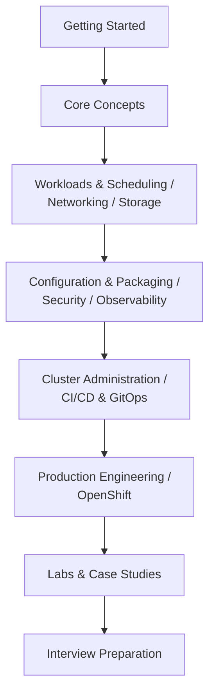

# Kubernetes

Kubernetes lets you describe the state your containerized workloads should be in — how many replicas, what image, what storage, what network access — and continuously reconciles the real cluster toward that state, forever, without you running a command every time something drifts. This is a hands-on guide to using it well: understanding the architecture underneath a `kubectl apply`, writing production-grade workloads, securing and observing a cluster, debugging what breaks, and operating OpenShift where that's the platform in front of you.

It's built to work two ways: read it start to finish as a course, or jump straight to the one page that answers what you need right now.

## Start Here, Based on Where You Are

| You are... | Start at |
|---|---|
| New to Kubernetes entirely | [Getting Started](getting-started/index.md) |
| Comfortable with the basics, want the daily-driver objects | [Core Concepts](core-concepts/index.md) |
| Running real workloads, want to tune rollouts and scheduling | [Workloads & Scheduling](workloads-and-scheduling/index.md) |
| Exposing services, debugging traffic | [Networking](networking/index.md) |
| Working with stateful apps and volumes | [Storage](storage/index.md) |
| Managing app config, Secrets, or packaging with Helm/Kustomize | [Configuration & Packaging](configuration-and-packaging/index.md) |
| Locking down a cluster | [Security](security/index.md) |
| Wiring up probes, logs, and metrics | [Observability & Health](observability/index.md) |
| Running the control plane yourself | [Cluster Administration](cluster-administration/index.md) |
| Building a deployment pipeline or adopting GitOps | [CI/CD & GitOps](cicd-and-gitops/index.md) |
| Running Kubernetes in production at scale | [Production Engineering](production-engineering/index.md) |
| Working on Red Hat OpenShift specifically | [OpenShift](openshift/index.md) |
| Learning by doing, on a local cluster | [Labs](labs/index.md) |
| Wanting full worked examples, failure paths included | [Case Studies](case-studies/index.md) |
| Something's broken right now | [Troubleshooting](troubleshooting/index.md) |
| Prepping for a Kubernetes or DevOps interview | [Interview Preparation](interview-prep/index.md) |
| Already know Kubernetes, need a fast lookup | [Quick Reference](quick-reference/index.md) |

## The Learning Path

## Learn by Building

Each project uses only what the previous ones already taught you. Skip ahead if you're already past a stage.

1. **Deploy and expose your first app** — [Your First Deployment](getting-started/04-your-first-deployment.md)
2. **Roll out a change with zero dropped requests** — [Deployment Strategies](workloads-and-scheduling/01-deployment-strategies.md), [Case Study: Rolling Deployment With Zero Downtime](case-studies/01-rolling-deployment-with-zero-downtime.md)
3. **Route real traffic in with TLS** — [Ingress and Ingress Controllers](networking/03-ingress-and-ingress-controllers.md)
4. **Give a database stable storage** — [StatefulSets](workloads-and-scheduling/02-statefulsets.md), [StatefulSet Storage Patterns](storage/04-statefulset-storage-patterns.md)
5. **Package it as a Helm chart** — [Helm Fundamentals and Writing Charts](configuration-and-packaging/04-helm-fundamentals-and-writing-charts.md)
6. **Isolate a new team in its own namespace** — [Case Study: Multi-Tenant Namespace Setup](case-studies/03-multi-tenant-namespace-setup.md)
7. **Lock down access with least privilege** — [RBAC](security/02-rbac.md)
8. **Scale it automatically under load** — [Autoscaling](workloads-and-scheduling/06-autoscaling.md), [Case Study: Autoscaling Under Load](case-studies/04-autoscaling-under-load.md)
9. **Adopt GitOps instead of pushing `kubectl apply` by hand** — [GitOps With ArgoCD and Flux](cicd-and-gitops/04-gitops-with-argocd-and-flux.md)
10. **Practice debugging a real incident** — [Case Study: Debugging a CrashLoopBackOff Incident](case-studies/06-debugging-a-crashloopbackoff-incident.md)
11. **Run the production readiness checklist against it** — [Production Readiness Checklist](production-engineering/05-production-readiness-checklist.md)

## Every Section

- [Getting Started](getting-started/index.md) — history and origins, what Kubernetes actually is, control-plane architecture, installing kubectl, your first deployment
- [Core Concepts](core-concepts/index.md) — Pods, ReplicaSets and Deployments, Services, namespaces, labels and selectors, Jobs and CronJobs
- [Workloads & Scheduling](workloads-and-scheduling/index.md) — deployment strategies, StatefulSets, DaemonSets, affinity and taints, requests/limits, autoscaling
- [Networking](networking/index.md) — the cluster networking model, Services in depth, Ingress, NetworkPolicy, DNS, CNI plugins
- [Storage](storage/index.md) — volumes, PersistentVolumes and Claims, StorageClasses and dynamic provisioning, StatefulSet storage
- [Configuration & Packaging](configuration-and-packaging/index.md) — ConfigMaps and Secrets in depth, config injection, Helm, Kustomize, external secret stores
- [Security](security/index.md) — authentication and authorization, RBAC, service accounts, Pod Security Admission, supply chain, encryption at rest
- [Observability & Health](observability/index.md) — probes, logging architecture, metrics-server, events and debugging
- [Cluster Administration](cluster-administration/index.md) — kubeadm, etcd, node management, upgrades, backup and restore, multi-tenancy
- [CI/CD & GitOps](cicd-and-gitops/index.md) — pipelines for Kubernetes, kubectl scripting, progressive delivery, ArgoCD and Flux
- [Production Engineering](production-engineering/index.md) — capacity planning, cost optimization, multi-cluster design, disaster recovery, readiness review
- [OpenShift](openshift/index.md) — what OpenShift adds, the `oc` CLI and Projects, Routes, Source-to-Image, Operators
- [Labs](labs/index.md) — minikube, kind, Docker Desktop, Podman, and guided hands-on scenarios
- [Case Studies](case-studies/index.md) — full worked deployments, including the failure paths
- [Troubleshooting](troubleshooting/index.md) — a symptom-first debugging methodology, not just a list of errors
- [Interview Preparation](interview-prep/index.md) — by subject and by level, tied back to the concepts
- [Quick Reference](quick-reference/index.md) — cheat sheets, no prose

## Related Learning

- [Docker and Linux Containers](../docker/index.md) — the runtime layer underneath every pod
- [Ansible Automation](../ansible/index.md) — configuring the machines Kubernetes nodes run on
- [Monitoring and SRE](../monitoring-tools/index.md)

## Further Reading

- [Kubernetes Documentation](https://kubernetes.io/docs/)
- [Kubernetes on GitHub](https://github.com/kubernetes/kubernetes)
- [CNCF](https://www.cncf.io/)
- [Red Hat OpenShift Documentation](https://docs.openshift.com/)
