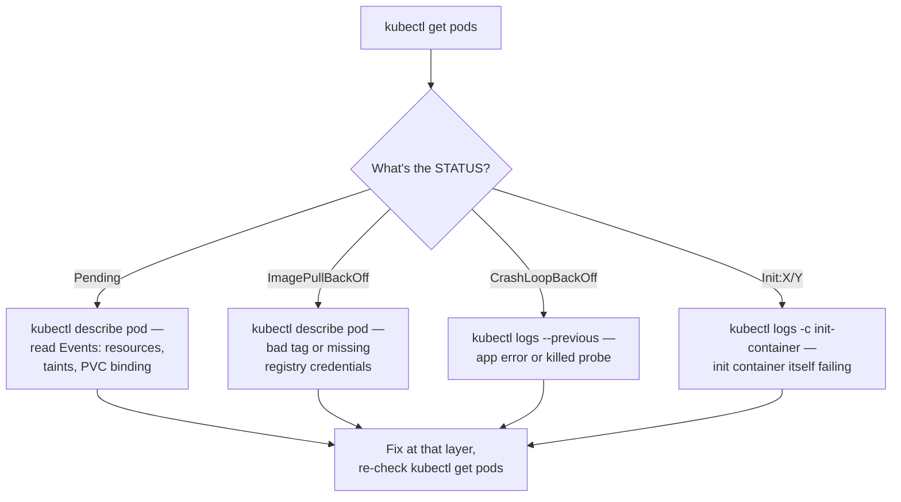

# Interview Prep: Scenario-Based Questions

Senior interviews test **reasoning**, not memorized definitions. Each scenario below is deliberately open-ended — the value is in the process you narrate out loud, not a single "correct" one-liner.

## Scenario 1 — "A pod won't start. Walk me through your debugging process."

**Expected thought process:**

A strong answer narrates the *decision*, not just the commands: "the status column tells me which layer to look at first, so I read it literally before I do anything else — `Pending` means the scheduler never placed it, so logs won't exist yet and checking them would be a wasted step." Full depth: [Pod Scheduling and Startup Problems](../troubleshooting/01-pod-scheduling-and-startup-problems.md).

## Scenario 2 — "A service that worked yesterday is now unreachable, and nobody changed the application code."

**Expected thought process:**

- First question: is this *every* client failing, or only some? All clients failing points at the Service/Pods; some clients failing (e.g., only from one namespace) points at a NetworkPolicy or DNS search-path issue instead.
- `kubectl get endpoints <service>` first — an empty list means the Service has zero matching, ready Pods, which is a labels or readiness problem, not a networking problem at all.
- If endpoints exist, test from inside the cluster directly: `kubectl run curl-test --rm -it --image=curlimages/curl:8.8.0 -- curl -sv http://svc.ns.svc.cluster.local`, bypassing DNS and Ingress one layer at a time until you find where it actually breaks.
- "Nobody changed the application code" doesn't mean nothing changed — check `kubectl get events` for anything else that shifted: a NetworkPolicy applied by another team, a node pool change, a CNI upgrade.
- Full depth: [Networking and Service Problems](../troubleshooting/02-networking-and-service-problems.md).

## Scenario 3 — "Pods are getting OOMKilled and the team wants a memory limit bump as the fix. Do you just do that?"

**Expected thought process:**

- Not immediately — first distinguish "the limit is genuinely too low for legitimate usage" from "there's a leak," because bumping the limit on a leak just delays the crash and hides the real problem, often making the eventual failure bigger.
- Pull `kubectl top pod` history and correlate the growth curve against traffic and time-running: a leak shows unbounded growth over hours regardless of load; a legitimately undersized limit shows the container hitting the ceiling quickly under real load and staying flat otherwise.
- If it's a leak: raising the limit buys time for a real fix, but the actual next step is a heap profile or restart-cadence monitoring in the app itself — that's a development-team action item, not just a platform config change.
- If it's genuinely undersized: raise `resources.limits.memory` based on the observed high-water mark plus headroom, and set the `request` close to typical steady-state usage so the scheduler doesn't overcommit the node.
- A strong answer explicitly says "bumping the limit without knowing which of these it is just changes when it fails, not whether it fails." Full depth: [Pod Scheduling and Startup Problems](../troubleshooting/01-pod-scheduling-and-startup-problems.md#oomkilled).

## Scenario 4 — "A `kubectl rollout status` has been hanging for ten minutes. What's happening and what do you check?"

**Expected thought process:**

- A hanging rollout means new Pods aren't reaching `Ready` fast enough to satisfy the Deployment's `maxUnavailable`/`maxSurge` budget — the rollout isn't stuck by definition, it's *waiting*, and the question is waiting on what.
- `kubectl rollout status deployment/myapp` plus `kubectl get rs` shows whether the new ReplicaSet is even scaling up, or whether it's created but its Pods aren't progressing.
- `kubectl describe pod` on one of the new Pods narrows it immediately: still `ImagePullBackOff`, still `CrashLoopBackOff`, or `Running` but failing `readinessProbe` (this last one is the most common — the container is fine but never reports ready, so the rollout can never proceed past it).
- If it's a genuinely bad rollout (the new image is broken), the answer isn't to wait longer — `kubectl rollout undo deployment/myapp` immediately restores the last known-good ReplicaSet, and root-causing the bad image happens after service is restored, not before.
- A senior answer distinguishes "should I fix forward or roll back" explicitly: roll back first if there's user impact and the fix isn't already known and fast; fix forward only when the rollback itself would be riskier or slower than a known one-line correction.

## Next

Continue to [Security & RBAC](04-security-and-rbac-questions.md).
