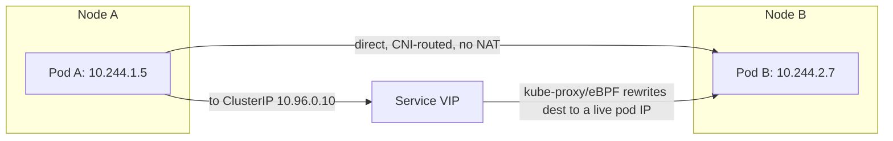

# Cluster Networking Model

## What You'll Learn

- The flat-network requirement Kubernetes assumes and why every CNI plugin has to satisfy it
- What a CNI plugin actually does versus what kube-proxy does versus what CoreDNS does
- How pod-to-pod traffic differs from pod-to-Service traffic under the hood

## Why This Matters

Kubernetes itself doesn't implement networking — it defines a *contract* (every pod gets a routable IP, no NAT required between pods) and delegates the implementation entirely to a CNI plugin. Understanding where that contract ends and the plugin's job begins is what lets you actually debug connectivity issues instead of guessing between "Kubernetes problem" and "network problem."

## Mental Model

> Every pod gets its own IP address, from a flat address space, and any pod can reach any other pod's IP directly — no NAT, no port mapping — regardless of which node either is on. Kubernetes requires this to be true; it does not itself make it true. A **CNI (Container Network Interface) plugin** is the thing that makes it true.

The three foundational rules, straight from the Kubernetes networking model:

1. Every pod gets its own IP, and every container in a pod shares that IP (and the pod's network namespace).
2. Pods on any node can communicate with all pods on all nodes without NAT.
3. Agents on a node (kubelet) can communicate with all pods on that node.

## How It Works

### What a CNI plugin actually provides

| Responsibility | Who provides it |
|---|---|
| Allocate a pod IP, wire up its network namespace | CNI plugin (invoked by kubelet on pod create) |
| Route pod IPs across nodes (overlay tunnel or native L3 routing) | CNI plugin |
| Enforce NetworkPolicy (if any is defined) | CNI plugin, only if it supports it |
| Load-balance traffic to a Service's backend pods | kube-proxy (or the CNI's own eBPF datapath, e.g. Cilium) |
| Resolve names (`my-svc.default.svc.cluster.local`) to a ClusterIP | CoreDNS |

Kubernetes itself only calls out to whatever CNI binary is configured — it never touches packets directly.

### Pod-to-pod vs. pod-to-Service traffic



- **Pod-to-pod**: the source pod dials the destination pod's IP directly. The CNI plugin is responsible for making that IP routable across nodes — either by tunneling (an overlay, e.g. VXLAN in Flannel's default mode) or by programming real routes on the underlying network (native routing, e.g. Calico BGP mode, Cilium's native routing mode).
- **Pod-to-Service**: the source pod dials a **virtual IP** (the Service's ClusterIP) that doesn't correspond to a real interface anywhere. kube-proxy (or an eBPF datapath) intercepts that traffic and rewrites the destination to one of the Service's live backend pod IPs, load-balancing across them. See [Services Deep Dive](02-services-deep-dive.md) for exactly how that rewrite happens.

### Verifying the model on a live cluster

```bash
kubectl get pods -o wide                      # see each pod's actual IP
kubectl get nodes -o jsonpath='{.items[*].spec.podCIDR}'   # per-node pod IP range
kubectl exec -it <pod-a> -- ping -c 2 <pod-b-ip>           # direct pod-to-pod, no NAT
kubectl get pods -n kube-system -l k8s-app=kube-dns        # confirm CoreDNS is running
```

## Common Mistakes

- Assuming Kubernetes "has networking built in" — it has a networking *contract*; a CNI plugin (which you install) fulfills it. A cluster with no CNI plugin has pods stuck `Pending`/`ContainerCreating` indefinitely.
- Debugging a connectivity issue by checking Kubernetes objects only — many real failures (MTU mismatches, security group/firewall rules blocking the overlay's UDP port, an underlying cloud VPC route table) live below Kubernetes entirely.
- Confusing an overlay network's tunnel IP/interface (e.g. `flannel.1`, `cni0`) with the actual pod IP when reading `ip addr` output on a node.
- Expecting NetworkPolicy to work on any cluster — it's a CNI feature, not a core Kubernetes guarantee (see [Network Policies](04-network-policies.md)).

## Interview Questions

- State the three rules of the Kubernetes networking model from memory.
- What's the actual division of labor between Kubernetes, the CNI plugin, kube-proxy, and CoreDNS?
- What's the difference between an overlay network and native routing, from a packet's perspective?

See [Interview Prep](../interview-prep/index.md) for full answers.

## Next

Continue to [Services Deep Dive](02-services-deep-dive.md) to see exactly how pod-to-Service traffic gets load-balanced.
