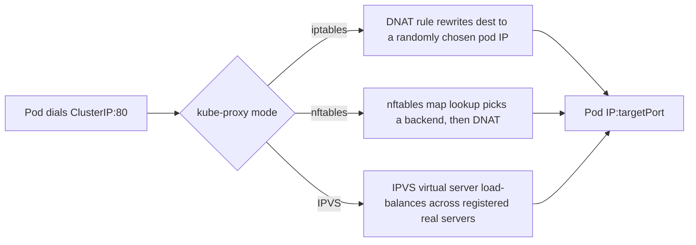

# Services Deep Dive

## What You'll Learn

- What each of the four Service types actually does, and when to use each
- How kube-proxy turns a Service into real traffic routing — iptables, nftables, and IPVS modes
- How Endpoints/EndpointSlices track which pods are live, and how session affinity works

## Why This Matters

A Service looks like a single YAML object with a `type` field, but that field selects between four genuinely different mechanisms — one is purely internal DNS/VIP routing, one opens a port on every node, one provisions cloud infrastructure, and one isn't really a proxy at all. Picking the wrong one is a common source of "why can't I reach this from outside the cluster" and "why is this exposed to the internet when it shouldn't be."

## Mental Model

> A Service is a stable virtual IP and DNS name in front of a changing set of pods. It exists because pod IPs are ephemeral — a Service gives callers something that doesn't change even as the pods behind it are created, killed, and replaced.

| Type | Reachable from | Mechanism |
|---|---|---|
| `ClusterIP` (default) | Inside the cluster only | Stable virtual IP, routed by kube-proxy |
| `NodePort` | Outside, via `<any-node-ip>:<30000-32767>` | Builds on ClusterIP, plus a port opened on every node |
| `LoadBalancer` | Outside, via a cloud load balancer's IP/DNS | Builds on NodePort, plus a cloud LB provisioned by the cloud controller manager |
| `ExternalName` | Internally, via DNS CNAME only | No proxying at all — just a DNS alias to an external name |

## How It Works

### ClusterIP and headless Services

```yaml
apiVersion: v1
kind: Service
metadata:
  name: checkout-api
spec:
  type: ClusterIP
  selector:
    app: checkout-api
  ports:
    - port: 80
      targetPort: 8080
  sessionAffinity: ClientIP
  sessionAffinityConfig:
    clientIP:
      timeoutSeconds: 3600
```

Setting `clusterIP: None` makes it **headless** — no virtual IP, no load-balancing. DNS queries for the Service name return the individual pod IPs directly (or, for a StatefulSet, stable per-pod DNS names). Use a headless Service when the client needs to pick or address a specific backend pod, not "any healthy one."

### NodePort and LoadBalancer

```yaml
apiVersion: v1
kind: Service
metadata:
  name: checkout-api-public
spec:
  type: LoadBalancer
  selector:
    app: checkout-api
  ports:
    - port: 443
      targetPort: 8443
      nodePort: 31443   # optional explicit port, otherwise auto-assigned 30000-32767
```

`LoadBalancer` is a superset of `NodePort`: the cloud controller manager provisions an external load balancer (ELB/ALB, Cloud Load Balancer, etc.) and points it at the NodePort on every node. In a bare-metal cluster with no cloud integration, `type: LoadBalancer` gets stuck `<pending>` forever unless something like MetalLB (or Cilium's LB IPAM) is installed to fulfill it.

Two settings come up in almost every real LoadBalancer Service:

```yaml
metadata:
  annotations:
    # Keep it private to the VPC (AWS Load Balancer Controller; GKE and AKS have their own)
    service.beta.kubernetes.io/aws-load-balancer-scheme: internal
    service.beta.kubernetes.io/aws-load-balancer-type: external
    service.beta.kubernetes.io/aws-load-balancer-nlb-target-type: ip
spec:
  type: LoadBalancer
  externalTrafficPolicy: Local    # preserve the client's source IP
```

- **`externalTrafficPolicy: Local`** sends traffic only to Pods on the node that received it, so the Pod sees the **real client IP** (needed for IP allow-lists, rate limiting, and access logs) and skips an extra hop. The cost: nodes without a ready Pod fail the load balancer's health check and get no traffic, so spread replicas across nodes. The default, `Cluster`, balances evenly but replaces the client IP with a node IP.
- **Internal load balancers** are the right default for anything that isn't meant for the internet. Load balancer annotations are provider-specific, so check your controller's documentation.

### ExternalName

```yaml
apiVersion: v1
kind: Service
metadata:
  name: legacy-db
spec:
  type: ExternalName
  externalName: db.legacy.internal.example.com
```

No selector, no ports, no proxying — this just makes `legacy-db.default.svc.cluster.local` resolve as a CNAME to the external hostname, so in-cluster code can use a consistent internal name for something that lives outside the cluster.

### How kube-proxy actually implements a Service



| Mode | How it works | Trade-offs |
|---|---|---|
| `iptables` (still the default on most clusters) | Chains of DNAT rules per Service/endpoint, evaluated roughly linearly | Simple and universal, but rule count grows with Service count — slower updates at very large scale |
| `nftables` (stable since v1.33) | The same job on the kernel's newer nftables framework, using map lookups instead of long rule chains | Scales much better than iptables and is where kube-proxy development is going; needs a recent kernel (5.13+) |
| `IPVS` | Kernel-level load balancer (Linux IPVS), Services registered as virtual servers | Fast lookups and several balancing algorithms, but it has long lagged behind in features and was deprecated in v1.35 in favor of nftables |

```bash
kubectl -n kube-system get configmap kube-proxy -o yaml | grep 'mode:'   # kubeadm clusters
```

For a new large cluster, prefer `nftables` (or an eBPF datapath) over IPVS. Some CNI plugins (notably Cilium) replace kube-proxy's job entirely with an eBPF datapath, skipping iptables/nftables altogether for lower latency and better observability.

### Endpoints and EndpointSlices

```bash
kubectl get endpointslices -l kubernetes.io/service-name=checkout-api
kubectl get endpointslices -l kubernetes.io/service-name=checkout-api -o yaml | grep -A3 conditions
```

The classic `Endpoints` object lists every ready pod IP for a Service in one flat object — this doesn't scale well past a few thousand pods behind one Service, and it was deprecated in v1.33. `EndpointSlices` shard that list into multiple smaller objects, which is both more efficient to update and lets kube-proxy/CNI process incremental changes instead of rewriting one giant object every time a pod's readiness flips. Each endpoint also carries `ready`, `serving`, and `terminating` conditions, which is how a Pod that's shutting down can finish in-flight requests without receiving new ones.

### Session affinity

`sessionAffinity: ClientIP` makes kube-proxy route repeated requests from the same client IP to the same backend pod, for up to `timeoutSeconds`. It's the closest thing a plain Service has to sticky sessions — there's no cookie-based affinity at the Service layer; that requires an Ingress controller or a service mesh.

## Common Mistakes

- Using `type: LoadBalancer` for every internal Service — each one provisions real, billed cloud infrastructure; internal-only traffic should stay `ClusterIP` and go through an Ingress if it needs a single external entry point.
- Expecting a headless Service to load-balance — by definition it doesn't; clients get all pod IPs and must choose (or rely on the client library to).
- Forgetting that Service selectors match on pod **labels**, not names — a typo'd label silently produces a Service with zero endpoints (`kubectl get endpoints` shows `<none>`).
- Assuming `sessionAffinity: ClientIP` behaves like cookie-based sticky sessions — it keys purely on source IP, which breaks down behind NAT or shared corporate egress IPs.
- Not checking kube-proxy mode when debugging performance at scale — a cluster still on `iptables` mode with thousands of Services can see real latency in rule evaluation and updates.
- Wondering why the app logs a node IP instead of the client's — that's `externalTrafficPolicy: Cluster`, the default.

## Interview Questions

- Explain the difference between all four Service types and give a real use case for each.
- How does kube-proxy actually get traffic from a ClusterIP to a specific pod, in either mode?
- Why do EndpointSlices exist when Endpoints already did the job?
- What's the practical difference between a headless Service and a normal ClusterIP Service?

See [Interview Prep](../interview-prep/index.md) for full answers.

## Next

Continue to [Ingress and Ingress Controllers](03-ingress-and-ingress-controllers.md) for routing HTTP/HTTPS traffic into multiple Services through one entry point.
