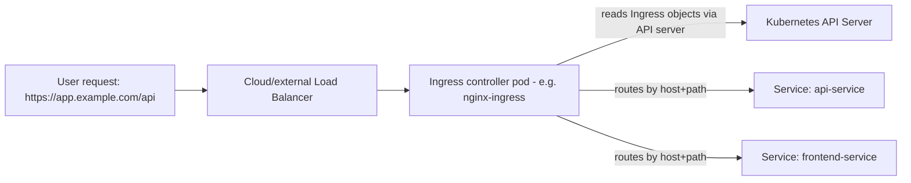

# Ingress and Ingress Controllers

## What You'll Learn

- Why an `Ingress` manifest does nothing by itself, and what actually makes it work
- How to route by host and path to multiple backend Services from one entry point
- How TLS termination and automatic certificate issuance with cert-manager fit together

## Why This Matters

`Ingress` is one of the most misunderstood objects in Kubernetes because it's declarative *config*, not a running *component*. Applying it with no controller installed produces an object that sits in etcd doing nothing — no errors, no traffic routed, nothing. Understanding this split is the difference between debugging in five minutes and an hour of confused `curl` attempts.

## Mental Model

> `Ingress` is a **specification** — "route this host/path to that Service." An **Ingress controller** is a running workload (usually a Deployment of a reverse proxy) that watches `Ingress` objects via the API server and configures itself to actually match them. No controller, no effect, regardless of how correct your YAML is.



## How It Works

### The Ingress resource

```yaml
apiVersion: networking.k8s.io/v1
kind: Ingress
metadata:
  name: app-ingress
  annotations:
    nginx.ingress.kubernetes.io/rewrite-target: /
    cert-manager.io/cluster-issuer: letsencrypt-prod
spec:
  ingressClassName: nginx
  tls:
    - hosts:
        - app.example.com
      secretName: app-tls
  rules:
    - host: app.example.com
      http:
        paths:
          - path: /api
            pathType: Prefix
            backend:
              service:
                name: api-service
                port:
                  number: 8080
          - path: /
            pathType: Prefix
            backend:
              service:
                name: frontend-service
                port:
                  number: 80
```

- `ingressClassName` tells Kubernetes **which** installed controller should handle this object — required once more than one controller might be present in a cluster.
- `pathType: Prefix` matches `/api`, `/api/`, `/api/anything` — `Exact` matches only the literal path; `ImplementationSpecific` defers matching semantics to the controller.
- Annotations are how controller-specific behavior (rewrites, rate limits, auth) gets configured — they aren't part of the core `Ingress` spec, which is deliberately minimal.

### Installing an Ingress controller

Nothing above works until a controller is actually running:

```bash
helm repo add ingress-nginx https://kubernetes.github.io/ingress-nginx
helm repo update
helm install ingress-nginx ingress-nginx/ingress-nginx \
  --namespace ingress-nginx --create-namespace
kubectl get pods -n ingress-nginx
kubectl get svc -n ingress-nginx   # usually a LoadBalancer Service — the real external entry point
```

Popular controllers:

| Controller | Notes |
|---|---|
| **ingress-nginx** | Most widely deployed, huge annotation surface, well understood |
| **Traefik** | Native support for dynamic config, good with Let's Encrypt out of the box, popular in smaller/edge deployments |
| **HAProxy Ingress** | Strong for teams already standardized on HAProxy |
| **Cloud-native (ALB Ingress Controller, GKE Ingress)** | Maps `Ingress` directly onto the cloud provider's native load balancer, no separate proxy pod |

### TLS termination with cert-manager

```yaml
apiVersion: cert-manager.io/v1
kind: ClusterIssuer
metadata:
  name: letsencrypt-prod
spec:
  acme:
    server: https://acme-v02.api.letsencrypt.org/directory
    email: platform-team@example.com
    privateKeySecretRef:
      name: letsencrypt-prod-key
    solvers:
      - http01:
          ingress:
            ingressClassName: nginx
```

With `cert-manager` installed and a `ClusterIssuer` configured, the `cert-manager.io/cluster-issuer` annotation on an `Ingress` (as in the example above) is enough: cert-manager watches for that annotation, requests a certificate from Let's Encrypt via the ACME HTTP-01 challenge (served through the same Ingress controller), and populates the `secretName` referenced in `tls:` automatically — including renewal before expiry.

```bash
kubectl get certificate app-tls
kubectl describe certificate app-tls   # check issuance status/errors
```

## Common Mistakes

- Applying an `Ingress` manifest and expecting it to work with no controller installed — check `kubectl get pods -n <ingress-namespace>` first when nothing routes.
- Omitting `ingressClassName` in a cluster with more than one controller — the `Ingress` may be picked up by the wrong one, or none, depending on default-class configuration.
- Mismatched `pathType` expectations — assuming `Prefix` behaves like a glob, when it matches on `/`-delimited path segments, not substrings.
- Forgetting that annotations are controller-specific — an `nginx.ingress.kubernetes.io/*` annotation does nothing under Traefik, and vice versa.
- Treating cert-manager's ACME HTTP-01 challenge as automatic without the Ingress controller actually reachable from the public internet — the challenge fails silently if DNS/firewall isn't pointed at the controller yet.

## Interview Questions

- Why does an `Ingress` object do nothing without an Ingress controller, and how would you verify one is installed?
- Walk through what happens end to end when cert-manager issues a certificate for an `Ingress`.
- What's the difference between `pathType: Prefix`, `Exact`, and `ImplementationSpecific`?

See [Interview Prep](../interview-prep/index.md) for full answers.

## Next

Continue to [Network Policies](04-network-policies.md) to restrict which traffic is even allowed to reach these Services in the first place.
