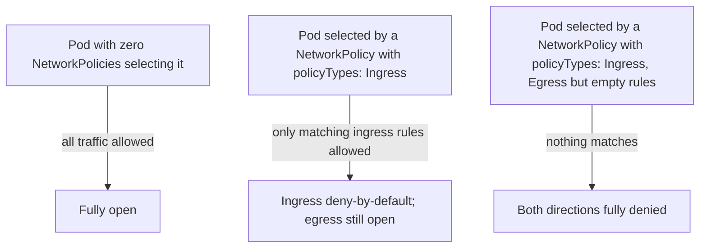

# Network Policies

## What You'll Learn

- Why every pod can talk to every other pod by default, and why that's rarely what you want in production
- How to write default-deny and allow-list `NetworkPolicy` rules with `podSelector`/`namespaceSelector`
- Why NetworkPolicy support is a CNI plugin feature, not a Kubernetes core guarantee

## Why This Matters

A cluster with no `NetworkPolicy` objects is fully open internally — any pod can reach any other pod on any port, across every namespace. That's convenient for a demo and a serious liability in production: a single compromised pod can otherwise reach your database, your internal admin APIs, and anything else in the cluster. `NetworkPolicy` is the tool for micro-segmentation, but only if you actually write default-deny rules — the absence of a policy is not a restriction, it's silence.

## Mental Model

> **Without any `NetworkPolicy` selecting a pod, all traffic to and from it is allowed.** The moment *any* `NetworkPolicy` selects a pod (via `podSelector`) for a given direction (`Ingress`/`Egress`), that direction switches to **deny-by-default**, and only traffic matching a rule in that policy (or another policy also selecting the pod) is allowed.

This "selecting a pod flips it to deny-by-default" behavior is the single most important, most misunderstood rule of `NetworkPolicy`.



## How It Works

### Default-deny-all, then allow specific traffic

```yaml
# 1. Deny all ingress and egress for every pod in the namespace
apiVersion: networking.k8s.io/v1
kind: NetworkPolicy
metadata:
  name: default-deny-all
  namespace: production
spec:
  podSelector: {}         # matches every pod in the namespace
  policyTypes:
    - Ingress
    - Egress
---
# 2. Explicitly allow what's actually needed
apiVersion: networking.k8s.io/v1
kind: NetworkPolicy
metadata:
  name: allow-frontend-to-api
  namespace: production
spec:
  podSelector:
    matchLabels:
      app: api
  policyTypes:
    - Ingress
    - Egress
  ingress:
    - from:
        - podSelector:
            matchLabels:
              app: frontend
      ports:
        - protocol: TCP
          port: 8080
  egress:
    - to:
        - podSelector:
            matchLabels:
              app: database
      ports:
        - protocol: TCP
          port: 5432
    - to:                  # DNS almost always needs an explicit egress allow too
        - namespaceSelector: {}
      ports:
        - protocol: UDP
          port: 53
```

Deploying policy 1 alone in a namespace with no other policies makes every pod there fully isolated — this is the standard "default deny, then allow-list" pattern, and it's deliberately written as two separate objects so the deny-all can be applied cluster-wide via GitOps while individual teams add their own allow rules.

### Selecting traffic sources precisely

```yaml
  ingress:
    - from:
        - namespaceSelector:
            matchLabels:
              kubernetes.io/metadata.name: monitoring
          podSelector:
            matchLabels:
              app: prometheus
      ports:
        - protocol: TCP
          port: 9090
```

Combining `namespaceSelector` **and** `podSelector` in the same `from` entry is an AND — "only `app: prometheus` pods, and only if they're in the `monitoring` namespace." Listed as two separate entries in the `from` list, they'd be an OR instead.

```yaml
  ingress:
    - from:
        - ipBlock:
            cidr: 10.0.0.0/16
            except:
              - 10.0.5.0/24
```

`ipBlock` is how you allow/deny by raw CIDR — useful for traffic coming from outside the cluster's pod network (e.g. a corporate VPN range) that `podSelector`/`namespaceSelector` can't express.

### Verifying and debugging

```bash
kubectl get networkpolicy -n production
kubectl describe networkpolicy allow-frontend-to-api -n production
kubectl exec -it frontend-pod -- curl -m 3 http://api:8080/healthz
```

There's no built-in "why was this blocked" diagnostic — `NetworkPolicy` failures show up as connection timeouts, not error messages. Most CNI plugins with policy support (Calico, Cilium) ship their own tooling (`calicoctl`, Cilium's Hubble) for actually observing policy decisions in real time.

## Common Mistakes

- Assuming `NetworkPolicy` works on any cluster — it's enforced by the **CNI plugin**, not the API server. Flannel's default mode, for example, does not enforce `NetworkPolicy` at all; the object gets accepted by the API but silently has no effect.
- Writing a default-deny policy and forgetting DNS egress (UDP/TCP 53) — pods can no longer resolve *any* name, including Service names, and everything looks like a networking outage rather than a policy problem.
- Believing `NetworkPolicy` encrypts or authenticates traffic — it's L3/L4 filtering only (IP/port), not a service mesh; it doesn't provide mTLS or identity-based auth.
- Forgetting that policies are **additive** — multiple policies selecting the same pod for the same direction are combined with OR, not overridden; you can't "deny" with a more specific policy once something else allows it.
- Applying a namespace-scoped default-deny without coordinating with every team in that namespace — a policy applied mid-day can silently break existing legitimate traffic with no clear error.

## Interview Questions

- What's the exact default behavior for a pod that no `NetworkPolicy` selects, versus one selected by a policy with `policyTypes: [Ingress]`?
- Why would a default-deny-all `NetworkPolicy` break DNS, and how do you fix it?
- Why does `NetworkPolicy` support depend on which CNI plugin is installed?

See [Interview Prep](../interview-prep/index.md) for full answers.

## Next

Continue to [DNS and CoreDNS](05-dns-and-coredns.md) — the exact traffic a default-deny policy has to remember to allow.
