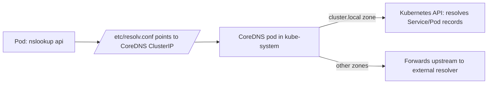

# DNS and CoreDNS

## What You'll Learn

- How CoreDNS is deployed and how it fits into pod DNS resolution
- The exact DNS naming convention for Services and Pods, including the full FQDN
- A repeatable, real command sequence for debugging "why can't this pod resolve that name"

## Why This Matters

Almost every "service not accessible" ticket that isn't a `NetworkPolicy` or selector mismatch turns out to be DNS. Every Service gets a name for free, but that name only resolves because CoreDNS is running, correctly configured, and reachable from the calling pod — three separate things that can each fail independently.

## Mental Model

> Every pod's `/etc/resolv.conf` points at CoreDNS's ClusterIP by default. CoreDNS is itself a Deployment running in `kube-system`, exposed by its own Service — DNS in Kubernetes is just another workload, not a special hidden subsystem.



## How It Works

### DNS naming conventions

| Resource | FQDN pattern | Example |
|---|---|---|
| Service (same namespace, short form) | `<service>` | `api` |
| Service (any namespace) | `<service>.<namespace>` | `api.production` |
| Service (fully qualified) | `<service>.<namespace>.svc.cluster.local` | `api.production.svc.cluster.local` |
| Pod behind a headless Service | `<pod-hostname>.<service>.<namespace>.svc.cluster.local` | `postgres-0.postgres.production.svc.cluster.local` |
| Pod, by IP with dashes | `<ip-with-dashes>.<namespace>.pod.cluster.local` | `10-244-1-5.production.pod.cluster.local` |

The short form (`api`) only resolves correctly from within the **same namespace**, because it relies on the pod's `search` domains in `/etc/resolv.conf` (`<namespace>.svc.cluster.local`, `svc.cluster.local`, `cluster.local`, in order). Cross-namespace lookups need at least `<service>.<namespace>`.

```bash
kubectl exec -it my-pod -- cat /etc/resolv.conf
```

```text
nameserver 10.96.0.10
search production.svc.cluster.local svc.cluster.local cluster.local
options ndots:5
```

`ndots:5` means any name with fewer than 5 dots gets every search domain tried first before being treated as fully qualified — this is a well-known source of extra DNS lookups (and latency) for external hostnames like `api.stripe.com`.

### CoreDNS itself

```bash
kubectl get pods -n kube-system -l k8s-app=kube-dns
kubectl get svc -n kube-system kube-dns
kubectl get configmap coredns -n kube-system -o yaml
```

The `Corefile` (CoreDNS's config, held in that ConfigMap) defines its behavior as a plugin chain — typically `kubernetes` (serves `cluster.local` records from the API), `forward` (sends anything else upstream, e.g. to `/etc/resolv.conf` on the node), and `cache`:

```text
.:53 {
    errors
    health
    ready
    kubernetes cluster.local in-addr.arpa ip6.arpa {
        pods insecure
        fallthrough in-addr.arpa ip6.arpa
    }
    forward . /etc/resolv.conf
    cache 30
    loop
    reload
    loadbalance
}
```

### Debugging DNS with a throwaway pod

```bash
kubectl run dns-debug --rm -it --restart=Never --image=busybox:1.36 -- \
  nslookup api.production.svc.cluster.local

kubectl run dns-debug --rm -it --restart=Never --image=busybox:1.36 -- \
  nslookup kube-dns.kube-system.svc.cluster.local   # confirm CoreDNS itself is reachable

kubectl logs -n kube-system -l k8s-app=kube-dns --tail=100   # check CoreDNS logs for errors
```

A structured debugging order:

1. Does CoreDNS itself resolve (`kube-dns.kube-system.svc.cluster.local`)? If not, CoreDNS pods or the Service in front of them are broken.
2. Does the target Service resolve from the *same* namespace? Rules out selector/name typos in the target Service.
3. Does it resolve using the fully-qualified name from a *different* namespace? Isolates whether it's a short-name/search-domain issue.
4. Is a `NetworkPolicy` blocking UDP/TCP port 53 egress from the calling pod? (Covered in [Network Policies](04-network-policies.md).)

## Common Mistakes

- Forgetting the short-name form only works within the same namespace — cross-namespace calls silently fail (`NXDOMAIN`) unless the namespace is included.
- Writing a default-deny `NetworkPolicy` and not allowing DNS egress, then spending an hour debugging "the app can't reach anything" before realizing nothing can resolve names anymore.
- Not knowing `ndots:5` exists — high-`ndots` search-domain expansion for frequently-called external APIs adds real, measurable latency (and DNS query volume) that's invisible until you look at `resolv.conf`.
- Assuming a DNS problem is a CoreDNS problem before ruling out the calling pod's own `NetworkPolicy`, kube-proxy/Service health, or a genuinely misspelled Service name.
- Editing the CoreDNS `Corefile` `ConfigMap` directly without understanding the resulting pods need a restart (or the `reload` plugin, which is included by default) to pick up changes.

## Interview Questions

- Give the fully qualified DNS name for a Service, and explain why the short form only works from the same namespace.
- What does `ndots:5` control, and why can it matter for performance on external DNS calls?
- Walk through your debugging order when a pod reports it can't resolve another Service's name.

See [Interview Prep](../interview-prep/index.md) for full answers.

## Next

Continue to [CNI Plugins](06-cni-plugins.md) to compare the plugins that implement the networking model DNS, Services, and NetworkPolicy all depend on.
