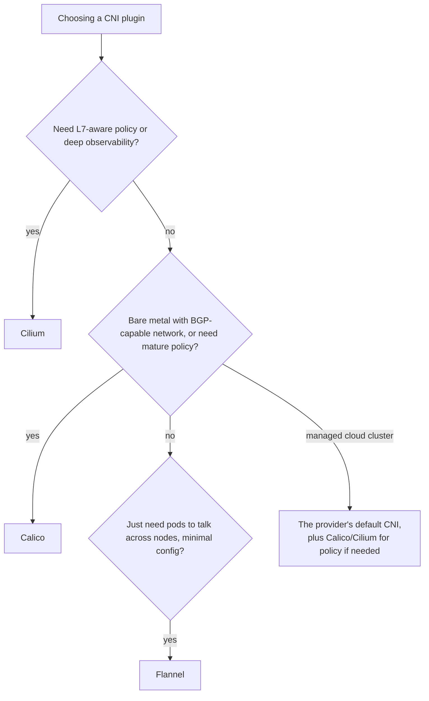

# CNI Plugins

## What You'll Learn

- The two fundamental design choices every CNI plugin makes: overlay vs. native routing, and iptables/IPVS vs. eBPF
- How Calico, Flannel, Cilium, and the cloud providers' VPC CNIs compare on those axes, plus NetworkPolicy support
- A decision framework for picking a default, instead of picking by name recognition

## Why This Matters

The CNI plugin is infrastructure you install once and then mostly forget about — until you need `NetworkPolicy` it doesn't support, or you're debugging latency and don't know if you're looking at an overlay tunnel or real routing. Picking one deliberately, based on your actual constraints (existing network, need for policy, scale, observability), avoids a painful migration later — CNI plugins are notoriously hard to swap on a live cluster.

## Mental Model

Two questions decide almost everything about a CNI plugin's behavior:

1. **Overlay or native routing?** Does it wrap pod traffic in a tunnel (VXLAN/IP-in-IP) that works over any underlying network, or does it program real routes on the underlying network directly (faster, but needs L3 access to the underlying network, e.g. BGP peering)?
2. **iptables/IPVS or eBPF?** Does it rely on the kernel's traditional netfilter path (like kube-proxy does), or does it use eBPF to process packets earlier and more efficiently, often replacing kube-proxy entirely?

## Comparison

| Plugin | Routing mode | Datapath | NetworkPolicy | Notable strength |
|---|---|---|---|---|
| **Flannel** | Overlay (VXLAN) by default; simplest option | iptables (via kube-proxy) | Not supported by Flannel itself — needs pairing with Calico ("Canal") for policy | Simplicity — minimal config, "just works" on almost any infrastructure |
| **Calico** | Native routing (BGP) by default, VXLAN/IP-in-IP available as fallback | iptables or eBPF (Calico's own eBPF dataplane, optional) | Full support — one of the most complete NetworkPolicy implementations, plus its own `GlobalNetworkPolicy` extensions | Mature policy engine, works well on bare metal via BGP, widely deployed at scale |
| **Cilium** | Native routing or overlay (VXLAN/Geneve), flexible | eBPF-native, typically replaces kube-proxy entirely | Full support, plus L7-aware policy (HTTP method/path, gRPC, Kafka) | Deepest observability (Hubble), identity-based security, best performance at high pod/Service counts |
| **Cloud-native CNIs** (AWS VPC CNI, Azure CNI, GKE Dataplane V2) | Pods get real VPC IP addresses | Varies (GKE Dataplane V2 is Cilium-based) | Varies; often via Calico or Cilium add-on | The managed-cluster default; pods are first-class citizens of the VPC, with no overlay |



!!! warning "Weave Net is no longer maintained"
    Weave Net appears in a lot of older tutorials. Its maintainer, Weaveworks, shut down in 2024 and the project was archived, so it receives no fixes. Don't choose it for a new cluster, and plan a migration if you still run it.

## How It Works

### Overlay vs. native routing, concretely

An overlay plugin (Flannel's default VXLAN mode) wraps every pod-to-pod packet crossing nodes in an extra UDP packet, decapsulated on the receiving node — this works regardless of what the underlying network looks like, at the cost of some throughput/latency overhead and larger packet headers (watch your MTU).

Native routing (Calico's BGP mode) instead announces each node's pod CIDR as a real route via BGP, so the underlying network fabric routes pod traffic directly, no encapsulation — faster, but requires a network that can actually carry those routes (or a full-mesh BGP setup Calico manages itself between nodes).

### eBPF vs. iptables, concretely

Traditional kube-proxy (iptables or IPVS mode) intercepts packets deep in the kernel's netfilter stack, after a fair amount of standard networking-stack processing has already happened. An eBPF-based datapath (Cilium, or Calico's eBPF mode) attaches directly to network interfaces and can make forwarding decisions much earlier, skipping redundant work — this is most noticeable at high Service/connection counts, where iptables rule evaluation cost visibly grows.

### Checking what's installed on a cluster

```bash
kubectl get pods -n kube-system -o wide | grep -Ei 'calico|flannel|cilium|aws-node|azure-cni|weave'
kubectl get daemonset -n kube-system
cilium status                      # if Cilium CLI is installed
calicoctl node status              # if calicoctl is installed
```

## Common Mistakes

- Assuming every CNI plugin supports `NetworkPolicy` — Flannel alone doesn't; verify support before writing policies you assume will be enforced.
- Running an overlay plugin without adjusting MTU on interfaces/instances that need it — VXLAN encapsulation overhead can silently cause fragmentation or dropped packets at the default MTU.
- Treating a CNI swap as a routine config change — most plugin migrations require careful planning (often a new cluster or a very deliberate node-by-node cutover) because pod networking is foundational.
- Choosing a plugin by popularity alone rather than against the real constraint (need for L7 policy, bare-metal BGP feasibility, existing team familiarity with eBPF tooling).
- Ignoring observability differences — debugging "why is this Service unreachable" is far easier with Cilium's Hubble than with raw iptables rule dumps.

## Interview Questions

- What's the practical difference between an overlay network and native/BGP routing, and what does each cost you?
- Why doesn't Flannel support `NetworkPolicy` on its own, and what's the common fix?
- What does an eBPF-based CNI plugin like Cilium do differently from kube-proxy's iptables mode?
- How would you decide between Calico and Cilium for a new production cluster?

See [Interview Prep](../interview-prep/index.md) for full answers.

## Next

Continue to [Gateway API](07-gateway-api.md), the modern way to route external traffic into the cluster.
