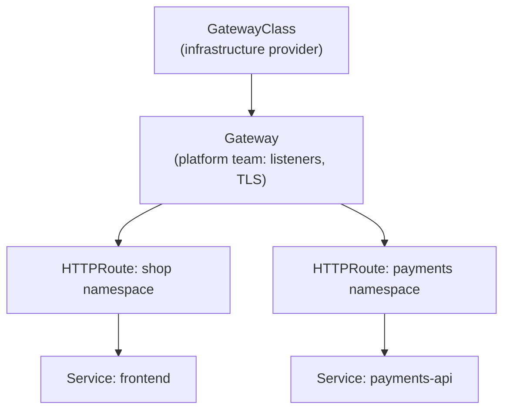

# Gateway API

## What You'll Learn

- Why Gateway API exists, and what it fixes compared to `Ingress`
- The role-oriented resource model: `GatewayClass`, `Gateway`, and `HTTPRoute`
- How to do host/path routing, TLS, and weighted canary traffic without controller-specific annotations
- How to migrate an existing ingress-nginx setup with `ingress2gateway`

## Why This Matters

In November 2025, Kubernetes SIG Network announced the retirement of **ingress-nginx**, the most widely deployed Ingress controller. Best-effort maintenance ended in March 2026: no more releases, bug fixes, or security patches. The recommended path forward is **Gateway API** — a GA, vendor-neutral API that most modern controllers already implement.

Even without the retirement, `Ingress` had hit its limits. Its spec is deliberately tiny, so anything beyond host/path routing — header matching, traffic splitting, timeouts, rewrites — lived in controller-specific annotations that silently did nothing on a different controller.

## Mental Model

> Gateway API splits one overloaded `Ingress` object into resources owned by different people. The **platform team** decides *what kind* of load balancer exists (`GatewayClass`) and *where* it listens (`Gateway`). **Application teams** attach routes (`HTTPRoute`) to that Gateway from their own namespaces, within limits the platform team sets.



| Concern | Ingress | Gateway API |
|---|---|---|
| Who owns it | One object mixes infra and app config | Split across `GatewayClass` / `Gateway` / `HTTPRoute` |
| Advanced routing | Controller-specific annotations | Typed fields: header/query matching, weights, filters |
| Protocols | HTTP/HTTPS | HTTP, gRPC, TLS passthrough (TCP/UDP in experimental channel) |
| Cross-namespace | Not really | Explicit, with `allowedRoutes` and `ReferenceGrant` |
| Portability | Annotations break between controllers | Conformance tests across implementations |

## How It Works

### Install the CRDs and a controller

Gateway API resources are CRDs, versioned separately from Kubernetes itself. Many managed platforms and controllers install them for you; otherwise:

```bash
kubectl apply --server-side -f \
  https://github.com/kubernetes-sigs/gateway-api/releases/download/v1.6.1/standard-install.yaml
kubectl get crd | grep gateway.networking.k8s.io
```

The CRDs alone do nothing, exactly like `Ingress` without a controller. Common implementations:

| Implementation | Notes |
|---|---|
| **Envoy Gateway** | CNCF Envoy project's reference-style implementation |
| **Cilium** | Built in if Cilium is already your CNI |
| **Istio** / **kgateway** | Envoy-based, strong if you also want mesh features |
| **NGINX Gateway Fabric** | NGINX-based, the natural target for teams leaving ingress-nginx |
| **Traefik** | Supports both Ingress and Gateway API |
| **Cloud controllers** (GKE Gateway, AWS Load Balancer Controller) | Map Gateways onto the provider's managed load balancers |

### Platform team: the Gateway

```yaml
apiVersion: gateway.networking.k8s.io/v1
kind: Gateway
metadata:
  name: public
  namespace: gateway-infra
  annotations:
    cert-manager.io/cluster-issuer: letsencrypt-prod   # requires cert-manager's Gateway API support enabled
spec:
  gatewayClassName: envoy-gateway        # matches an installed GatewayClass
  listeners:
    - name: https
      protocol: HTTPS
      port: 443
      hostname: "*.example.com"
      tls:
        mode: Terminate
        certificateRefs:
          - name: wildcard-example-com-tls
      allowedRoutes:
        namespaces:
          from: Selector
          selector:
            matchLabels:
              gateway-access: public     # only labeled namespaces may attach routes
```

### App team: an HTTPRoute

This is the equivalent of the host + path `Ingress` in [Ingress and Ingress Controllers](03-ingress-and-ingress-controllers.md), with no annotations:

```yaml
apiVersion: gateway.networking.k8s.io/v1
kind: HTTPRoute
metadata:
  name: app
  namespace: shop
spec:
  parentRefs:
    - name: public
      namespace: gateway-infra
  hostnames:
    - app.example.com
  rules:
    - matches:
        - path:
            type: PathPrefix
            value: /api
      filters:
        - type: URLRewrite
          urlRewrite:
            path:
              type: ReplacePrefixMatch
              replacePrefixMatch: /
      backendRefs:
        - name: api-service
          port: 8080
    - matches:
        - path:
            type: PathPrefix
            value: /
      backendRefs:
        - name: frontend-service
          port: 80
```

### Weighted canary without a special controller

Traffic splitting is a first-class field, so the canary pattern from [Case Study: Blue-Green and Canary Releases](../case-studies/02-blue-green-and-canary-releases.md) needs no `canary-weight` annotations:

```yaml
  rules:
    - backendRefs:
        - name: payments-ui-stable
          port: 80
          weight: 90
        - name: payments-ui-canary
          port: 80
          weight: 10
```

Change the weights and re-apply to shift traffic; set the canary to `0` to roll back.

### Check that a route actually attached

```bash
kubectl get gateway -n gateway-infra
kubectl describe httproute app -n shop
```

Look at `status.parents[].conditions` on the route: `Accepted=True` means the Gateway allowed it, and `ResolvedRefs=True` means every backend Service and port exists. A route that is `Accepted=False` usually hit an `allowedRoutes` restriction — the namespace isn't labeled, or the hostname doesn't match the listener.

## Migrating From ingress-nginx

1. **Inventory** what you rely on: `kubectl get ingress -A -o yaml | grep 'nginx.ingress.kubernetes.io/' | sort | uniq -c`. Annotations are the hard part of any migration.
2. **Install a Gateway API implementation** alongside ingress-nginx — both can run at once on different load balancer IPs.
3. **Generate a first draft** with the Kubernetes project's converter:

    ```bash
    ingress2gateway print --providers=ingress-nginx -A > gateway-resources.yaml
    ```

    Review the output — it translates common annotations and warns about the ones it cannot.

4. **Test through the new load balancer** using a hosts-file entry or a temporary DNS name before touching production DNS.
5. **Shift DNS** (or weights at your external load balancer) gradually, then remove the old `Ingress` objects and the ingress-nginx release.

!!! note "Staying on Ingress is still valid — just not on ingress-nginx"
    The `Ingress` API itself is not deprecated. If a full move to Gateway API is too big right now, switching to another maintained Ingress controller (Traefik, HAProxy, a cloud controller) removes the security risk first; you can adopt Gateway API later.

## Common Mistakes

- Applying `HTTPRoute`s with no Gateway API implementation installed, or with a `gatewayClassName` that doesn't match any installed `GatewayClass`.
- Forgetting `allowedRoutes` on the Gateway listener, so routes from app namespaces are silently rejected (`Accepted=False`).
- Referencing a Service in another namespace from a route without a `ReferenceGrant` in the target namespace.
- Treating `ingress2gateway` output as finished — unsupported annotations (auth snippets, custom Lua, rate limits) need a manual equivalent.
- Leaving ingress-nginx running "because it still works" — it no longer gets security fixes.

## Interview Questions

- What problems with `Ingress` does Gateway API solve, beyond ingress-nginx being retired?
- Explain the split between `GatewayClass`, `Gateway`, and `HTTPRoute`, and which team owns each.
- How would you run a 90/10 canary with Gateway API, and how does that differ from doing it with ingress-nginx?
- Walk through how you would migrate 200 `Ingress` objects with heavy annotation use to Gateway API with no downtime.

See [Interview Prep](../interview-prep/index.md) for full answers.

## Next

Continue to [Storage](../storage/index.md) for how persistent data is attached to the pods this networking layer connects.
