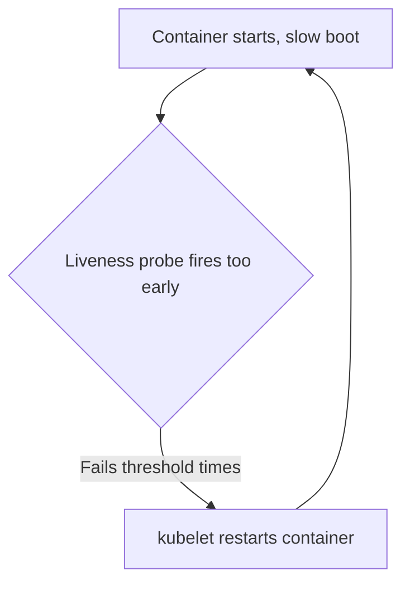

# Probes: Liveness, Readiness, and Startup

## What You'll Learn

- The one specific thing each of the three probe types controls, and why confusing them causes real outages
- Every timing field that governs a probe, and how they interact with each other
- The classic "slow-starting app + tight liveness probe" death spiral, and how the startup probe was built specifically to fix it

## Why This Matters

Probes are the mechanism Kubernetes uses to decide two very different things: "should I restart this container?" and "should I send it traffic?" Conflating those two questions — or setting timing that doesn't match how the application actually starts — is one of the most common causes of self-inflicted outages: an app that would have started fine gets killed repeatedly before it ever finishes booting.

## Mental Model

> Three probes, three different consequences. Getting the *type* right matters more than getting the exact thresholds right.

| Probe | Question it answers | Failure action |
|---|---|---|
| **Liveness** | Is this container in a state it can never recover from on its own? | kubelet **restarts** the container |
| **Readiness** | Is this container currently able to serve traffic? | Pod is **removed from Service endpoints** — no restart |
| **Startup** | Has this container finished its (possibly slow) initial boot yet? | Liveness and readiness probes are **not run at all** until this succeeds |

The startup probe doesn't do anything on its own beyond gating the other two — it exists purely to give a slow-booting container room to start without the liveness probe interpreting "still booting" as "must be restarted."

## How It Works

### All three probes on one container

```yaml
apiVersion: v1
kind: Pod
metadata:
  name: web
spec:
  containers:
    - name: app
      image: myregistry.example.com/web-app:2.3.1
      ports:
        - containerPort: 8080
      startupProbe:
        httpGet:
          path: /healthz
          port: 8080
        failureThreshold: 30
        periodSeconds: 10
      livenessProbe:
        httpGet:
          path: /healthz
          port: 8080
        initialDelaySeconds: 0
        periodSeconds: 10
        failureThreshold: 3
        timeoutSeconds: 1
      readinessProbe:
        httpGet:
          path: /ready
          port: 8080
        periodSeconds: 5
        failureThreshold: 3
```

### Timing fields, and how they interact

| Field | Meaning |
|---|---|
| `initialDelaySeconds` | Wait this long after container start before the *first* probe attempt |
| `periodSeconds` | How often to probe after that |
| `timeoutSeconds` | How long to wait for a probe response before counting it as failed |
| `failureThreshold` | Consecutive failures needed before the probe is considered failed |
| `successThreshold` | Consecutive successes needed to mark it healthy again (readiness/startup only — liveness must be 1) |

For the startup probe specifically, the effective boot budget is `periodSeconds × failureThreshold` — in the example above, `10s × 30 = 300s` of allowed startup time before Kubernetes gives up and restarts the container. Once the startup probe succeeds even once, it stops running entirely for the rest of the container's life, and liveness/readiness take over on their own schedules.

### The death spiral this exists to prevent

Before startup probes existed (pre-1.16, and still a common misconfiguration today when people skip them), teams had one lever for a slow-booting app: crank up the liveness probe's `initialDelaySeconds`. That's a bad trade in both directions:

- Set it too short, and a legitimately slow boot (JVM warmup, large cache load, migration on startup) gets killed by the liveness probe before it ever finishes — the container restarts, starts booting again, gets killed again, forever. This is the death spiral: `CrashLoopBackOff` on an application that was never actually broken, just slow to start.
- Set it too long "to be safe," and a genuinely hung container after a successful start takes far longer than necessary to be detected and restarted.



The startup probe breaks this cycle by decoupling the two concerns: give the startup probe a generous, boot-specific budget, and keep the liveness probe's own thresholds tight and tuned for detecting a genuine hang *after* startup — because liveness doesn't even begin running until startup has already succeeded.

### Readiness vs. liveness in practice

A container can be alive but not ready — for example, an app that's up and responsive but has temporarily lost its database connection. The correct response is "stop sending it traffic until the DB connection recovers," not "restart the container," because restarting won't fix a downstream dependency issue and just adds unnecessary churn. That's exactly the readiness probe's job, and exactly why it must be a distinct check from liveness rather than the same endpoint reused for both.

```bash
# Confirm probe results and current status
kubectl describe pod web
kubectl get pod web -o jsonpath='{.status.containerStatuses[0].ready}'
```

## Common Mistakes

- Using the same endpoint and thresholds for liveness and readiness — a transient dependency outage then triggers unnecessary container restarts instead of just a traffic pause.
- Setting `initialDelaySeconds` on the liveness probe to accommodate slow startup instead of adding a dedicated startup probe — this is exactly the pattern that causes restart-loop death spirals.
- Making the liveness probe check downstream dependencies (database, external API) — if the dependency is down, restarting the container doesn't help and can restart-loop every replica simultaneously.
- Setting `failureThreshold: 1` on a liveness probe, which restarts a container on a single transient blip (a GC pause, a momentary CPU spike) instead of tolerating brief hiccups.
- Forgetting that `successThreshold` must be `1` for liveness probes — Kubernetes rejects any other value there.

## Interview Questions

- What's the specific difference in consequence between a failed liveness probe and a failed readiness probe?
- Explain exactly how a startup probe prevents a restart-loop death spiral on a slow-booting application.
- Why shouldn't a liveness probe check a downstream database connection?
- How would you calculate the maximum allowed startup time from a startup probe's `periodSeconds` and `failureThreshold`?

See [Interview Prep](../interview-prep/index.md) for full answers.

## Next

Continue to [Logging](02-logging.md) to see what happens to a container's output once it's running and passing these probes.
