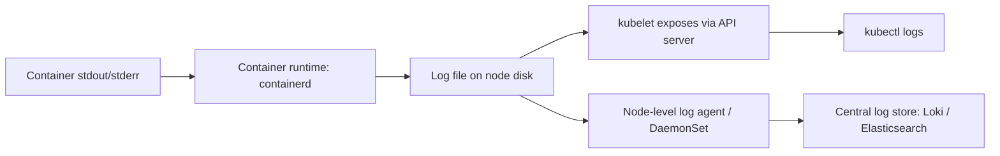

# Logging

## What You'll Learn

- Exactly how a line a container writes to stdout ends up visible in `kubectl logs`
- The full set of `kubectl logs` flags you'll actually use in an incident, not just the basic form
- The two dominant patterns for shipping logs cluster-wide, and when each one fits

## Why This Matters

`kubectl logs` feels simple until the pod that generated the interesting log line has already been restarted or evicted, at which point "just check the logs" stops working unless you understand the architecture underneath it — where logs live on the node, how long they're kept, and what a cluster-wide logging pipeline needs to capture before that data disappears.

## Mental Model

> Kubernetes itself does not have a built-in cluster-wide logging system. It guarantees exactly one thing: whatever a container writes to **stdout/stderr** is captured by the container runtime on that node and made available via the API server. Everything past that single node — retention, search, cluster-wide aggregation — is something you have to explicitly build or install.



## How It Works

### From stdout to kubectl logs

1. A process inside the container writes to `stdout`/`stderr`.
2. The container runtime (`containerd` in most current clusters) captures that stream and writes it to a JSON log file on the node's local disk (`/var/log/containers/...` via a symlink chain into `/var/log/pods/...`).
3. The **kubelet** exposes those log files through an API endpoint.
4. `kubectl logs` calls that endpoint through the API server — it never reads the file directly, which is why `kubectl logs` stops working the moment the node or pod is gone.

This means: **anything not written to stdout/stderr is invisible to Kubernetes logging by default.** An app that writes only to a local file inside the container is logging into a void that disappears with the container's filesystem.

### `kubectl logs` in practice

```bash
# Basic
kubectl logs my-pod

# Follow in real time, like tail -f
kubectl logs -f my-pod

# A specific container in a multi-container pod
kubectl logs my-pod -c sidecar

# The previous container instance — essential after a crash/restart
kubectl logs my-pod --previous

# Last N lines, or logs since a duration
kubectl logs my-pod --tail=100
kubectl logs my-pod --since=1h

# All pods matching a label, aggregated
kubectl logs -l app=checkout --all-containers --prefix
```

`--previous` is the single most important flag during an incident: once a container has restarted (say, after a liveness probe failure), the plain `kubectl logs my-pod` shows only the **new** container instance's logs — the crash you're actually investigating is in the previous instance, retrievable only with `--previous`, and only until the node rotates that data away.

### Node-level log rotation

Node disks aren't infinite, so `kubelet` enforces rotation on container log files — by default, based on size (`containerLogMaxSize`) and count of retained files (`containerLogMaxFiles`), both configurable in the kubelet config. Once a pod's logs roll past retention or the pod itself is deleted, `kubectl logs` has nothing left to return — this is the fundamental reason cluster-wide log aggregation exists: to move logs off short-lived node disks before rotation or pod deletion erases them.

### Cluster-wide logging patterns

Two architectures dominate, and they trade off resource usage against isolation:

| Pattern | How it works | Trade-off |
|---|---|---|
| **Node-level agent (DaemonSet)** | One log-shipping agent per node (e.g. Fluent Bit, Promtail) reads every container's log files on that node and forwards them centrally | One agent per node regardless of pod count — efficient, but all workloads on a node share the same agent configuration |
| **Sidecar container** | A dedicated logging container runs inside the same pod as the app, reading the app's output (or a shared volume) and shipping it independently | Per-pod control over log handling (useful if an app can't write to stdout at all, or needs per-app processing) — costs a container's worth of resources per pod |

The **node-agent/DaemonSet** pattern is the standard default for most clusters because it scales with nodes, not pods, and keeps resource overhead low. The **sidecar** pattern is reserved for exceptions — an application that logs only to a file and can't be changed to use stdout, or a workload needing log processing too specific for a shared node agent.

A common cluster-wide stack pairs a DaemonSet log shipper (Fluent Bit or Promtail) with a central store — **Loki** (paired with Promtail/Fluent Bit, designed to integrate with Grafana) or the **EFK stack** (Elasticsearch, Fluentd, Kibana) are the two most common combinations in production Kubernetes environments.

## Common Mistakes

- Assuming an application logging to a local file inside the container is "logging normally" — Kubernetes only captures stdout/stderr; file-based logs vanish with the container unless separately shipped.
- Forgetting `--previous` when investigating a `CrashLoopBackOff` and concluding "there's nothing in the logs" when the crash is actually in the previous instance.
- Relying on `kubectl logs` as your only logging strategy in production — it has no retention beyond node-level rotation and no cross-pod search.
- Choosing the sidecar pattern by default, adding a full extra container's resource cost per pod, when a node-level DaemonSet agent would cover the same need at a fraction of the overhead.
- Not accounting for log volume growth when sizing node disk and rotation settings, leading to disk pressure evictions caused by log files rather than application data.

## Interview Questions

- Trace exactly what happens between a container writing to stdout and that line appearing in `kubectl logs`.
- Why does `kubectl logs --previous` matter, and when is it the only way to see a crash?
- Compare the node-agent/DaemonSet logging pattern to the sidecar pattern — when would you choose each?
- What happens to a pod's logs after the pod is deleted, and how does that shape cluster logging architecture?

See [Interview Prep](../interview-prep/index.md) for full answers.

## Next

Continue to [Metrics and Metrics Server](03-metrics-and-metrics-server.md) to cover the other half of built-in observability: resource usage rather than log output.
