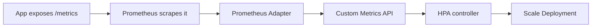

# Metrics and Metrics Server

## What You'll Learn

- What metrics-server actually provides, and just as importantly, what it doesn't
- How to install it and read its output with `kubectl top`
- Why the Horizontal Pod Autoscaler needs an entirely different API for anything beyond CPU/memory

## Why This Matters

"We have metrics-server installed" is often mistaken for "we have monitoring." metrics-server answers one narrow question — current CPU/memory usage, right now, for `kubectl top` and basic CPU/memory-based autoscaling — with no history, no alerting, and no custom application metrics. Knowing exactly where that boundary sits tells you when metrics-server is enough and when you actually need a full monitoring stack.

## Mental Model

> metrics-server is a **cluster add-on**, not a built-in component — a fresh cluster has no CPU/memory data available at all until it's installed. It scrapes each kubelet's resource usage summary on a short interval and holds only the **most recent** snapshot in memory. No history, no storage, no alerting.

| API | Backed by | What it serves |
|---|---|---|
| **Resource Metrics API** (`metrics.k8s.io`) | metrics-server | Current CPU/memory only — powers `kubectl top` and CPU/memory-based HPA |
| **Custom Metrics API** | An adapter you install (e.g. Prometheus Adapter) | Application-specific metrics (queue depth, requests/sec) scoped to Kubernetes objects |
| **External Metrics API** | An adapter you install | Metrics from outside the cluster entirely (a cloud queue's backlog, an external service's SLI) |

metrics-server implements only the first row. The other two require a separate adapter — most commonly the **Prometheus Adapter**, which translates Prometheus query results into the Custom/External Metrics API shape that the HPA controller can consume.

## How It Works

### Installing metrics-server

```bash
kubectl apply -f https://github.com/kubernetes-sigs/metrics-server/releases/latest/download/components.yaml

# Confirm it's running and serving data
kubectl get deployment metrics-server -n kube-system
kubectl top nodes
```

Many managed distributions (EKS, GKE, AKS) ship metrics-server as an optional or default add-on — check before assuming a manual install is needed. On some local/self-managed setups, metrics-server needs `--kubelet-insecure-tls` if kubelet certificates aren't properly signed for the API server to validate — acceptable for local clusters, not for production.

### `kubectl top`

```bash
# Node-level usage
kubectl top nodes

# Pod-level usage, current namespace
kubectl top pods

# Every namespace, sorted by memory
kubectl top pods -A --sort-by=memory

# Per-container breakdown within pods
kubectl top pods --containers
```

This is a live snapshot pulled straight from metrics-server's cache — there is no `--since` or historical range flag, because metrics-server was never designed to store history. For "what was memory usage three hours ago," you need a real time-series store.

### What HPA needs beyond metrics-server

The Horizontal Pod Autoscaler's most basic form — scale on average CPU or memory utilization — is satisfied entirely by metrics-server through the Resource Metrics API:

```yaml
apiVersion: autoscaling/v2
kind: HorizontalPodAutoscaler
metadata:
  name: app-hpa
spec:
  scaleTargetRef:
    apiVersion: apps/v1
    kind: Deployment
    name: app
  minReplicas: 2
  maxReplicas: 10
  metrics:
    - type: Resource
      resource:
        name: cpu
        target:
          type: Utilization
          averageUtilization: 70
```

But scaling on a real application signal — requests per second, queue depth, active WebSocket connections — needs the **Custom Metrics API**, which metrics-server does not implement at all:

```yaml
apiVersion: autoscaling/v2
kind: HorizontalPodAutoscaler
metadata:
  name: app-hpa-custom
spec:
  scaleTargetRef:
    apiVersion: apps/v1
    kind: Deployment
    name: app
  minReplicas: 2
  maxReplicas: 20
  metrics:
    - type: Pods
      pods:
        metric:
          name: http_requests_per_second
        target:
          type: AverageValue
          averageValue: "100"
```

For this HPA to function, a Custom Metrics API adapter (typically the **Prometheus Adapter**, backed by an existing Prometheus deployment scraping the app's `/metrics` endpoint) must already be registered with the API server — without it, the HPA controller has nowhere to fetch `http_requests_per_second` from, and scaling silently stalls.



For a full monitoring stack — historical data, dashboards, alerting, and the Prometheus deployment that a Custom Metrics adapter depends on — see the dedicated Prometheus guide.

## Common Mistakes

- Expecting `kubectl top` to show historical usage — metrics-server holds only the latest scrape; there's no time range to query.
- Assuming metrics-server alone is enough to scale on a custom application metric — it only implements the Resource Metrics API, not Custom or External Metrics.
- Forgetting to actually install the Prometheus Adapter (or another Custom Metrics adapter) before writing an HPA that references a custom metric — the HPA will just report an error fetching metrics.
- Running `--kubelet-insecure-tls` in production to work around certificate issues instead of fixing the underlying kubelet certificate configuration.
- Treating metrics-server as a monitoring solution rather than what it is: a thin, in-memory API purely to support `kubectl top` and basic autoscaling.

## Interview Questions

- What's the difference between the Resource Metrics API and the Custom Metrics API, and which one does metrics-server implement?
- Why can't `kubectl top` show you usage from an hour ago?
- What has to be installed and configured before an HPA can scale on requests-per-second instead of CPU?
- What role does the Prometheus Adapter play in the Custom Metrics API pipeline?

See [Interview Prep](../interview-prep/index.md) for full answers.

## Next

Continue to [Events and Debugging](04-events-and-debugging.md) to turn probes, logs, and metrics into a repeatable process for diagnosing a broken workload.
