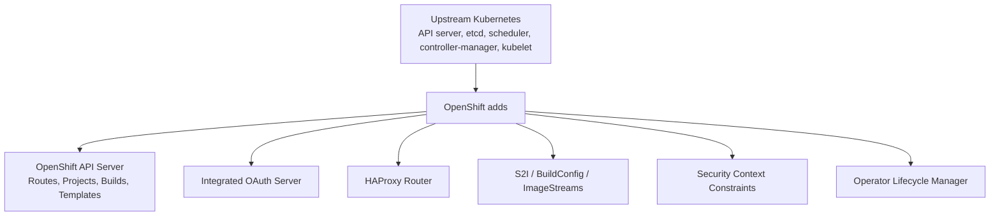

# What Is OpenShift?

## What You'll Learn

- A precise definition of OpenShift relative to vanilla Kubernetes — not a marketing description
- The specific components OpenShift adds on top of the standard Kubernetes control plane
- How Red Hat's enterprise distribution model relates to OKD, the community upstream

## Why This Matters

"OpenShift is Kubernetes for enterprises" is true and vague in exactly the way that fails an interview follow-up. The useful version is concrete: OpenShift ships the same upstream Kubernetes API machinery, then adds specific components — an integrated OAuth server, a build system, a router, and an Operator-first lifecycle model — that change how teams deploy and operate workloads day to day, without changing what a Deployment or a Service fundamentally is.

## Mental Model

> OpenShift = upstream Kubernetes + Red Hat's own API extensions, security defaults, build tooling, and support lifecycle, distributed as a product with a subscription and a defined upgrade path. Nothing you know about Kubernetes objects stops being true on OpenShift — you're adding capabilities and constraints, not replacing the foundation.

## How It Works

### What OpenShift adds over vanilla Kubernetes

| Layer | Vanilla Kubernetes | OpenShift |
|---|---|---|
| API server | Kubernetes API server only | Kubernetes API server + OpenShift API server extensions (Routes, Projects, Builds, Templates) |
| Authentication | You bring your own (OIDC, webhook, certs) | Integrated OAuth server with pluggable identity providers (LDAP, GitHub, htpasswd, etc.) out of the box |
| Ingress | Requires installing an Ingress controller yourself | Built-in HAProxy-based router and Route resources, in addition to standard Ingress support |
| Builds | No native build system — bring your own CI | Source-to-Image (S2I), BuildConfig, and ImageStreams built into the platform |
| Namespaces | Namespace only | Project — a namespace plus default quotas, limits, and self-service provisioning |
| Pod security | PodSecurity admission (namespace-labeled) | Security Context Constraints (SCC) — a more granular, OpenShift-native admission model that predates and still coexists with PodSecurity |
| Add-on lifecycle | You choose and manage your own operators/add-ons | Operator Lifecycle Manager (OLM) and OperatorHub built in, with Red Hat-certified operators |
| CLI | `kubectl` | `oc` — a superset of `kubectl` (see [oc CLI and Projects](02-oc-cli-and-projects.md)) |
| Support model | Whatever you arrange yourself (self-support, a vendor, or a managed service) | Red Hat subscription with defined support SLAs and a certified upgrade path |

### Red Hat's enterprise distribution model

OpenShift Container Platform (OCP) is Red Hat's supported, commercial product: a specific, tested combination of Kubernetes version, OS (Red Hat Enterprise Linux CoreOS on most installs), and add-on components, released on a defined cadence with a documented support lifecycle and backports for security fixes. You pay for a subscription in exchange for support SLAs, certified operators, and a predictable, tested upgrade path between versions — which matters most for organizations that need a vendor to call when the cluster is down, or a regulatory story about who's accountable for the platform.

### OKD: the community upstream

OKD ("The Origin Community Distribution of Kubernetes") is the open-source project OpenShift Container Platform is built from — same core codebase and architecture, without the Red Hat subscription, certified operator catalog curation, or commercial support SLA. OKD is a legitimate way to learn OpenShift's concepts and run it without a subscription, but production teams that need enterprise support run OCP, not OKD, for the same reason many teams pay for RHEL instead of running only its community-rebuild equivalents: support commitments and a guaranteed upgrade path matter once real revenue depends on the cluster.

## Common Mistakes

- Describing OpenShift as "a different Kubernetes" — it's the same Kubernetes API machinery with additions, not a fork or a reimplementation.
- Assuming SCCs replaced PodSecurity admission — they coexist, and SCCs are OpenShift's own, older, more granular mechanism.
- Confusing OKD with a "free trial" of OpenShift — it's the actual open-source upstream project, not a limited demo.
- Assuming every vanilla Kubernetes manifest needs rewriting for OpenShift — most don't; only where a workload interacts with the additions (Routes, SCCs, builds) does OpenShift-specific knowledge matter.

## Interview Questions

- What does OpenShift add on top of upstream Kubernetes, specifically?
- How does OKD relate to OpenShift Container Platform, and why would a team choose one over the other?
- Is a standard Kubernetes Deployment manifest still valid on OpenShift? What might need to change?

See [Interview Prep](../interview-prep/index.md) for full answers.

## Next

Continue to [oc CLI and Projects](02-oc-cli-and-projects.md) to start working with a cluster directly.
