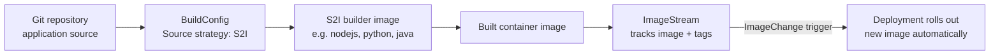

# Source-to-Image and Builds

## What You'll Learn

- What Source-to-Image (S2I) actually does, and why it exists as an alternative to a Dockerfile
- How BuildConfig and ImageStream work together to produce and track container images
- How `oc new-app` chains source code, a builder image, a build, and a deployment into one command

## Why This Matters

Vanilla Kubernetes has no opinion about how your image gets built — that's entirely a CI/CD concern outside the cluster. OpenShift is different: it has an opinion, baked into the platform, for the common case of "I have application source code and want a container image without writing a Dockerfile." Understanding S2I and ImageStreams is what makes `oc new-app` meaningful instead of feeling like a magic black box.

## Mental Model

> **Source-to-Image (S2I)** answers "how do I turn source code into a container image?" without requiring a Dockerfile — a builder image knows the conventions for a language/framework and injects your source into it. **BuildConfig** is the declarative object describing *how* a build happens (source location, strategy, output). **ImageStream** is OpenShift's abstraction that tracks image tags over time, independent of any particular registry, and can trigger downstream actions (like a new deployment) whenever the image it points to changes.



## How It Works

### BuildConfig: declaring how a build happens

```yaml
apiVersion: image.openshift.io/v1
kind: ImageStream
metadata:
  name: payments-api
  namespace: payments
spec:
  lookupPolicy:
    local: true
---
apiVersion: build.openshift.io/v1
kind: BuildConfig
metadata:
  name: payments-api
  namespace: payments
spec:
  source:
    type: Git
    git:
      uri: https://github.com/example/payments-api.git
      ref: main
  strategy:
    type: Source
    sourceStrategy:
      from:
        kind: ImageStreamTag
        name: nodejs:20-ubi9
        namespace: openshift
  output:
    to:
      kind: ImageStreamTag
      name: payments-api:latest
  triggers:
    - type: ConfigChange
    - type: ImageChange
```

The `strategy.type: Source` block is what makes this an S2I build — it takes a builder image (`nodejs:20-ubi9` from the `openshift` namespace's shared ImageStreams) that already knows Node.js conventions (`npm install`, where to find `package.json`, how to start the app), injects the Git-fetched source into it, and produces a new image with no Dockerfile written by hand.

```bash
# Trigger a build manually
oc start-build payments-api

# Follow the build's logs live
oc logs -f bc/payments-api

# List builds and their status
oc get builds
```

Other build strategies exist alongside S2I for cases where a Dockerfile is preferred or a fully custom build process is needed:

| Strategy | When to use it |
|---|---|
| **Source (S2I)** | Standard language/framework app, no custom build logic needed |
| **Docker** | You already have (or want) a Dockerfile with custom build steps |
| **Custom** | You need a fully custom builder image controlling the entire build process |
| ~~Pipeline~~ | Deprecated (the old JenkinsPipeline strategy). Use **OpenShift Pipelines** (Tekton) for multi-step CI inside the cluster |

For new work, Red Hat also offers **Builds for OpenShift**, based on the upstream Shipwright project, which runs Buildah, S2I, or Cloud Native Buildpacks builds through a `Build`/`BuildRun` API that also works on other Kubernetes distributions. `BuildConfig` remains supported and is what most existing clusters use.

### ImageStreams: a stable pointer that triggers action

An ImageStream doesn't store image layers itself — it's a set of named pointers (tags) to actual images in a registry (either OpenShift's own internal registry or an external one), and it's what lets a Deployment react automatically when a new image lands:

```bash
oc get imagestream payments-api -n payments
oc describe imagestream payments-api -n payments

# Import an externally-built image into an ImageStream for tracking
oc import-image payments-api:prod --from=quay.io/example/payments-api:1.4.2 --confirm
```

Two different triggers are easy to confuse:

- The **BuildConfig's** `ImageChange` trigger rebuilds the app when its **builder image** changes (for example, Red Hat publishes a patched `nodejs:20-ubi9`), so security fixes in the base flow into your image automatically. `ConfigChange` builds once when the BuildConfig is created or edited.
- Rolling out the **new app image** is a trigger on the **Deployment**. For a standard Kubernetes Deployment, add an annotation that tells OpenShift to update the container image whenever the ImageStreamTag changes:

```yaml
metadata:
  annotations:
    image.openshift.io/triggers: >-
      [{"from":{"kind":"ImageStreamTag","name":"payments-api:latest"},
        "fieldPath":"spec.template.spec.containers[?(@.name==\"payments-api\")].image"}]
```

Or run `oc set triggers deployment/payments-api --from-image=payments-api:latest -c payments-api`. With both in place, a push to Git produces a build, the build updates the ImageStream, and the Deployment rolls out the new image.

### `oc new-app`: the one-command version

`oc new-app` inspects its input (a Git URL, a builder image name, or an existing image) and creates the matching set of objects — ImageStream, BuildConfig, Deployment, and Service — in one step:

```bash
# From Git source — OpenShift detects the language and picks a builder image
oc new-app https://github.com/example/payments-api.git --name=payments-api

# From an explicit builder image plus Git source
oc new-app nodejs:20-ubi9~https://github.com/example/payments-api.git --name=payments-api

# From an existing container image (no build at all)
oc new-app quay.io/example/payments-api:1.4.2 --name=payments-api

# Expose it once created
oc expose service payments-api
```

`oc new-app` is genuinely useful for getting something running fast — a demo, a quick test, early exploration — but production workloads are usually managed by writing the BuildConfig/Deployment/Service manifests explicitly (or via a GitOps repo) rather than relying on what `oc new-app` infers, since inferred defaults rarely match a production team's exact resource, probe, and security requirements.

## Common Mistakes

- Treating S2I as mandatory — a plain Dockerfile-based build strategy is equally valid and sometimes simpler when the S2I builder image doesn't fit the app's actual build process.
- Expecting a successful build to roll out the app on its own — without an image trigger on the **Deployment**, the ImageStream updates but the running Pods keep the old image.
- Using `DeploymentConfig` for new apps. It's deprecated since OpenShift 4.14; use a standard `Deployment` with the image trigger annotation instead.
- Using `oc new-app`-generated objects as-is in production without reviewing the resource requests, probes, and security settings it defaulted to.
- Confusing an ImageStream with the registry itself — deleting an ImageStream doesn't necessarily delete the underlying image layers in the registry.

## Interview Questions

- What problem does Source-to-Image solve that a Dockerfile-based build doesn't?
- How does an ImageStream trigger an automatic deployment when a build completes?
- Walk through what `oc new-app` actually creates when given a Git repository URL.

See [Interview Prep](../interview-prep/index.md) for full answers.

## Next

Continue to [Operators and OLM](05-operators-and-olm.md) to see how OpenShift manages the lifecycle of applications and add-ons after they're deployed.
