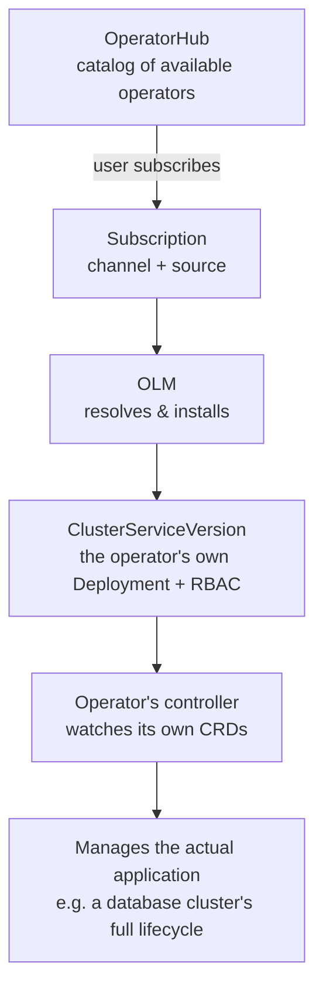

# Operators and OLM

## What You'll Learn

- What an Operator actually is, beyond "a controller that does more stuff"
- How the Operator Lifecycle Manager (OLM) installs, upgrades, and manages permissions for operators
- How OperatorHub works as a built-in catalog, and how that catalog differs between connected and disconnected clusters

## Why This Matters

Operators are how OpenShift (and Kubernetes generally) encodes human operational knowledge — "how do I safely upgrade this database," "how do I fail over this cluster," "how do I back this up" — into software that runs continuously inside the cluster instead of living in a runbook a human executes manually. OLM is what makes installing and safely upgrading dozens of these operators, from dozens of vendors, tractable on a single cluster without everything colliding.

## Mental Model

> An **Operator** is a custom controller plus one or more Custom Resource Definitions (CRDs) that together encode the operational knowledge for running a specific piece of software — not just deploying it once, but managing its entire lifecycle (upgrades, backups, failover, scaling) the way a skilled human operator would. **OLM** is the platform component that installs, upgrades, and manages permissions for operators themselves — an operator for operators. **OperatorHub** is the catalog UI/API in front of OLM, listing what's available to install.



## How It Works

### The Operator pattern

A standard Kubernetes controller (like the built-in Deployment controller) reconciles a small, generic set of behavior. An Operator does the same reconcile loop, but for a specific, often stateful application, and typically goes well beyond "keep N replicas running" — a database operator might handle version upgrades in the correct order, take scheduled backups, promote a replica during failover, and reject a config change that would put the cluster in an unsafe state.

```bash
# CRDs are what an operator's users actually interact with day to day
oc get crd | grep postgresql

# A CR (custom resource) instance the operator watches and acts on
oc get postgresclusters -n payments
```

### Operator Lifecycle Manager (OLM)

OLM manages operators the way a package manager manages packages — but with awareness of Kubernetes-native concerns like RBAC scoping, upgrade channels, and dependency resolution between operators. Installing an operator through OLM means creating a `Subscription`:

```yaml
apiVersion: operators.coreos.com/v1alpha1
kind: Subscription
metadata:
  name: cloudnative-pg
  namespace: openshift-operators
spec:
  channel: stable
  name: cloudnative-pg
  source: certified-operators
  sourceNamespace: openshift-marketplace
  installPlanApproval: Automatic
```

```bash
# Check what OLM actually installed for this subscription
oc get subscription cloudnative-pg -n openshift-operators
oc get installplan -n openshift-operators
oc get csv -n openshift-operators   # ClusterServiceVersion — the operator's own workload + permissions
```

The **channel** (`stable`, `alpha`, `fast`, etc.) controls which upgrade stream a subscription tracks, and `installPlanApproval` controls whether upgrades within that channel happen automatically or wait for manual approval — a meaningful production decision, since automatic upgrades of an operator that manages a stateful database carry real risk if a new version has a regression.

### OperatorHub as a catalog

OperatorHub is the browsable catalog (available both in the web console and via `oc get packagemanifests`) of everything OLM can install, sourced from one or more `CatalogSource` objects — Red Hat's own certified catalog, community operators, and any private catalog an organization runs internally:

```bash
# List everything available to install, across all configured catalog sources
oc get packagemanifests -n openshift-marketplace

# Inspect one specific package's available channels
oc describe packagemanifest cloudnative-pg -n openshift-marketplace
```

On a **disconnected** (air-gapped) cluster, the default Red Hat catalog sources aren't reachable — teams instead mirror the specific operator images and catalog content they need into an internal registry and point a custom `CatalogSource` at it, which is a meaningfully different (and more manual) workflow than connected clusters get by default.

## Common Mistakes

- Treating every Operator as equally safe to auto-upgrade — a stateless utility operator and a stateful database operator carry very different upgrade risk, and `installPlanApproval` should reflect that.
- Installing an operator without checking its RBAC footprint — an operator's ClusterServiceVersion often requests broad permissions across the cluster, not just its own namespace.
- Assuming OperatorHub's default catalogs are reachable on a disconnected/air-gapped cluster without additional mirroring setup.
- Confusing "installed the operator" with "the workload it manages is configured correctly" — installing, say, a database operator doesn't create a database cluster by itself; a corresponding custom resource still has to be created.

## Interview Questions

- What does an Operator do that a standard Kubernetes Deployment controller doesn't?
- What role does OLM play that OperatorHub alone doesn't cover?
- Why might a team choose manual install-plan approval instead of automatic upgrades for a given operator?

See [Interview Prep](../interview-prep/index.md) for full answers.

## Next

This is the last page in OpenShift. Continue to [Labs](../labs/index.md) to practice these workflows hands-on, including running OpenShift Local.
