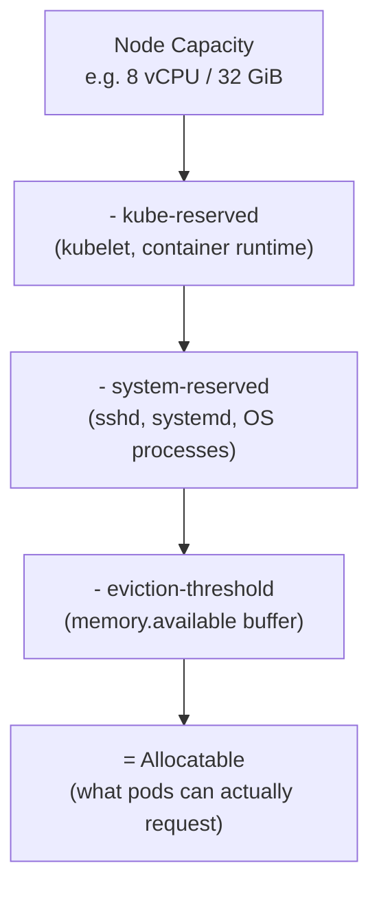

# Cluster Sizing and Capacity Planning

## What You'll Learn

- How to size worker nodes from actual pod requests instead of guessing an instance type
- Why control-plane sizing differs sharply between self-hosted clusters and managed services like EKS, GKE, and AKS
- Why etcd has hard size and object-count limits, and what happens when a cluster quietly approaches them

## Why This Matters

"Just pick a big instance type" works until the cluster has 40 nodes and someone asks why pods are pending despite 30% of CPU showing free in a dashboard. Capacity planning failures in Kubernetes rarely look like an outage at first — they look like scheduling weirdness, slow API calls, or a control plane that falls over during a mass reschedule. Getting the math right up front avoids all three.

## Mental Model

> A node's allocatable capacity is never its full capacity. Every node reserves a slice for the OS, the kubelet, and system daemons before a single application pod can be scheduled onto it — and every cluster's control plane has its own scaling ceiling, driven mostly by etcd, that has nothing to do with how big your nodes are.

Think of node capacity as three nested boxes:



## How It Works

### Node sizing: work from requests, not vibes

Start from what your workloads actually request, then add headroom for DaemonSets and reserved capacity — don't start from an instance type and hope it fits.

1. Sum the CPU/memory **requests** (not limits) of every pod you plan to run per node, including DaemonSets (log shippers, CNI agents, node-exporter) that land on *every* node.
2. Subtract `kube-reserved` and `system-reserved` from the node's advertised capacity to get allocatable resources.
3. Leave 10-20% headroom on top of that for bursts, node drains during upgrades, and the Cluster Autoscaler's own scheduling latency.

Check what a node actually reports as allocatable versus its raw capacity:

```bash
kubectl get node worker-3 -o jsonpath='{.status.capacity}'
kubectl get node worker-3 -o jsonpath='{.status.allocatable}'
```

A rough allocation on a managed node with typical reservations:

| Node type | Total memory | System + kube reserved | Eviction threshold | Allocatable for pods |
|---|---|---|---|---|
| 4 vCPU / 16 GiB | 16 GiB | ~1.2 GiB | 100 MiB | ~14.7 GiB |
| 8 vCPU / 32 GiB | 32 GiB | ~2.0 GiB | 100 MiB | ~29.9 GiB |
| 16 vCPU / 64 GiB | 64 GiB | ~3.3 GiB | 100 MiB | ~60.6 GiB |

Exact numbers vary by cloud provider and kubelet flags (`--kube-reserved`, `--system-reserved`, `--eviction-hard`), but the pattern — reserved overhead shrinks as a percentage on larger nodes — holds everywhere. This is one reason fewer, larger nodes are often more resource-efficient than many small ones, up to the point where blast radius per node becomes a bigger concern than efficiency.

### DaemonSet overhead compounds across the fleet

A DaemonSet's request isn't paid once — it's paid on *every* node. A log shipper requesting `100m` CPU / `128Mi` memory across a 200-node cluster is reserving 20 full CPU cores and 25 GiB of memory cluster-wide before any application workload is scheduled. Audit DaemonSet requests specifically when capacity planning a large fleet:

```bash
kubectl get daemonsets -A -o custom-columns=\
NAME:.metadata.name,NAMESPACE:.metadata.namespace,\
CPU_REQ:.spec.template.spec.containers[0].resources.requests.cpu,\
MEM_REQ:.spec.template.spec.containers[0].resources.requests.memory
```

### Control-plane sizing: self-hosted vs. managed

| Concern | Self-hosted (kubeadm) | Managed (EKS / GKE / AKS) |
|---|---|---|
| Who sizes the API server / etcd | You | The provider |
| Control-plane HA (3+ nodes, odd etcd count) | Your responsibility to design | Handled internally |
| etcd tuning (`--quota-backend-bytes`, disk IOPS) | You choose and tune | Abstracted away, sometimes not tunable at all |
| API server scaling with cluster size | You add control-plane nodes/resources | Provider scales automatically (often opaquely) |
| Visibility into etcd health | Full (`etcdctl endpoint status`) | Limited or none |
| Cost | You pay for control-plane nodes | Flat or per-cluster fee, control-plane compute hidden |

The trade-off is real: managed control planes remove an entire category of 2 a.m. pages, but they also remove your ability to tune the exact component (etcd) most likely to become the scaling bottleneck. If you're running a large self-hosted cluster, put etcd on dedicated, fast (SSD, low-latency) disks — it is extremely sensitive to disk fsync latency, and a slow disk under etcd will manifest as slow `kubectl` commands and leader elections cluster-wide, not just slow storage.

### etcd's hard limits are the ceiling on cluster size

Kubernetes doesn't have a documented maximum number of pods or nodes so much as etcd has practical limits that everything else runs into first:

- **Database size**: etcd defaults to an 8 GiB storage quota (`--quota-backend-bytes`); upstream guidance caps recommended size around 8 GiB even when raised, because compaction and defragmentation get slower and riskier past that point.
- **Object count**: Kubernetes' own scale targets (roughly 150,000 total objects, 5,000 nodes, 110 pods per node in the official scalability thresholds) exist because etcd's watch and range-query performance degrades as object count and resource-version churn grow.
- **Request size**: individual objects (a giant ConfigMap holding an entire application config, for example) are capped around 1.5 MiB — hitting this shows up as an "etcdserver: request is too large" error.

The practical warning signs that a cluster is approaching etcd limits: slow `kubectl get`/`list` calls across the board, API server timeouts under load, and rising etcd `db_size_in_use_in_bytes` with infrequent compaction. Check it directly:

```bash
# Requires an etcdctl client with access to the cluster's etcd endpoints and certs
etcdctl endpoint status --write-out=table
etcdctl endpoint health --write-out=table
```

If you're closing in on these limits, the fix is architectural, not a bigger etcd disk: split into multiple clusters (see [Multi-Cluster and Multi-Region](03-multi-cluster-and-multi-region.md)), reduce object churn (short-lived Jobs, excessive Helm release history, verbose CRDs), or move very large config blobs out of etcd entirely (object storage, external secret stores).

## Common Mistakes

- Sizing nodes off `status.capacity` instead of `status.allocatable`, then being surprised when pods stay `Pending` with resources "available."
- Forgetting that DaemonSet requests are paid per node, not once — silently eating a large chunk of every node's allocatable capacity on a big cluster.
- Treating a managed control plane as infinitely scalable because you can't see etcd — its limits still apply, they're just invisible until the provider throttles or the API server starts timing out.
- Running etcd on shared, slow, or network-attached disks and blaming the API server for the resulting latency.

## Interview Questions

- Why is `status.allocatable` different from `status.capacity`, and why does that difference matter for scheduling?
- What are etcd's practical scaling limits, and what's the actual failure mode when a cluster approaches them?
- How does control-plane sizing responsibility differ between a self-hosted cluster and a managed service like EKS?

See [Interview Prep](../interview-prep/index.md) for full answers.

## Next

Continue to [Cost Optimization](02-cost-optimization.md) to turn correctly-sized requests into a lower cloud bill.
