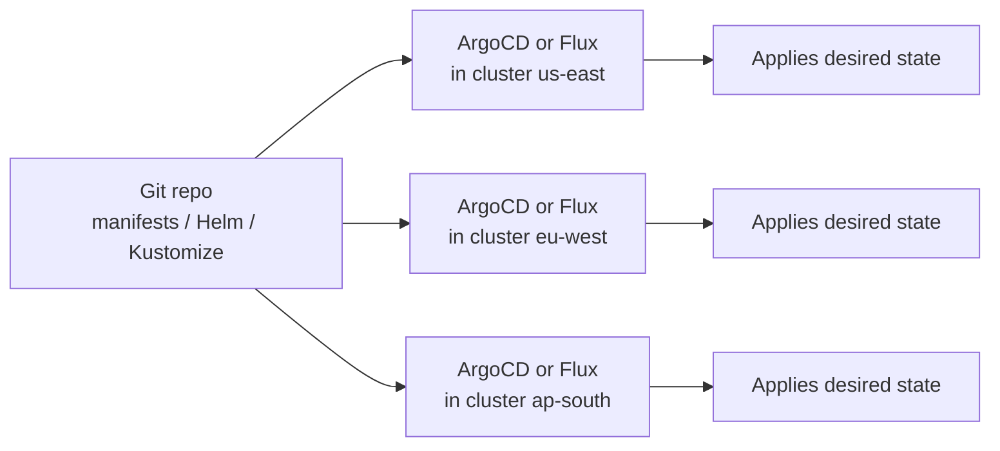

# Multi-Cluster and Multi-Region

## What You'll Learn

- The concrete reasons teams split workloads across multiple clusters instead of scaling one
- Why KubeFed-style cluster federation never became the industry default
- Why the GitOps fan-out pattern is the multi-cluster approach most production teams actually run today

## Why This Matters

"Just run a bigger cluster" is the right answer far more often than infrastructure teams admit — a single well-run cluster is simpler to operate, secure, and debug than several small ones. But past a certain point, blast radius, compliance boundaries, or physical latency make a single cluster the wrong answer regardless of how well it's operated. Knowing which reason applies tells you what kind of multi-cluster architecture you actually need — they are not interchangeable.

## Mental Model

> Multi-cluster is not one pattern — it's a response to one of three distinct pressures: **blast-radius isolation** (a bad rollout in one cluster shouldn't take down every region), **compliance/data residency** (this data legally cannot leave this jurisdiction), or **latency** (users in Tokyo shouldn't round-trip to a cluster in Virginia). Pick the architecture that matches the actual pressure — don't adopt multi-cluster complexity "for scale" when a single cluster would still fit comfortably within etcd and node-count limits (see [Cluster Sizing and Capacity Planning](01-cluster-sizing-and-capacity-planning.md)).

| Driver | Symptom if ignored | Typical resolution |
|---|---|---|
| Blast-radius isolation | One bad config change or CRD bug takes down all regions/tenants at once | Separate clusters per region, tier, or major tenant |
| Compliance / data residency | Regulator or contract requires data to stay within a jurisdiction | Separate clusters per legal region, no cross-region data flow |
| Latency | Users far from the cluster see high round-trip time | Clusters placed near user populations, traffic routed to the nearest |

## How It Works

### Cluster federation: mostly a cautionary tale

Kubernetes Cluster Federation (KubeFed) attempted to let a control plane manage resources across multiple clusters from one place — propagate a Deployment to every member cluster, keep them in sync centrally. It never reached general availability, development has effectively stalled, and it is not a technology to build new production architecture on in 2026. The core lesson from its failure holds regardless of tooling: **centralizing multi-cluster state adds a new single point of failure and a new API to operate**, which cuts against the blast-radius isolation that was often the reason for going multi-cluster in the first place.

### Service mesh multi-cluster

A service mesh (Istio, Linkerd, Cilium's mesh mode) can stitch service discovery and mTLS across cluster boundaries, letting a service in cluster A call a service in cluster B as if they shared a network. This solves a real problem — cross-cluster service communication — but it's a networking-layer answer, not a deployment/config-management one: it doesn't tell you how manifests get applied consistently across clusters, and it adds meaningful operational complexity (cross-cluster certificate trust, east-west gateways, mesh control-plane HA) that should be adopted deliberately, not as a default for every multi-cluster setup.

### The GitOps fan-out pattern (the common modern approach)

Rather than a central control plane pushing to member clusters (federation) or a mesh trying to unify them at the network layer, most production teams keep each cluster fully independent and use **Git plus a GitOps controller per cluster** to keep them consistent:



Each cluster pulls its own desired state from Git independently — there's no central control plane to fail, and blast radius is naturally contained because each GitOps controller only ever reconciles its own cluster. Per-cluster differences (region-specific config, feature-flag rollout stage, compliance-driven data rules) are expressed as overlays in Git — a Kustomize overlay per cluster, or an ApplicationSet in ArgoCD that templates one Application per target cluster:

```yaml
apiVersion: argoproj.io/v1alpha1
kind: ApplicationSet
metadata:
  name: payments-api
  namespace: argocd
spec:
  generators:
    - clusters: {}   # one Application generated per registered cluster
  template:
    metadata:
      name: 'payments-api-{{name}}'
    spec:
      project: default
      source:
        repoURL: https://github.com/example/platform-manifests.git
        targetRevision: main
        path: 'apps/payments-api/overlays/{{name}}'
      destination:
        server: '{{server}}'
        namespace: payments
```

This is what "the fan-out pattern" means in practice: one source of truth in Git, many independent clusters, no shared runtime control plane between them. It gets you the blast-radius, compliance, and latency benefits of multi-cluster without reintroducing federation's central point of failure. See [CI/CD and GitOps](../cicd-and-gitops/index.md) for the mechanics of ArgoCD/Flux themselves.

## Common Mistakes

- Going multi-cluster "for scale" before actually hitting etcd or node-count limits on a single cluster — adding operational surface area for a problem you don't have yet.
- Reaching for KubeFed or building a custom central-push system in 2026 — the ecosystem has moved decisively toward the GitOps fan-out model instead.
- Assuming a service mesh's cross-cluster networking also solves configuration consistency — it doesn't; you still need a GitOps layer for that.
- Under-provisioning the "nearest cluster" routing layer (global load balancer, GeoDNS) and discovering the latency problem multi-cluster was meant to solve is still there.

## Interview Questions

- What are the three main reasons a team goes multi-cluster, and why does the answer change the architecture?
- Why did Kubernetes cluster federation (KubeFed) fail to become the standard approach?
- Describe how a GitOps fan-out pattern keeps N clusters consistent without a shared control plane.

See [Interview Prep](../interview-prep/index.md) for full answers.

## Next

Continue to [Disaster Recovery](04-disaster-recovery.md) to see how multi-region design connects to failover and RTO/RPO planning.
