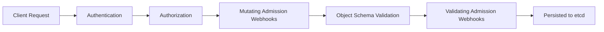

# Authentication and Authorization

## What You'll Learn

- The authentication methods the API server accepts, and which ones you'll actually see in production
- The full request pipeline — Authentication → Authorization → Admission Control — and what each stage can and cannot do
- Where mutating and validating admission webhooks sit in that pipeline, and why the order between them matters

## Why This Matters

Every `kubectl` command, every controller reconcile loop, every CI/CD pipeline deploy — all of it is just an HTTPS request to the API server. If you can't explain how that request gets checked, you can't reason about why a `kubectl apply` gets a `403 Forbidden`, why a webhook silently mutated your pod spec, or why a perfectly valid manifest gets rejected at the door. This pipeline is also one of the most common system-design and interview topics in Kubernetes because it's the single choke point every write passes through.

## Mental Model

> The API server never trusts a request until it has been authenticated (who are you), authorized (are you allowed to do this), and passed through admission control (should this specific object be allowed, and does it need to be modified first).



If a request fails any stage, it stops there — a request that fails authentication never reaches authorization, and a request denied by RBAC never reaches admission control.

## How It Works

### Stage 1: Authentication

The API server doesn't maintain its own user database. It delegates identity to one or more configured authenticators, tried in order until one succeeds (or all fail, resulting in `401 Unauthorized`).

| Method | How identity is proven | Typical use |
|---|---|---|
| **Client certificates (x509)** | mTLS cert signed by the cluster CA; CN becomes username, O becomes group | `kubectl` for cluster admins, kubelet-to-API-server auth |
| **Static token file** | Bearer token from a file loaded at API server startup | Legacy/dev clusters only — not rotatable without a restart |
| **Bootstrap tokens** | Short-lived token used only to join a new node to the cluster | `kubeadm join` |
| **Service account tokens** | JSON Web Token, either the legacy long-lived Secret-backed token or the modern bound/projected token | Every in-cluster workload calling the API |
| **OIDC (OpenID Connect)** | Token issued by an external identity provider (Okta, Azure AD, Google) | Human users in production clusters — the recommended approach |
| **Webhook token authentication** | API server calls out to an external service to validate the token | Custom identity systems, cloud-provider IAM bridges |

In practice, production clusters use **OIDC for humans** and **service account tokens for workloads**. Client certificates are common for the initial admin/bootstrap identity but rarely handed out broadly, since x509 certs can't be revoked without a CRL or short expiry.

Authentication produces exactly one output: a **username** and a **set of group memberships**. Nothing more. What that identity is allowed to do is a completely separate question, answered next.

### Stage 2: Authorization

Once the API server knows *who* is asking, it checks *what they're allowed to do*. Kubernetes supports multiple authorization modes, and like authenticators, they're evaluated in the order configured on the API server — the first mode to return an explicit `allow` wins; if every mode abstains or denies, the request is rejected.

| Mode | How it decides | Notes |
|---|---|---|
| **RBAC** | Role/ClusterRole bound to a subject via Role/ClusterRoleBinding | The default and near-universal choice today |
| **ABAC** | Static JSON policy file read at API server startup | Legacy — inflexible, requires API server restart to change; avoid for new clusters |
| **Node authorization** | Special-purpose mode that lets each kubelet only read/write objects related to its own node | Always on alongside RBAC in any real cluster |
| **Webhook** | API server calls an external service with a `SubjectAccessReview`; the service returns allow/deny | Used for integrating with external policy engines or custom entitlement systems |

RBAC is covered in full in [RBAC](02-rbac.md) — this page focuses on where it sits in the bigger pipeline.

### Stage 3: Admission Control

A request that passes authorization isn't done yet — it still has to clear **admission controllers**, which run only on `create`, `update`, `delete`, and `connect` requests (not on reads). Admission runs in two phases, always in this order:

1. **Mutating admission webhooks** (and built-in mutating controllers, e.g. `DefaultStorageClass`) — these can *change* the object before it's persisted. A sidecar-injector (like Istio's) or a defaulting webhook that adds labels runs here.
2. **Validating admission webhooks** (and built-in validating controllers, e.g. Pod Security Admission) — these can only *accept or reject* the object as it now stands. They never modify it.

This ordering matters: validation always sees the object *after* every mutation has already been applied, never before. A validating webhook that checks for a required label will still pass if a mutating webhook injected that label upstream of it.

Both webhook types are backed by a `ValidatingWebhookConfiguration` or `MutatingWebhookConfiguration` object that tells the API server which resources to intercept and which endpoint to call.

```yaml
apiVersion: admissionregistration.k8s.io/v1
kind: ValidatingWebhookConfiguration
metadata:
  name: require-team-label.example.com
webhooks:
  - name: require-team-label.example.com
    clientConfig:
      service:
        name: policy-webhook
        namespace: policy-system
        path: /validate
    rules:
      - apiGroups: [""]
        apiVersions: ["v1"]
        operations: ["CREATE"]
        resources: ["pods"]
    admissionReviewVersions: ["v1"]
    sideEffects: None
    failurePolicy: Fail
```

`failurePolicy: Fail` means if the webhook endpoint is unreachable, the request is rejected — the safer default for security-critical policy, versus `Ignore`, which lets the request through if the webhook can't be reached.

### Verifying the pipeline yourself

```bash
# What identity am I authenticated as?
kubectl auth whoami

# Am I authorized to do X? (checked against RBAC/ABAC/Node/Webhook)
kubectl auth can-i create pods --namespace production

# What webhooks are currently intercepting admission?
kubectl get validatingwebhookconfigurations
kubectl get mutatingwebhookconfigurations
```

## Common Mistakes

- Treating authentication and authorization as one step — they're separate stages with separate failure modes (`401` vs. `403`).
- Forgetting that admission control only runs on writes — a read-only `kubectl get` never touches a webhook, so a webhook bug can't explain a broken `get`.
- Assuming validating webhooks see the original request body — they see the object *after* mutating webhooks have already changed it.
- Using `failurePolicy: Ignore` on a security-critical webhook, which silently lets requests through the moment the webhook pod is unavailable.
- Relying on ABAC for new clusters — it requires an API server restart to update and has no dynamic policy story; RBAC (and Webhook mode for advanced cases) has fully replaced it.

## Interview Questions

- Walk through what happens, stage by stage, when `kubectl apply -f pod.yaml` is run.
- What's the difference between a mutating and a validating admission webhook, and why does the order between them matter?
- Why can a request pass RBAC and still get rejected by admission control?
- What does `failurePolicy: Fail` vs. `Ignore` mean for a webhook, and when would you choose each?

See [Interview Prep](../interview-prep/index.md) for full answers.

## Next

Continue to [RBAC](02-rbac.md) to go deep on the authorization mode almost every cluster relies on.
