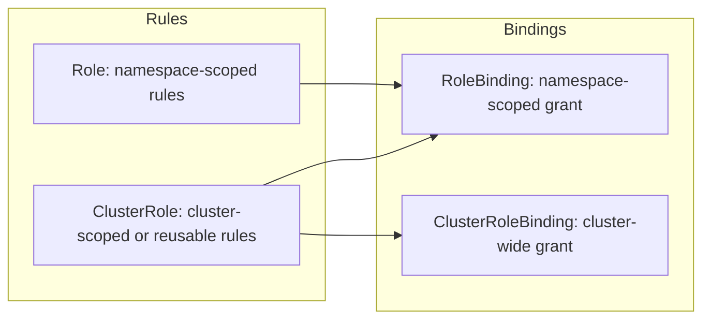

# RBAC

## What You'll Learn

- The four RBAC objects and exactly which combinations are valid
- How to read and write rules built from `apiGroups`, `resources`, and `verbs`
- How to design a least-privilege Role from scratch, and verify it with `kubectl auth can-i`

## Why This Matters

RBAC is the authorization mode nearly every real cluster runs, and it's also the security control most commonly misconfigured — either too loose (a ClusterRoleBinding to `cluster-admin` handed out "just to unblock someone") or too rigid (an app can't read its own ConfigMap because nobody wrote the Role). Understanding the object model precisely is what lets you design access that's both safe and usable, and it's one of the most reliably-asked topics in Kubernetes interviews.

## Mental Model

> RBAC has exactly two kinds of objects: **rules that define permissions** (Role, ClusterRole) and **bindings that hand those permissions to someone** (RoleBinding, ClusterRoleBinding). A permission by itself does nothing until it's bound to a subject.

| Object | Scope | Grants permissions on |
|---|---|---|
| **Role** | Single namespace | Resources within that one namespace |
| **ClusterRole** | Cluster-wide | Cluster-scoped resources (nodes, PVs), non-resource URLs, *or* namespaced resources across **all** namespaces |
| **RoleBinding** | Single namespace | Binds a Role **or a ClusterRole** to subjects, scoped to that one namespace |
| **ClusterRoleBinding** | Cluster-wide | Binds a ClusterRole to subjects, cluster-wide |

The one combination that surprises people: a **ClusterRoleBinding + Role does not exist** — Roles are always namespace-local, so nothing cluster-wide can bind to one. But a **RoleBinding can reference a ClusterRole**, which is the standard pattern for reusing one set of rules (e.g. "view") across many namespaces without redefining it each time.



## How It Works

### Anatomy of a rule

Every RBAC rule is built from three parts: which API group the resource belongs to, which resource(s), and which verbs are allowed on them.

```yaml
apiVersion: rbac.authorization.k8s.io/v1
kind: Role
metadata:
  namespace: production
  name: pod-reader
rules:
  - apiGroups: [""]              # "" is the core API group (pods, services, configmaps...)
    resources: ["pods", "pods/log"]
    verbs: ["get", "list", "watch"]
```

Common verbs: `get`, `list`, `watch` (read), `create`, `update`, `patch`, `delete` (write), and `deletecollection`. `apiGroups: [""]` is the core group; `apps` covers Deployments/StatefulSets, `rbac.authorization.k8s.io` covers RBAC objects themselves, and `*` matches all groups — reserve `*` for genuinely cluster-admin-equivalent roles.

### Binding a Role to a subject

```yaml
apiVersion: rbac.authorization.k8s.io/v1
kind: RoleBinding
metadata:
  name: read-pods
  namespace: production
subjects:
  - kind: User
    name: jane
    apiGroup: rbac.authorization.k8s.io
  - kind: ServiceAccount
    name: ci-deployer
    namespace: production
roleRef:
  kind: Role
  name: pod-reader
  apiGroup: rbac.authorization.k8s.io
```

Subjects can be `User`, `Group`, or `ServiceAccount` — RBAC treats all three uniformly once bound.

### ClusterRole reused across namespaces

```yaml
apiVersion: rbac.authorization.k8s.io/v1
kind: ClusterRole
metadata:
  name: configmap-reader
rules:
  - apiGroups: [""]
    resources: ["configmaps"]
    verbs: ["get", "list"]
---
apiVersion: rbac.authorization.k8s.io/v1
kind: RoleBinding
metadata:
  name: read-configmaps
  namespace: staging
subjects:
  - kind: Group
    name: platform-team
    apiGroup: rbac.authorization.k8s.io
roleRef:
  kind: ClusterRole
  name: configmap-reader
  apiGroup: rbac.authorization.k8s.io
```

This grants `configmap-reader` only inside `staging`, even though it's defined as a ClusterRole. To grant it everywhere, use a ClusterRoleBinding instead.

### A least-privilege design walkthrough

Say a CI pipeline needs to deploy to the `checkout` namespace: create/update Deployments and Services, read Pods and their logs to verify the rollout, but nothing else — no Secrets, no RBAC objects, no other namespace.

```yaml
apiVersion: rbac.authorization.k8s.io/v1
kind: Role
metadata:
  namespace: checkout
  name: ci-deployer
rules:
  - apiGroups: ["apps"]
    resources: ["deployments"]
    verbs: ["get", "list", "create", "update", "patch"]
  - apiGroups: [""]
    resources: ["services"]
    verbs: ["get", "list", "create", "update", "patch"]
  - apiGroups: [""]
    resources: ["pods", "pods/log"]
    verbs: ["get", "list", "watch"]
---
apiVersion: rbac.authorization.k8s.io/v1
kind: RoleBinding
metadata:
  name: ci-deployer-binding
  namespace: checkout
subjects:
  - kind: ServiceAccount
    name: ci-deployer
    namespace: checkout
roleRef:
  kind: Role
  name: ci-deployer
  apiGroup: rbac.authorization.k8s.io
```

Notice what's absent: no `delete` verb (the pipeline never needs to delete a Deployment), no `secrets` resource, and a Role — not a ClusterRole — because this identity has no business touching any other namespace.

### Verifying access

```bash
# Can the current identity do this?
kubectl auth can-i create deployments --namespace checkout

# Check as a different identity, without needing their credentials
kubectl auth can-i delete secrets --namespace checkout --as=system:serviceaccount:checkout:ci-deployer

# List everything the current identity can do in a namespace
kubectl auth can-i --list --namespace checkout
```

`kubectl auth can-i` is the fastest way to prove an RBAC design does what you intended — always verify with `--as` before assuming a Role works.

## Common Mistakes

- Reaching for `ClusterRoleBinding` to `cluster-admin` to "just get past" a permissions error instead of writing the specific rule needed.
- Using `resources: ["*"]` or `verbs: ["*"]` out of laziness rather than because the identity genuinely needs full access.
- Forgetting that a Role and a RoleBinding must live in the **same** namespace — a RoleBinding cannot reference a Role from a different namespace (only a ClusterRole).
- Not realizing `pods/log` is a distinct sub-resource from `pods` — a Role that grants `get` on `pods` doesn't automatically let you read `pods/log`.
- Editing RBAC objects directly with `kubectl edit` in production instead of through version-controlled manifests, which erases the audit trail of who changed access and when.

## Interview Questions

- What's the difference between a Role and a ClusterRole, and when would a ClusterRole be bound with a RoleBinding instead of a ClusterRoleBinding?
- Can a ClusterRoleBinding reference a Role? Why or why not?
- How would you design a least-privilege Role for a CI pipeline that only deploys to one namespace?
- How does `kubectl auth can-i --as` help you verify an RBAC design before rolling it out?

See [Interview Prep](../interview-prep/index.md) for full answers.

## Next

Continue to [Service Accounts](03-service-accounts.md) to see the identity RBAC rules are most often bound to for in-cluster workloads.
