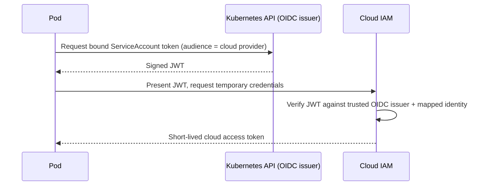

# Service Accounts

## What You'll Learn

- What identity a pod gets by default, and why that default is broader than most workloads need
- How bound service account tokens differ from the legacy long-lived Secret-backed tokens
- How workload identity federation lets a pod assume cloud IAM permissions without storing cloud credentials at all

## Why This Matters

Every pod is a security principal whether you designed for it or not — if you never think about its ServiceAccount, it still gets one, and that ServiceAccount's token is sitting on disk inside the container, mountable by anything that can exec into it. Understanding how that token is minted, scoped, and refreshed is the difference between a compromised pod being a contained incident and a compromised pod being a path to the entire API server.

## Mental Model

> A ServiceAccount is the identity Kubernetes gives to processes running inside pods, the same way a User or Group is the identity for a human. Every pod authenticates to the API server *as* a ServiceAccount, whether or not you specified one — the default namespace ServiceAccount is used automatically if you don't.

## How It Works

### Default behavior

Every namespace gets a ServiceAccount named `default` automatically. Any pod that doesn't specify `serviceAccountName` uses it, and by default Kubernetes:

1. Automatically mounts a token for that ServiceAccount into the pod at `/var/run/secrets/kubernetes.io/serviceaccount/token`.
2. Grants that token whatever RBAC permissions are bound to `default` in that namespace — usually none, but worth verifying.

The practical risk: if `default` ever accumulates permissions (a broad RoleBinding applied "temporarily" and forgotten), *every* pod in that namespace that didn't specify its own ServiceAccount inherits them.

### Disabling auto-mounting

If a workload never calls the Kubernetes API, it shouldn't carry a token at all.

```yaml
apiVersion: v1
kind: ServiceAccount
metadata:
  name: no-api-access
  namespace: production
automountServiceAccountToken: false
```

Or per-pod, overriding the ServiceAccount's own setting:

```yaml
apiVersion: v1
kind: Pod
metadata:
  name: static-worker
spec:
  serviceAccountName: no-api-access
  automountServiceAccountToken: false
  containers:
    - name: worker
      image: myregistry.example.com/worker:2.4.1
```

### Legacy tokens vs. bound service account tokens

| | Legacy Secret-backed token | Bound service account token (default since v1.24+) |
|---|---|---|
| **Lifetime** | Permanent until the Secret is deleted | Expires (default 1 hour, auto-refreshed by kubelet) |
| **Audience** | Valid for any API server that trusts the signing key | Audience-bound — scoped to the specific API server (or other audience) that requested it |
| **Storage** | A real `Secret` object, visible via `kubectl get secrets` | Not stored as a Secret — issued in-memory via the TokenRequest API and projected into the pod |
| **Revocation** | Delete the Secret | Expires on its own; can't be revoked early without deleting the pod |

Since Kubernetes 1.24, ServiceAccounts no longer auto-generate a long-lived Secret token by default — pods get a **bound, expiring, audience-scoped token** issued through the **TokenRequest API** and mounted via a projected volume:

```yaml
apiVersion: v1
kind: Pod
metadata:
  name: api-caller
spec:
  serviceAccountName: api-caller
  containers:
    - name: app
      image: myregistry.example.com/api-caller:1.3.0
      volumeMounts:
        - name: token
          mountPath: /var/run/secrets/tokens
  volumes:
    - name: token
      projected:
        sources:
          - serviceAccountToken:
              path: k8s-token
              expirationSeconds: 3600
              audience: my-api-audience
```

This is strictly better for security: a leaked bound token is only useful for a limited window, to a limited audience, and can't be replayed against unrelated services the way an unscoped legacy token could.

### Workload identity federation with cloud IAM

Kubernetes tokens authenticate you to the Kubernetes API — they say nothing to AWS, GCP, or Azure. Historically, pods needing cloud API access (read from S3, write to Cloud Storage) had cloud credentials baked into environment variables or mounted Secrets, which is exactly the kind of long-lived credential sprawl this whole section is trying to eliminate. Workload identity federation solves this by letting a pod exchange its Kubernetes ServiceAccount token for temporary cloud credentials, with no static cloud credential ever stored in the cluster.



- **IRSA (IAM Roles for Service Accounts)** on EKS — the EKS cluster is registered as an OIDC identity provider in AWS IAM. A ServiceAccount is annotated with an IAM role ARN; AWS's mutating webhook injects the projected token and STS endpoint into the pod, and the AWS SDK automatically exchanges the token for temporary IAM credentials.
- **Workload Identity** on GKE — a Kubernetes ServiceAccount is bound to a Google Cloud IAM service account. GKE's metadata server presents the mapped identity transparently to any Google Cloud client library running in the pod, with no manifest-level SDK configuration required.

Both patterns achieve the same goal: cloud permissions are scoped per-workload via IAM policy, credentials are short-lived and auto-rotated, and nothing sensitive is stored as a Kubernetes Secret.

## Common Mistakes

- Letting application pods run under the namespace's `default` ServiceAccount instead of a dedicated one scoped to that workload's actual needs.
- Leaving `automountServiceAccountToken` enabled for pods that never call the Kubernetes API — an unnecessary token is an unnecessary attack surface.
- Storing long-lived cloud credentials (access keys, service account JSON key files) in a Secret when workload identity federation (IRSA, Workload Identity) is available on the platform.
- Assuming a ServiceAccount token grants cloud permissions directly — it doesn't; only the federation exchange step does that, and only if IAM trust is explicitly configured.
- Binding broad RBAC permissions to a namespace's `default` ServiceAccount "temporarily," which silently grants those permissions to every pod that doesn't specify its own ServiceAccount.

## Interview Questions

- What identity does a pod use if you never set `serviceAccountName`, and what does it default to being able to do?
- How does a bound service account token differ from the legacy Secret-backed token, and why was the change made?
- Explain how IRSA or GKE Workload Identity lets a pod access cloud resources without storing cloud credentials in the cluster.
- When would you disable `automountServiceAccountToken`, and what's the security benefit?

See [Interview Prep](../interview-prep/index.md) for full answers.

## Next

Continue to [Pod Security Standards](04-pod-security-standards.md) to lock down what a pod's containers are allowed to do at runtime, independent of what API calls they can make.
