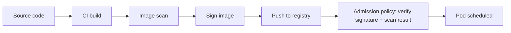

# Image and Supply Chain Security

## What You'll Learn

- Where in the pipeline image scanning, signing, and policy enforcement each belong, and why one alone isn't enough
- How admission-time policy engines like OPA Gatekeeper and Kyverno stop unsafe images before they ever run
- How image signing with cosign/sigstore proves an image came from where it claims to, and how to keep private images out of reach entirely

## Why This Matters

Hardened pods (from [Pod Security Standards](04-pod-security-standards.md)) still trust whatever binary is inside the container image — RBAC and `securityContext` say nothing about whether that image contains a known CVE, malware, or was even built by your own pipeline. Supply chain security is the set of controls that answer "can I trust what's actually running," which is a different question from "is it running with restricted permissions."

## Mental Model

> No single control secures the supply chain. Scanning catches known vulnerabilities *before* deploy. Admission policy enforces rules *at* deploy. Signing proves provenance *at* deploy. Each stage catches what the others miss.



## How It Works

### Image scanning in CI

Scanning should happen as early as possible — failing a build in CI is far cheaper than catching a vulnerable image after it's already running in production.

```yaml
# Example CI step (tool-agnostic pattern; Trivy shown)
- name: Scan image for vulnerabilities
  run: |
    trivy image --severity HIGH,CRITICAL --exit-code 1 \
      myregistry.example.com/app:1.4.2
```

`--exit-code 1` fails the pipeline on any HIGH/CRITICAL finding, which is what actually blocks a vulnerable image from being pushed at all.

### Admission-time policy enforcement

CI scanning only helps if every image is guaranteed to go through that CI pipeline — nothing stops someone from pushing an unscanned image directly and applying a manifest that references it. Admission-time policy closes that gap by enforcing rules at the cluster boundary itself, regardless of how the image got built.

**OPA Gatekeeper** and **Kyverno** are the two dominant policy engines, both implemented as validating (and optionally mutating) admission webhooks:

```yaml
# Kyverno ClusterPolicy: block images without a pinned digest or tag
apiVersion: kyverno.io/v1
kind: ClusterPolicy
metadata:
  name: disallow-latest-tag
spec:
  validationFailureAction: Enforce
  rules:
    - name: require-image-tag
      match:
        any:
          - resources:
              kinds: ["Pod"]
      validate:
        message: "Images must not use the ':latest' tag."
        pattern:
          spec:
            containers:
              - image: "!*:latest"
```

```yaml
# OPA Gatekeeper: only allow images from an approved registry
apiVersion: constraints.gatekeeper.sh/v1beta1
kind: K8sAllowedRepos
metadata:
  name: approved-registries-only
spec:
  match:
    kinds:
      - apiGroups: [""]
        kinds: ["Pod"]
  parameters:
    repos:
      - "myregistry.example.com/"
```

Kyverno's policies are written directly in YAML; Gatekeeper's constraints are backed by Rego policy logic wrapped in a ConstraintTemplate. Both integrate the same way: as admission webhooks that reject non-compliant objects before they're persisted.

### Image signing and verification

Signing answers a narrower but critical question: did this exact image come from the build pipeline you trust, unmodified since it was built? **cosign**, part of the **sigstore** project, is the current standard.

```bash
# Sign an image after building it (keyless signing via OIDC identity)
cosign sign myregistry.example.com/app:1.4.2

# Verify a signature before deploying
cosign verify \
  --certificate-identity=https://github.com/example-org/app/.github/workflows/build.yml@refs/heads/main \
  --certificate-oidc-issuer=https://token.actions.githubusercontent.com \
  myregistry.example.com/app:1.4.2
```

That verification step is then wired into admission policy (both Kyverno and Gatekeeper support cosign signature verification directly), so an unsigned or improperly-signed image is rejected at deploy time, not caught after the fact.

### Private registries and pull secrets

Images that shouldn't be publicly reachable belong in a private registry, with pods authenticating via `imagePullSecrets`:

```bash
kubectl create secret docker-registry regcred \
  --docker-server=myregistry.example.com \
  --docker-username=deploy-bot \
  --docker-password="$REGISTRY_TOKEN" \
  --namespace production
```

```yaml
apiVersion: v1
kind: Pod
metadata:
  name: private-app
  namespace production
spec:
  imagePullSecrets:
    - name: regcred
  containers:
    - name: app
      image: myregistry.example.com/app:1.4.2
```

### Minimizing base images

The smaller the image, the smaller the attack surface — fewer packages means fewer CVEs to track and fewer binaries an attacker can abuse if they gain shell access.

| Base image style | Trade-off |
|---|---|
| Full OS (`ubuntu`, `debian`) | Familiar tooling, largest surface, most CVEs over time |
| Slim variants (`python:3.12-slim`) | Fewer packages, still has a shell and package manager |
| `distroless` | No shell, no package manager, no shell to gain if compromised — much smaller attack surface |
| `scratch` (static binaries only) | Smallest possible image; no libc, no shell, nothing but your compiled binary |

`distroless` is a strong default for compiled or interpreted-with-runtime-only languages where you don't need to `kubectl exec` into a shell for debugging in production.

## Common Mistakes

- Scanning images in CI but never enforcing anything at admission time — an unscanned image pushed outside the pipeline sails straight through.
- Treating a passing scan as permanent — a scan result is a snapshot; new CVEs are discovered against already-deployed images constantly, which is why periodic re-scanning of running workloads matters too.
- Verifying image signatures manually and only sometimes, instead of wiring verification into admission policy so it's enforced on every deploy without relying on humans to remember.
- Using `:latest` (or no tag at all) in production manifests, which defeats reproducibility and makes it impossible to know exactly what's running or roll back precisely.
- Choosing a full OS base image out of habit when a distroless or slim variant would cover the same runtime needs with a dramatically smaller surface.

## Interview Questions

- Why isn't CI image scanning alone sufficient supply chain security?
- What's the difference between what OPA Gatekeeper/Kyverno enforce and what cosign/sigstore verifies?
- How would you prevent an unsigned image from ever being deployed to a cluster?
- What's the security benefit of a distroless base image over a full OS image?

See [Interview Prep](../interview-prep/index.md) for full answers.

## Next

Continue to [Secrets and Encryption at Rest](06-secrets-and-encryption-at-rest.md) to secure the data these workloads consume, not just the images they run.
