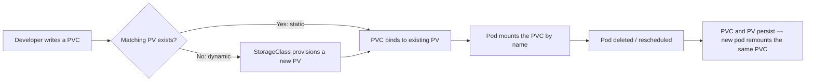

# PersistentVolumes and PersistentVolumeClaims

## What You'll Learn

- How a PersistentVolume (PV) and a PersistentVolumeClaim (PVC) bind to each other, and why that indirection exists
- The four access modes — RWO, ROX, RWX, RWOP — and which storage backends actually support each one
- What each reclaim policy (`Retain`, `Delete`, `Recycle`) does to the underlying storage once a claim is released

## Why This Matters

A pod's ephemeral volumes die with the pod. A PersistentVolume is Kubernetes' abstraction for storage that has its **own** lifecycle, independent of any pod — a pod can be deleted and recreated, even rescheduled to a different node, and reattach to the exact same underlying data. Getting the PV/PVC model right is the difference between a database that survives a rolling update and one that silently starts from empty every time a pod restarts.

## Mental Model

> A **PersistentVolume** is a piece of storage in the cluster — provisioned by an admin or dynamically by a StorageClass. A **PersistentVolumeClaim** is a *request* for storage made by a pod's owner. Kubernetes binds a PVC to a PV that satisfies its requested size, access mode, and StorageClass — the pod itself never talks to the PV directly, only to the PVC.



## How It Works

### The binding lifecycle

1. **Available** — a PV exists and isn't bound to any claim.
2. **Bound** — a PVC has been matched to a PV (by size, access mode, StorageClass, and optionally `selector` labels). Binding is one-to-one: once a PV is bound to a PVC, no other PVC can claim it.
3. **Released** — the PVC was deleted, but the PV isn't yet available for a new claim (it may still hold the previous claim's data, per its reclaim policy).
4. **Failed** — automatic reclamation failed.

```yaml
apiVersion: v1
kind: PersistentVolume
metadata:
  name: pv-app-data
spec:
  capacity:
    storage: 20Gi
  accessModes:
    - ReadWriteOnce
  persistentVolumeReclaimPolicy: Retain
  storageClassName: manual
  csi:
    driver: ebs.csi.aws.com
    volumeHandle: vol-0123456789abcdef0
    fsType: ext4
---
apiVersion: v1
kind: PersistentVolumeClaim
metadata:
  name: app-data-claim
  namespace: production
spec:
  accessModes:
    - ReadWriteOnce
  resources:
    requests:
      storage: 20Gi
  storageClassName: manual
---
apiVersion: v1
kind: Pod
metadata:
  name: app
  namespace: production
spec:
  containers:
    - name: app
      image: myapp:1.8.2
      volumeMounts:
        - name: data
          mountPath: /var/lib/app
  volumes:
    - name: data
      persistentVolumeClaim:
        claimName: app-data-claim
```

Note that the PV in this example is defined by hand and references an already-existing CSI volume (`volumeHandle`) — this is **static provisioning**. The far more common approach in production is **dynamic provisioning**, where a StorageClass creates the PV automatically the moment a matching PVC is created; that's covered in full on the next page.

### Access modes

| Access mode | Meaning | Common backends that support it |
|---|---|---|
| **RWO** — `ReadWriteOnce` | Read-write by a single node at a time (not a single pod — multiple pods on the *same* node can share it) | Almost every block storage backend: EBS, PD, Azure Disk |
| **ROX** — `ReadOnlyMany` | Read-only by many nodes simultaneously | NFS, some CSI drivers, cloud file shares |
| **RWX** — `ReadWriteMany` | Read-write by many nodes simultaneously | NFS, CephFS, EFS, Azure Files, Filestore — file storage, not block storage |
| **RWOP** — `ReadWriteOncePod` | Read-write by a single **pod** in the whole cluster (stricter than RWO) | CSI drivers that implement the newer `SINGLE_NODE_SINGLE_WRITER` mode |

The single most common access-mode mistake is requesting `ReadWriteMany` against a block-storage backend like EBS or a cloud persistent disk — those are physically attachable to only one node at a time, so RWX requests against them will sit `Pending` forever. RWX needs a genuinely shared filesystem (NFS, EFS, Azure Files, CephFS) underneath it.

`ReadWriteOncePod` exists specifically to close a gap in RWO: RWO only guarantees single-*node* access, so two pods co-located on the same node could both mount the same RWO volume simultaneously — often not what you want for a single-writer database. RWOP enforces true single-pod exclusivity cluster-wide.

### Reclaim policies

| Policy | What happens when the PVC is deleted |
|---|---|
| **Retain** | The PV and its underlying storage are kept, moved to `Released`. Data isn't touched, but the PV must be manually cleaned up or rebound before reuse. Safest default for anything you can't afford to lose. |
| **Delete** | The PV **and** the underlying storage (the actual cloud disk) are deleted automatically. This is the default for most dynamically provisioned StorageClasses — convenient, but destructive if triggered by accident. |
| **Recycle** | *Deprecated.* Ran a basic scrub (`rm -rf` equivalent) and made the volume available again. Removed in favor of dynamic provisioning; don't use it in new manifests. |

!!! warning "Delete is the dynamic-provisioning default"
    Most StorageClasses set `reclaimPolicy: Delete`. For stateful production workloads, explicitly set `Retain` on the StorageClass (or patch the resulting PV) so a deleted PVC — intentional or not — doesn't take the underlying disk with it.

## Common Mistakes

- Requesting `ReadWriteMany` on a block-storage-backed StorageClass and then not understanding why the PVC is stuck `Pending`.
- Assuming `kubectl delete pvc` is always safe because "Kubernetes keeps backups" — with `reclaimPolicy: Delete`, it deletes the actual disk.
- Forgetting that a PV's `storageClassName` (or empty string for none) must match the PVC's for binding to occur, even in static provisioning.
- Treating RWO as "single pod" access when it actually means "single node" — a StatefulSet or Deployment with multiple replicas scheduled on the same node can both mount an RWO volume unless RWOP is used.

## Interview Questions

- Walk through what happens, step by step, from a developer applying a PVC manifest to a pod successfully mounting storage.
- What's the difference between `ReadWriteOnce` and `ReadWriteOncePod`, and why does the latter exist?
- If a PVC is deleted, what determines whether the underlying disk is also deleted?

See [Interview Prep](../interview-prep/index.md) for full answers.

## Next

Continue to [StorageClasses and Dynamic Provisioning](03-storageclasses-and-dynamic-provisioning.md) to see how PVs get created automatically instead of by hand.
