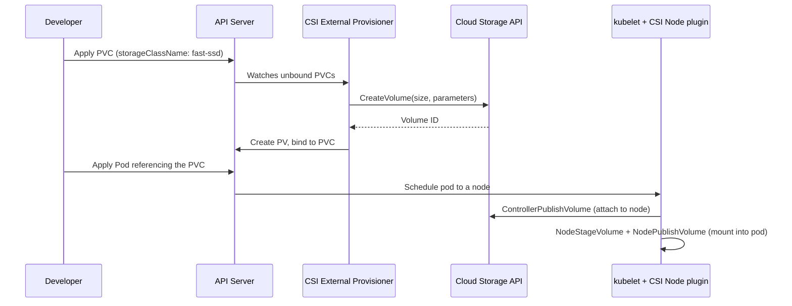

# StorageClasses and Dynamic Provisioning

## What You'll Learn

- What a StorageClass actually configures, and how it connects to a CSI driver
- The end-to-end dynamic provisioning flow, from `kubectl apply` on a PVC to a bound, mountable volume
- How `allowVolumeExpansion` and default StorageClass behavior work, and where they commonly go wrong

## Why This Matters

Hand-writing a PersistentVolume for every PVC doesn't scale past a handful of workloads, and it means a human is in the loop every time an application needs storage. StorageClasses turn "give me 50Gi of fast storage" into something a developer can request with a PVC alone — no admin ticket, no manually created PV. This is how storage is provisioned on essentially every modern cluster.

## Mental Model

> A StorageClass is a template: it names a **provisioner** (almost always a CSI driver today) and the **parameters** that provisioner needs (disk type, IOPS, filesystem, replication) to create a volume on demand. A PVC that references a StorageClass doesn't wait for a human to create a matching PV — the provisioner creates one automatically.

| Concept | Role |
|---|---|
| **StorageClass** | Declares which provisioner to use and how (disk type, IOPS, encryption, replication) |
| **CSI driver** | The plugin (usually a DaemonSet + Deployment pair) that actually talks to the storage backend's API to create/attach/resize volumes |
| **Provisioner** | The CSI driver name referenced by `provisioner:` in the StorageClass |
| **PVC** | The request that triggers the provisioner when no matching PV already exists |

## How It Works

### CSI has replaced in-tree provisioners

Older clusters used **in-tree volume plugins** — provisioner strings like `kubernetes.io/aws-ebs` or `kubernetes.io/gce-pd` compiled directly into `kube-controller-manager`. That model is legacy: in-tree plugins are deprecated (many removed outright since the 1.26+ line) in favor of the **Container Storage Interface (CSI)**, an out-of-tree standard that lets any storage vendor ship a driver without touching Kubernetes core. Every current recommendation — AWS, GCP, Azure, and every serious on-prem storage vendor — is CSI-based. Treat `kubernetes.io/*` in-tree provisioners as legacy context only; new StorageClasses should target a CSI driver name like `ebs.csi.aws.com`.

```yaml
apiVersion: storage.k8s.io/v1
kind: StorageClass
metadata:
  name: fast-ssd
provisioner: ebs.csi.aws.com
parameters:
  type: gp3
  iops: "3000"
  throughput: "125"
  encrypted: "true"
reclaimPolicy: Delete
allowVolumeExpansion: true
volumeBindingMode: WaitForFirstConsumer
```

### The dynamic provisioning flow, end to end



1. A PVC is created referencing a StorageClass by name (or the cluster's default StorageClass, if `storageClassName` is omitted).
2. The CSI external-provisioner sidecar (running alongside the CSI controller plugin) notices the unbound PVC and calls the driver's `CreateVolume` gRPC method with the StorageClass's `parameters`.
3. The storage backend creates the volume and returns an ID; the provisioner creates a PV object pointing at it and binds it to the PVC.
4. When a pod referencing the PVC is scheduled, the CSI node plugin (running as a DaemonSet pod on that node) attaches and mounts the volume into the pod's filesystem.

`volumeBindingMode: WaitForFirstConsumer` (rather than the older `Immediate`) delays step 2 until a pod actually needs the volume, so the provisioner can create the disk in the same availability zone the scheduler picks for the pod — critical for zonal block storage that can't attach cross-zone.

### Volume expansion

```yaml
apiVersion: v1
kind: PersistentVolumeClaim
metadata:
  name: app-data-claim
spec:
  accessModes:
    - ReadWriteOnce
  resources:
    requests:
      storage: 100Gi   # was 20Gi — edit and re-apply to grow
  storageClassName: fast-ssd
```

If the StorageClass has `allowVolumeExpansion: true` and the CSI driver supports resize, increasing `resources.requests.storage` on an existing PVC and re-applying it triggers an online (usually) expansion — no data loss, though the filesystem inside the pod may need a restart to see the new size depending on the driver and filesystem type. Expansion is one-directional: PVCs cannot be shrunk this way.

### Default StorageClass behavior

Exactly one StorageClass in a cluster should carry the annotation `storageclass.kubernetes.io/is-default-class: "true"`. Any PVC that omits `storageClassName` entirely is bound using that default. Two common failure modes:

- **No default set** — PVCs without an explicit `storageClassName` stay `Pending` forever with no clear error pointing at the cause.
- **Two StorageClasses marked default** — behavior is undefined/version-dependent; the admission controller does not guarantee which one wins, so this should be treated as a misconfiguration to fix immediately, not relied upon.

```bash
kubectl get storageclass
kubectl patch storageclass standard \
  -p '{"metadata": {"annotations": {"storageclass.kubernetes.io/is-default-class": "true"}}}'
```

## Common Mistakes

- Writing a new StorageClass against a deprecated in-tree provisioner (`kubernetes.io/aws-ebs`) instead of the CSI driver name (`ebs.csi.aws.com`) — in-tree support is being removed across supported Kubernetes versions.
- Setting `volumeBindingMode: Immediate` for zonal block storage, which lets the PV get provisioned in a zone the scheduler then can't place the pod into.
- Shrinking a PVC's `resources.requests.storage` and expecting it to work — expansion is expand-only.
- Marking more than one StorageClass as default, leaving PVC-to-class resolution ambiguous.

## Interview Questions

- Why did Kubernetes move from in-tree volume plugins to CSI, and what does that mean for a StorageClass's `provisioner` field?
- Walk through what happens between applying a PVC and a pod actually mounting the resulting disk.
- What problem does `volumeBindingMode: WaitForFirstConsumer` solve that `Immediate` doesn't?

See [Interview Prep](../interview-prep/index.md) for full answers.

## Next

Continue to [StatefulSet Storage Patterns](04-statefulset-storage-patterns.md) to see how dynamic provisioning is used to give each replica of a stateful workload its own durable volume.
