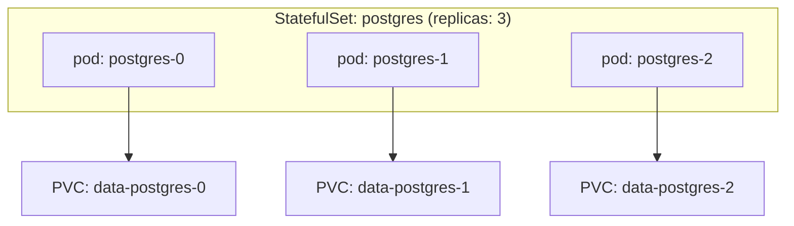

# StatefulSet Storage Patterns

## What You'll Learn

- How `volumeClaimTemplates` gives every StatefulSet replica its own PVC with a stable, predictable name
- The difference between deleting one StatefulSet pod and deleting the whole StatefulSet — and what each does to storage
- What to actually back up, and where to hand this workload off to a proper backup strategy

## Why This Matters

A Deployment's replicas are interchangeable — any pod can serve any request, and its PVC (if any) would be shared or irrelevant. A database replica is not interchangeable: replica 0 might be the primary, replica 1 and 2 are followers with their own replicated state, and swapping their disks would corrupt the cluster. StatefulSets exist specifically to give each replica a stable identity **and** stable, dedicated storage — that's `volumeClaimTemplates`.

## Mental Model

> `volumeClaimTemplates` isn't a shared volume — it's a **template** the StatefulSet controller uses to create one distinct PVC per replica, named deterministically so pod N always reattaches to the same PVC, even after being deleted and recreated.



## How It Works

### Defining volumeClaimTemplates

```yaml
apiVersion: apps/v1
kind: StatefulSet
metadata:
  name: postgres
spec:
  serviceName: postgres
  replicas: 3
  selector:
    matchLabels:
      app: postgres
  template:
    metadata:
      labels:
        app: postgres
    spec:
      containers:
        - name: postgres
          image: postgres:16.4
          env:
            - name: PGDATA
              value: /var/lib/postgresql/data/pgdata   # subdirectory: a fresh volume's lost+found breaks initdb
          ports:
            - containerPort: 5432
          volumeMounts:
            - name: data
              mountPath: /var/lib/postgresql/data
  volumeClaimTemplates:
    - metadata:
        name: data
      spec:
        accessModes: ["ReadWriteOnce"]
        storageClassName: fast-ssd
        resources:
          requests:
            storage: 50Gi
```

Applying this creates three PVCs named `data-postgres-0`, `data-postgres-1`, and `data-postgres-2` — the pattern is always `<volumeClaimTemplate name>-<statefulset name>-<ordinal>`. Each is provisioned independently (dynamic provisioning applies exactly as covered on the previous page), and each is permanently associated with that one ordinal for the life of the StatefulSet.

```bash
kubectl get pvc -l app=postgres
# NAME               STATUS   VOLUME       CAPACITY   ACCESS MODES   STORAGECLASS
# data-postgres-0    Bound    pvc-a1b2...  50Gi       RWO            fast-ssd
# data-postgres-1    Bound    pvc-c3d4...  50Gi       RWO            fast-ssd
# data-postgres-2    Bound    pvc-e5f6...  50Gi       RWO            fast-ssd
```

### Deleting one pod vs. deleting the StatefulSet

This distinction is the single most important thing to internalize about StatefulSet storage:

| Action | What happens to the pod | What happens to its PVC |
|---|---|---|
| `kubectl delete pod postgres-1` | Controller recreates `postgres-1` on (possibly) a different node | **Unchanged.** The new `postgres-1` remounts `data-postgres-1` — same data, same identity |
| `kubectl scale statefulset postgres --replicas=2` | `postgres-2` is terminated | `data-postgres-2` is **retained** by default (not deleted) — scaling back up reattaches it |
| `kubectl delete statefulset postgres` | All pods are terminated | All PVCs (`data-postgres-0/1/2`) are **retained** by default — the StatefulSet controller never deletes PVCs on its own |
| `kubectl delete statefulset postgres --cascade=orphan` | **Keep running**, unmanaged — only the StatefulSet object is removed | Untouched, still mounted. Used to change immutable StatefulSet fields: recreate the StatefulSet and it adopts the running Pods |
| `kubectl delete pvc data-postgres-2` (with `Delete` reclaim policy) | — | The PVC, PV, **and the cloud disk** are deleted. The only step here that destroys data |

By design, the StatefulSet controller treats storage as too precious to delete automatically. Even deleting the entire StatefulSet leaves every PVC bound and intact — you must delete PVCs yourself to actually free the underlying disks. The `persistentVolumeClaimRetentionPolicy` field (stable since Kubernetes v1.32) lets you opt into automatic PVC deletion on scale-down or StatefulSet deletion, but the default (`Retain`) preserves the old, safer behavior:

```yaml
spec:
  persistentVolumeClaimRetentionPolicy:
    whenDeleted: Retain   # or Delete
    whenScaled: Retain    # or Delete
```

### Growing StatefulSet volumes (a real procedure)

`volumeClaimTemplates` can't be edited on an existing StatefulSet, so "the database disks are 90% full" needs a specific sequence. It works online when the StorageClass has `allowVolumeExpansion: true`:

```bash
# 1. Grow each existing PVC directly
for i in 0 1 2; do
  kubectl patch pvc data-postgres-$i -p '{"spec":{"resources":{"requests":{"storage":"100Gi"}}}}'
done
kubectl get pvc -l app=postgres -w          # wait until CAPACITY shows 100Gi

# 2. Update the template so future replicas get the new size:
#    delete only the StatefulSet object (Pods keep running), then re-apply
#    the manifest with storage: 100Gi in volumeClaimTemplates
kubectl delete statefulset postgres --cascade=orphan
kubectl apply -f postgres-statefulset.yaml
```

The recreated StatefulSet adopts the running Pods by their labels; nothing restarts. If your GitOps tool manages the StatefulSet, make the template change in Git first so it doesn't revert step 2.

### Backup considerations

Retained PVCs are not a backup strategy — they're just undeleted disks. A disk-level snapshot of `data-postgres-1` captures whatever the filesystem looked like at snapshot time, which for a running database is only safe if the storage backend and application coordinate a consistent point (e.g., a CSI VolumeSnapshot taken while the database is quiesced, or an application-level backup like `pg_dump`/`pg_basebackup` instead of a raw disk snapshot). Relying on `Retain` alone means you still lose everything if the underlying cloud disk itself is destroyed, corrupted, or the wrong PVC is deleted by a human.

For the actual backup and disaster-recovery mechanics — CSI VolumeSnapshots, etcd backups for cluster state, and restore procedures — see [Backup and Restore](../cluster-administration/05-backup-and-restore.md).

## Common Mistakes

- Assuming `kubectl delete statefulset` deletes the data — it doesn't, by default; the PVCs are orphaned but retained, which is a "phantom cost" trap (disks keep billing after the workload is gone) as often as it's a safety net.
- Treating a retained PVC as a backup. It protects against StatefulSet/pod deletion, not against disk corruption, accidental PVC deletion, or region loss.
- Manually editing `volumeClaimTemplates` on an existing StatefulSet expecting it to resize or reprovision existing PVCs — the API rejects the change. Resize the PVCs themselves, then recreate the StatefulSet with `--cascade=orphan` (see above).
- Forgetting `persistentVolumeClaimRetentionPolicy` exists and manually scripting PVC cleanup instead, when the built-in `whenScaled`/`whenDeleted` policy may already cover the need.

## Interview Questions

- Why does a StatefulSet use `volumeClaimTemplates` instead of a single shared `volumes:` entry like a Deployment would?
- If you delete a StatefulSet and recreate it with the same name, what happens to the old PVCs, and what data does the new pod see?
- Why is a retained PVC not sufficient as a database backup strategy?

See [Interview Prep](../interview-prep/index.md) for full answers.

## Next

Continue to [Configuration and Packaging](../configuration-and-packaging/index.md) to see how these same stateful workloads get their configuration and secrets managed.
