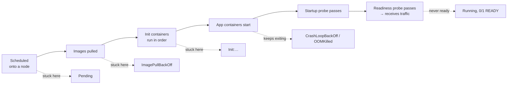

# Kubernetes Pod Startup Errors

Every startup failure shows up the same way in `kubectl get pods` — a `STATUS` that isn't `Running` — but the fix lives in a completely different layer depending on which status it is. Read the status literally: it tells you which subsystem to look at first. This page is the triage map; each error has its own detailed page.

## Match the Status to the Layer

| Status | What it means | Layer at fault | Start with | Full guide |
|---|---|---|---|---|
| `Pending` | Not scheduled onto any node yet | Scheduler: capacity, taints, affinity, storage | `kubectl describe pod` → `FailedScheduling` | [Pod stuck in Pending](pod-pending.md) |
| `ErrImagePull`, `ImagePullBackOff` | Scheduled, but the image won't download | Registry, credentials, network | Error message in events | [ImagePullBackOff](imagepullbackoff.md) |
| `Init:0/1`, `Init:Error`, `Init:CrashLoopBackOff` | An init container hasn't completed | Init container command or dependency | `kubectl logs <pod> -c <init-container>` | [Init container failures](init-container-failures.md) |
| `CrashLoopBackOff` | Container starts, exits, and restarts with back-off | Application, command, probes, config | `kubectl logs <pod> --previous` | [CrashLoopBackOff](crashloopbackoff.md) |
| `OOMKilled` (exit code `137`) | Container exceeded its memory limit | Memory limits and runtime settings | `lastState.terminated.reason` | [OOMKilled](oomkilled.md) |
| `CreateContainerConfigError` | A referenced ConfigMap, Secret, or key doesn't exist | Configuration | `kubectl describe pod` events | [CrashLoopBackOff: missing configuration](crashloopbackoff.md#missing-or-wrong-configuration) |

## The Order Kubernetes Starts a Pod

Knowing the sequence tells you how far a pod got before it stopped:



A pod that is `Running` but `0/1` ready has started fine and is failing its readiness probe — that's a traffic and health-check problem, covered in [Networking and Service Problems](02-networking-and-service-problems.md) and [Probes](../observability/01-probes-liveness-readiness-startup.md).

## The Five Commands That Answer Most Questions

```bash
# Where is it, and how many restarts?
kubectl get pod <pod> -o wide

# Why: scheduling decisions, pull errors, probe failures, kills
kubectl describe pod <pod>

# The last crash's reason and exit code
kubectl get pod <pod> -o jsonpath='{range .status.containerStatuses[*]}{.name}{"\t"}{.lastState.terminated.reason}{"\t"}{.lastState.terminated.exitCode}{"\n"}{end}'

# What the container printed before it died
kubectl logs <pod> --previous

# The namespace's recent history, in order
kubectl get events -n <namespace> --sort-by=.lastTimestamp
```

## Quick Reference

| Symptom | First fix to try |
|---|---|
| `0/6 nodes are available: 3 Insufficient cpu` | Lower requests or add capacity |
| `node(s) had untolerated taint` | Add a toleration only if the workload belongs on those nodes |
| `manifest unknown` | Deploy a tag that exists |
| `unauthorized` / `pull access denied` | Attach `imagePullSecrets` or node registry permissions |
| Exit code `0` then `CrashLoopBackOff` | Run the process in the foreground |
| Exit code `127` | Fix `command`/`args` or the image entrypoint |
| `Liveness probe failed` before each restart | Add a `startupProbe` |
| Reason `OOMKilled` | Size the memory limit from real usage, or fix the leak |
| `Init:0/1` for minutes | Check the dependency the init container waits for |

## Interview Questions

- Walk through your exact diagnostic sequence for a pod stuck in `Pending`.
- What's the practical difference between exit code `1` and exit code `137` when a pod is in `CrashLoopBackOff`?
- Why does adding a `startupProbe` often fix a `CrashLoopBackOff` that inflating `initialDelaySeconds` doesn't fully solve?
- How do you tell an `OOMKilled` container from a pod evicted for node memory pressure?

## Next

Start with the page matching your status above, or continue to [Networking and Service Problems](02-networking-and-service-problems.md).
