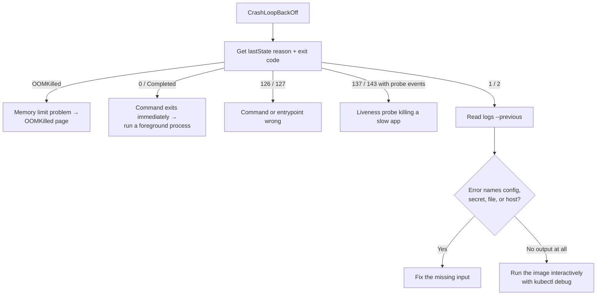

# Fix Kubernetes CrashLoopBackOff

## Problem

A pod shows `CrashLoopBackOff`: its container starts, exits, and the kubelet keeps restarting it with a growing delay between attempts.

```text
NAME                        READY   STATUS             RESTARTS      AGE
orders-api-7c9d8b6f5-k2x4p  0/1     CrashLoopBackOff   6 (82s ago)   9m
```

`CrashLoopBackOff` is not a cause. It's the kubelet telling you *the container keeps dying, so I'm waiting before trying again*. The cause is whatever made the container exit.

## Symptoms

- `STATUS` alternates between `Running`, `Error` (or `Completed`), and `CrashLoopBackOff`.
- `RESTARTS` climbs steadily.
- `READY` stays `0/1`, so the pod never receives traffic from its Service.
- During a rollout, `kubectl rollout status` hangs and new ReplicaSet pods never become available.

## How the Back-Off Works

With the default `restartPolicy: Always` (used by Deployments, StatefulSets, and DaemonSets), the kubelet restarts an exited container after an exponential back-off: 10 seconds, then 20, 40, and so on, capped at five minutes. If the container then runs for ten minutes without problems, the delay resets. That's why a crashing pod can look `Running` for a few seconds between long waits.

A container that exits with code `0` is restarted too. A web server whose command finishes immediately shows `Completed` and then `CrashLoopBackOff` even though nothing "failed".

## Likely Causes

| Cause | Typical evidence |
|---|---|
| Application error on startup: missing config, bad environment variable, can't reach a dependency | Exit code `1` or `2`; a stack trace or error in `--previous` logs |
| Wrong command or entrypoint | Exit code `127` (not found) or `126` (not executable); `exec format error` |
| Process exits normally when it should keep running | Exit code `0`, reason `Completed` |
| Liveness probe kills the container | Events: `Liveness probe failed`, `failed liveness probe, will be restarted`; exit code `137` or `143` |
| Out of memory | Reason `OOMKilled`, exit code `137` — see [OOMKilled](oomkilled.md) |
| Missing ConfigMap key, Secret, or volume content the app reads | App error naming a file or variable; `describe` shows the mount |
| Permission problem with a non-root security context | `permission denied` writing to a path; exit code `1` |
| Wrong CPU architecture for the node | `exec format error` in logs, exit code `1` or `255` |

## Diagnostic Commands

```bash
# 1. The exit code and reason of the last crash
kubectl get pod orders-api-7c9d8b6f5-k2x4p \
  -o jsonpath='{range .status.containerStatuses[*]}{.name}{"\t"}{.lastState.terminated.reason}{"\t"}{.lastState.terminated.exitCode}{"\n"}{end}'

# 2. What the container printed before it died (not the current attempt)
kubectl logs orders-api-7c9d8b6f5-k2x4p --previous
kubectl logs orders-api-7c9d8b6f5-k2x4p -c app --previous      # multi-container pods

# 3. Events: probes, mounts, pulls, kills
kubectl describe pod orders-api-7c9d8b6f5-k2x4p
kubectl get events --field-selector involvedObject.name=orders-api-7c9d8b6f5-k2x4p --sort-by=.lastTimestamp

# 4. What actually runs: image, command, args, env sources
kubectl get pod orders-api-7c9d8b6f5-k2x4p -o yaml | less
```

### Reading the exit code

| Exit code | Meaning | Look at |
|---|---|---|
| `0` | Process finished successfully | The command should run a long-lived process in the foreground |
| `1`, `2` | Application error | `--previous` logs |
| `126` | Command found but not executable | File permissions in the image, `securityContext` |
| `127` | Command not found | `command`/`args` in the spec, entrypoint in the image |
| `137` | Killed with `SIGKILL` | `OOMKilled` reason, liveness probe events, or a slow shutdown past the grace period |
| `139` | Segmentation fault | Native library or architecture mismatch |
| `143` | Terminated with `SIGTERM` | Liveness probe failure or an external stop |

## Step-by-Step Debugging



1. **Get the reason and exit code** with the first command above. It tells you which branch of the tree you're on before you read a single log line.
2. **Read `--previous` logs.** Plain `kubectl logs` shows the attempt that's starting now, which is often empty. The crash happened in the previous container.
3. **Check events for probe failures.** If you see `Liveness probe failed` shortly before each restart, the app may be healthy but slow, and Kubernetes is killing it.
4. **Compare with the last working version.** If a rollout triggered it, `kubectl rollout history deployment/orders-api` and a diff of the two pod templates usually point straight at the change.
5. **When logs are empty, get a shell.** Copy the pod with a command that doesn't exit, then run the real entrypoint by hand:

```bash
kubectl debug orders-api-7c9d8b6f5-k2x4p -it \
  --copy-to=orders-api-debug --container=app -- sh

# inside the copy
env | sort
ls -l /app /config
/app/start.sh            # watch it fail with the full error
```

Delete the copy afterwards: `kubectl delete pod orders-api-debug`.

## Solutions

### Missing or wrong configuration

```bash
kubectl get configmap orders-config -o yaml
kubectl get secret orders-db -o jsonpath='{.data}' | jq 'keys'
```

A renamed key is a classic cause: the Deployment references `DATABASE_URL`, but the ConfigMap now has `DB_URL`. Mark required references explicitly so the pod fails fast with a clear event instead of crashing:

```yaml
env:
  - name: DATABASE_URL
    valueFrom:
      secretKeyRef:
        name: orders-db
        key: url
        optional: false      # the pod won't start until this key exists
```

### The process exits immediately

Run the service in the foreground as PID 1. A shell script that starts a daemon in the background and exits will always loop:

```dockerfile
# Wrong: nginx daemonizes and the shell exits
CMD service nginx start

# Right: foreground process
CMD ["nginx", "-g", "daemon off;"]
```

### Liveness probe kills a slow-starting app

Add a `startupProbe`. Liveness checks don't begin until it succeeds, so slow starts are tolerated without weakening liveness detection later:

```yaml
startupProbe:
  httpGet:
    path: /healthz
    port: 8080
  periodSeconds: 5
  failureThreshold: 36        # up to 3 minutes to start
livenessProbe:
  httpGet:
    path: /healthz
    port: 8080
  periodSeconds: 10
  failureThreshold: 3
```

Keep liveness endpoints cheap and independent of dependencies. A liveness probe that checks the database restarts every pod when the database blips. See [Probes](../observability/01-probes-liveness-readiness-startup.md).

### Permission denied

With `runAsNonRoot` or a specific `runAsUser`, the image's writable paths must be owned by that user, or mounted as writable volumes:

```yaml
securityContext:
  runAsNonRoot: true
  runAsUser: 10001
  fsGroup: 10001
volumeMounts:
  - name: tmp
    mountPath: /tmp
volumes:
  - name: tmp
    emptyDir: {}
```

### Wrong architecture

`exec format error` usually means an `amd64` image on `arm64` nodes (or the reverse). Build multi-platform images, or schedule onto matching nodes:

```bash
docker buildx build --platform linux/amd64,linux/arm64 -t registry.example.com/orders-api:2.14.0 --push .
```

## Prevention

- Validate configuration at startup and exit with a clear, single-line error naming what's missing.
- Use `startupProbe` for anything with variable start time; keep liveness probes shallow.
- Use `optional: false` for required ConfigMap and Secret keys.
- Test the exact image and manifests in a staging namespace before production; run `kubectl rollout status` with a timeout in CI so a crash-looping rollout fails the pipeline.
- Use progressive delivery (canary) so a bad version affects a few pods, not all — see [Progressive Delivery](../cicd-and-gitops/03-progressive-delivery-canary-and-blue-green.md).

## Production Considerations

- **Roll back first, debug second.** `kubectl rollout undo deployment/orders-api` restores service while you investigate the failed revision.
- **Don't delete crash-looping pods to "fix" them.** The ReplicaSet recreates them with the same spec, and you lose the `--previous` logs.
- **Alert on restarts, not only on `CrashLoopBackOff`.** With kube-state-metrics: `increase(kube_pod_container_status_restarts_total[15m]) > 3`.
- **Ship logs off the node.** Once a pod is replaced, previous-container logs are gone; a central logging pipeline keeps them — see [Kubernetes Logging](../observability/02-logging.md).

## Related Problems

- [OOMKilled (exit code 137)](oomkilled.md)
- [Init container stuck or crashing](init-container-failures.md)
- [ImagePullBackOff](imagepullbackoff.md) — the container never starts at all
- [Case study: debugging a CrashLoopBackOff incident](../case-studies/06-debugging-a-crashloopbackoff-incident.md)
- [All pod startup errors](01-pod-scheduling-and-startup-problems.md)
