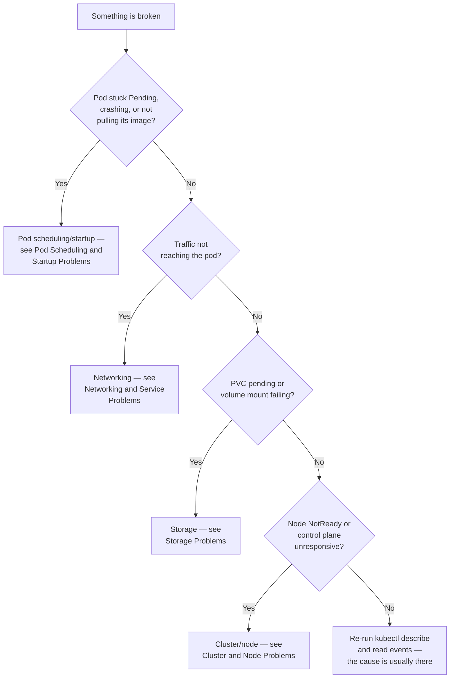

# Troubleshooting

`kubectl` output is rarely the actual problem — `CrashLoopBackOff`, `Pending`, and `503` are symptoms, not root causes. This page is the methodology and the diagnostic toolkit; the pages after it work through each failure category symptom by symptom, with the real diagnosis and fix for each.

## The Diagnostic Toolkit

| Command | What it actually tells you |
|---|---|
| `kubectl get events --sort-by=.metadata.creationTimestamp -A` | The chronological story of what the cluster tried to do and where it gave up |
| `kubectl describe <kind> <name>` | Conditions, events, and the exact scheduling/admission reason — the single most useful command for "why" |
| `kubectl logs <pod> [-c container] [--previous]` | What the application itself said, including the last thing it printed before it died |
| `kubectl get <kind> -o yaml` | The actual applied spec and live status, not what you think you applied |
| `kubectl top nodes` / `kubectl top pods` | Real-time resource pressure — requires the metrics server |
| `kubectl exec -it <pod> -- sh` or `kubectl debug` | A shell inside (or attached to) the failing container, for anything logs don't explain |
| `kubectl get componentstatuses` / node `.status.conditions` | Control-plane and node health, one layer below the workload |

## The Decision Tree

## Read in this order

1. [Pod Scheduling and Startup Problems](01-pod-scheduling-and-startup-problems.md)
2. [Networking and Service Problems](02-networking-and-service-problems.md)
3. [Storage Problems](03-storage-problems.md)
4. [Cluster and Node Problems](04-cluster-and-node-problems.md)

## Next

Continue to [Interview Preparation](../interview-prep/index.md).
