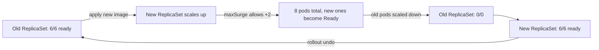

# Deployment Strategies

## What You'll Learn

- How `RollingUpdate` and `Recreate` actually behave, pod by pod
- How to tune `maxSurge` and `maxUnavailable` for your availability and cost trade-off
- How `kubectl rollout status/history/undo` fit into a real release, and where blue-green and canary sit relative to a plain Deployment

## Why This Matters

A Deployment's `strategy` field is the difference between "users never notice a release happened" and "half your requests 503 for ninety seconds." Most production incidents from deployments aren't caused by bad code — they're caused by a rollout strategy nobody tuned past the default.

## Mental Model

A Deployment doesn't update pods directly. It manages ReplicaSets, and a rollout is really: create a new ReplicaSet, scale it up, scale the old one down, according to the strategy. `RollingUpdate` (the default) does this gradually and keeps the app available throughout; `Recreate` kills every old pod before starting any new one.

| Strategy | Old pods removed | New pods created | Downtime | Use when |
|---|---|---|---|---|
| `RollingUpdate` | Gradually, as new pods pass readiness | Gradually, up to `maxSurge` over desired count | None (if probes are correct) | Default — almost everything stateless |
| `Recreate` | All at once, before any new pod starts | Only after all old pods are gone | Yes, by design | The app can't run two versions at once (schema-incompatible singleton, exclusive port/lock) |

### RollingUpdate, tuned

```yaml
apiVersion: apps/v1
kind: Deployment
metadata:
  name: checkout-api
spec:
  replicas: 6
  strategy:
    type: RollingUpdate
    rollingUpdate:
      maxSurge: 2          # up to 8 pods running briefly
      maxUnavailable: 0    # never drop below 6 ready pods
  minReadySeconds: 10       # pod must stay Ready this long before counting as "up"
  selector:
    matchLabels:
      app: checkout-api
  template:
    metadata:
      labels:
        app: checkout-api
    spec:
      containers:
        - name: checkout-api
          image: registry.example.com/checkout-api:1.14.2
          ports:
            - containerPort: 8080
          readinessProbe:
            httpGet:
              path: /healthz/ready
              port: 8080
            initialDelaySeconds: 5
            periodSeconds: 5
          resources:
            requests:
              cpu: 250m
              memory: 256Mi
            limits:
              cpu: 500m
              memory: 512Mi
```

- `maxSurge` — how many pods *above* `replicas` can exist during the rollout. Higher = faster rollout, more capacity needed.
- `maxUnavailable` — how many pods *below* `replicas` are tolerated during the rollout. `0` guarantees full capacity throughout, at the cost of needing headroom for `maxSurge` extra pods.
- Setting both to sensible non-zero values (e.g. `maxSurge: 25%`, `maxUnavailable: 25%`, the actual defaults) balances rollout speed against cluster headroom.
- A rollout only proceeds pod-by-pod as fast as the **readiness probe** says the new pods are healthy — a broken readiness probe silently stalls or fast-tracks a bad rollout.

### Managing a rollout

```bash
kubectl apply -f checkout-api-deployment.yaml
kubectl rollout status deployment/checkout-api
kubectl rollout history deployment/checkout-api
kubectl rollout history deployment/checkout-api --revision=3
kubectl rollout undo deployment/checkout-api
kubectl rollout undo deployment/checkout-api --to-revision=2
kubectl rollout restart deployment/checkout-api
```

`rollout status` blocks until the rollout finishes or fails — use it in CI to gate the next pipeline step. `rollout undo` works because Kubernetes keeps old ReplicaSets around (`revisionHistoryLimit`, default 10) — undo just scales the previous ReplicaSet back up and the current one down, which is itself a RollingUpdate.



## Blue-Green and Canary, Conceptually

`RollingUpdate` mixes old and new pods behind the same Service the entire time — fine for most apps, but it means both versions serve traffic simultaneously and you can't instantly cut back to 100% old version if something's wrong.

- **Blue-green** runs two full environments (blue = current, green = new) and switches traffic all at once, usually by repointing a Service selector or load balancer. Rollback is instant — flip back to blue — but you pay for two full environments during the switch.
- **Canary** sends a small percentage of traffic to the new version, watches error rates/latency, then ramps up gradually. It catches bad releases with minimal blast radius, but needs traffic-splitting infrastructure a plain Deployment doesn't have.

A Deployment alone can approximate both crudely (two Deployments + a Service selector swap for blue-green; two Deployments with proportional replica counts for a rough canary), but real weighted traffic splitting, automated analysis, and automated rollback need a progressive-delivery tool.

!!! note "Where the full walkthroughs live"
    Operational, tool-based walkthroughs with Argo Rollouts and Flagger are in [Progressive Delivery: Canary and Blue-Green](../cicd-and-gitops/03-progressive-delivery-canary-and-blue-green.md). A real-world postmortem of both patterns is in [Blue-Green and Canary Releases](../case-studies/02-blue-green-and-canary-releases.md).

## Common Mistakes

- Setting `maxUnavailable: 0` and `maxSurge: 0` at the same time — the rollout can never make progress and hangs.
- No readiness probe (or a probe that always passes) — the rollout has no real signal, so a broken new pod gets marked ready and takes production traffic immediately.
- Using `Recreate` out of habit "to be safe" — it introduces downtime a `RollingUpdate` with `maxUnavailable: 0` doesn't need.
- Confusing `kubectl rollout restart` (re-rolls current pods with the same spec, e.g. to pick up a changed Secret) with `kubectl rollout undo` (reverts to a previous revision).
- Assuming a successful `rollout status` means the release is actually healthy — it only means pods are Ready per the probe; it says nothing about real user-facing error rates.

## Interview Questions

- Walk through exactly what happens, pod by pod, during a `RollingUpdate` with `maxSurge: 1, maxUnavailable: 0`.
- Why would you choose `Recreate` over `RollingUpdate`, and what's the cost?
- How does `kubectl rollout undo` work under the hood, given Deployments don't store "old pods" directly?
- How does a canary release differ from what a Deployment's `RollingUpdate` already gives you?

See [Interview Prep](../interview-prep/index.md) for full answers.

## Next

Continue to [StatefulSets](02-statefulsets.md) for workloads that need stable identity instead of interchangeable pods.
