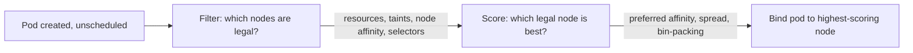

# Scheduling, Affinity, and Taints

## What You'll Learn

- How `kube-scheduler` actually chooses a node for a pod, step by step
- The difference between node affinity, pod affinity/anti-affinity, and taints/tolerations — and when to use each
- How topology spread constraints keep pods distributed across zones or nodes instead of piling onto one

## Why This Matters

Every scheduling primitive answers the same underlying question — "where should this pod run" — but from a different direction. Affinity says "prefer/require nodes/pods like this." Taints and tolerations say "nodes can repel pods unless they explicitly tolerate it." Mixing them up (e.g. using a taint when you meant affinity) either fails to schedule anything or schedules everything onto one overloaded node.

## Mental Model

> The scheduler runs two phases for every unscheduled pod: **filtering** (which nodes are even legal — enough resources, matching affinity/selectors, tolerated taints) and **scoring** (of the legal nodes, which is best — spreading pods out, bin-packing, respecting preferred affinity). It picks the highest-scoring node from the filtered set.



| Mechanism | Direction | Question it answers |
|---|---|---|
| Node affinity | Pod → node | "Which nodes am I allowed/prefer to land on?" |
| Pod affinity/anti-affinity | Pod → other pods | "Do I want to be near/away from pods with this label?" |
| Taints + tolerations | Node → pod | "This node repels pods unless they explicitly tolerate me." |
| Topology spread constraints | Pod → topology | "Spread pods evenly across zones/nodes, don't just pick one good node repeatedly." |

## How It Works

### Node affinity

```yaml
apiVersion: v1
kind: Pod
metadata:
  name: gpu-inference
spec:
  affinity:
    nodeAffinity:
      requiredDuringSchedulingIgnoredDuringExecution:
        nodeSelectorTerms:
          - matchExpressions:
              - key: node-type
                operator: In
                values: ["gpu"]
      preferredDuringSchedulingIgnoredDuringExecution:
        - weight: 80
          preference:
            matchExpressions:
              - key: topology.kubernetes.io/zone
                operator: In
                values: ["us-east-1a"]
  containers:
    - name: inference
      image: registry.example.com/inference:2.3.0
```

`required...` is a hard filter (no matching node = pod stays `Pending`); `preferred...` only influences scoring. `IgnoredDuringExecution` means a node's labels changing after the pod is already running doesn't evict it — affinity is only evaluated at scheduling time.

### Pod affinity and anti-affinity

```yaml
  affinity:
    podAntiAffinity:
      requiredDuringSchedulingIgnoredDuringExecution:
        - labelSelector:
            matchLabels:
              app: postgres
          topologyKey: kubernetes.io/hostname   # never co-locate two postgres pods on one node
    podAffinity:
      preferredDuringSchedulingIgnoredDuringExecution:
        - weight: 50
          podAffinityTerm:
            labelSelector:
              matchLabels:
                app: checkout-api
            topologyKey: topology.kubernetes.io/zone   # prefer being near checkout-api, same zone
```

Anti-affinity is the standard way to guarantee replicas of the same app land on different nodes (or zones), so one node failure doesn't take out every replica.

### Taints and tolerations

Taints go on **nodes**; tolerations go on **pods**. A pod can only schedule onto a tainted node if it tolerates that specific taint.

```bash
kubectl taint nodes gpu-node-1 nvidia.com/gpu=true:NoSchedule
```

```yaml
  tolerations:
    - key: nvidia.com/gpu
      operator: Equal
      value: "true"
      effect: NoSchedule
```

| Effect | Behavior |
|---|---|
| `NoSchedule` | New pods without a matching toleration won't be scheduled here |
| `PreferNoSchedule` | Scheduler tries to avoid this node, but will use it if needed |
| `NoExecute` | Existing pods without a matching toleration are **evicted**, not just blocked from scheduling |

A common pattern: taint expensive nodes (GPU, high-memory) so nothing lands there by accident, and only pods that explicitly need that hardware tolerate the taint.

### Topology spread constraints

```yaml
  topologySpreadConstraints:
    - maxSkew: 1
      topologyKey: topology.kubernetes.io/zone
      whenUnsatisfiable: DoNotSchedule
      labelSelector:
        matchLabels:
          app: checkout-api
```

`maxSkew: 1` means no zone can have more than one pod more than the least-populated zone for pods matching this selector — this is what actually gets you "3 replicas, one per zone" instead of relying on anti-affinity rules that only look at pairs.

## Common Mistakes

- Using `podAntiAffinity` with `topologyKey: kubernetes.io/hostname` on a cluster smaller than the replica count — `required...` anti-affinity then leaves pods `Pending` forever because there aren't enough distinct nodes.
- Expecting a taint to attract pods — taints only repel; tolerations only cancel that repulsion, they never make a pod prefer that node (use affinity for attraction).
- Confusing `NoSchedule` with `NoExecute` — assuming a taint added to an already-schedulable node won't touch running pods, then being surprised when a `NoExecute` taint evicts them.
- Forgetting `IgnoredDuringExecution` semantics — labeling a node differently after pods are already running doesn't retroactively reschedule them.

## Interview Questions

- Walk through the scheduler's filter-then-score process for a single pod.
- What's the practical difference between pod anti-affinity and a topology spread constraint — why would you need both?
- What happens to already-running pods when you add a `NoExecute` taint to their node?

See [Interview Prep](../interview-prep/index.md) for full answers.

## Next

Continue to [Resource Requests, Limits, and QoS](05-resource-requests-limits-and-qos.md) — the other input the scheduler's filtering phase depends on.
